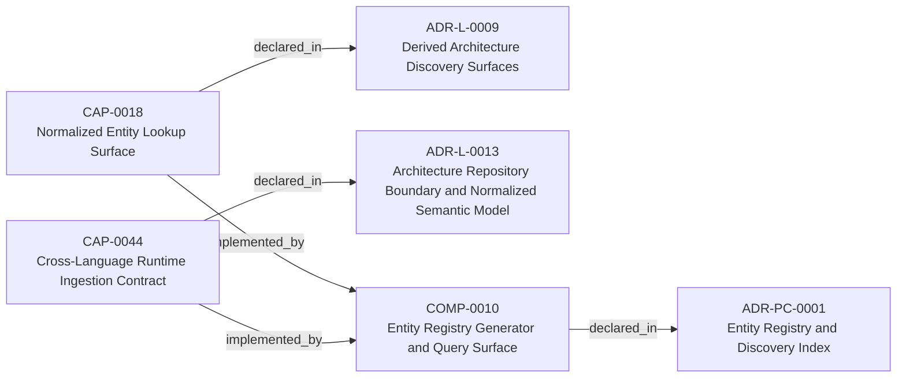
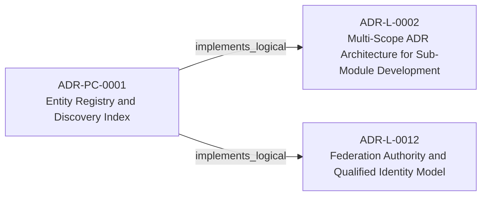
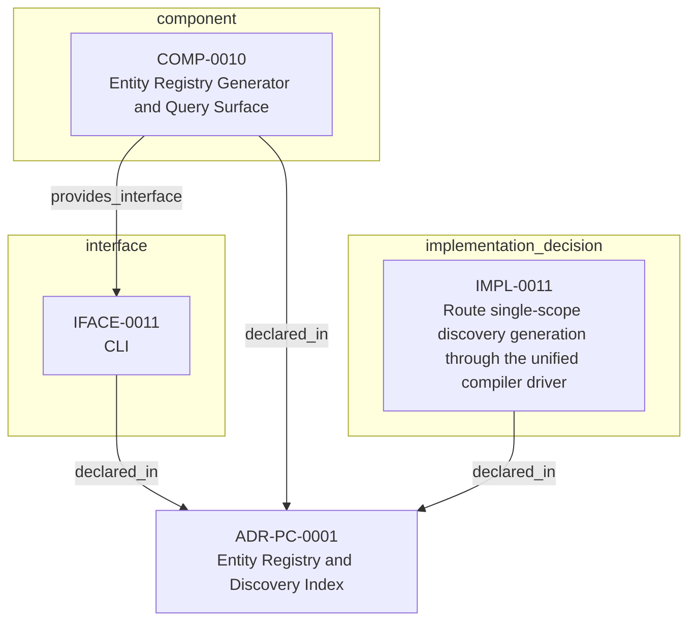

<!--
integrity_schema_version: 1
generated: deterministic_projection_v1
artifact_kind: rendered_adr_markdown
generator_id: adr-projection-markdown
generator_version: 3
hash_algorithm: sha256
source_hash: fedce3027f00aed75d6126800158c2740521898a1fd1493bfb0347fbc09e33c2
rendered_hash: 9fc68e9051a44ba019ad4bdadd30a4f0394216a4b69b0f2e39984ccb8f43771a
-->

# ADR-PC-0001: Entity Registry and Discovery Index

## Identity / Status

**Type:** physical-component  
**Status:** accepted  
**Alias:** ADR-PC-0001  
**Authoring contract:** authoring v1.5  
**Created:** 2026-03-13  
**Modified:** 2026-08-27  
**Authors:** adr-architecture-kit  
**Domains:** discovery, indexing, tooling  
**Implements Logical:** [ADR-L-0009](../logical/ADR-L-0009-derived-architecture-discovery-surfaces.md), [ADR-L-0012](../logical/ADR-L-0012-federation-authority-and-qualified-identity-model.md), [ADR-L-0002](../logical/ADR-L-0002-multi-scope-adr-architecture-for-sub-module-development.md)  
**Implements System:** [ADR-PS-0001](../physical-system/ADR-PS-0001-adr-architecture-kit-discovery-and-indexing-system.md)  

## Architecture Position

Physical-component ADRs author component, interface, and implementation entities. Topology is not authored here; neighborhood uses compiled semantic architecture edges plus structural bridges.

**Containing system(s):**
- [ADR-PS-0001](../physical-system/ADR-PS-0001-adr-architecture-kit-discovery-and-indexing-system.md)

**Logical authority implemented:**
- [ADR-L-0009](../logical/ADR-L-0009-derived-architecture-discovery-surfaces.md)
- [ADR-L-0012](../logical/ADR-L-0012-federation-authority-and-qualified-identity-model.md)
- [ADR-L-0002](../logical/ADR-L-0002-multi-scope-adr-architecture-for-sub-module-development.md)

**Component(s) owned by this ADR:**
- COMP-0010 — Entity Registry Generator and Query Surface (service)

**Component type(s):** service

**Authored purpose:**
- Generate and query the normalized entity registry for agent discovery.

**Provided interface types:** CLI

**Implementation location(s):**
- Primary implementation: src/adr_kit/compiler/driver.py
- Service: adr-compiler
- Entry point: src/adr_kit/cli/main.py
- Primary tests: tests/test_compiler_driver.py

## Architecture Neighborhood

### Semantic architecture inventory

- `implemented_by`: CAP-0018 → COMP-0010
- `implemented_by`: CAP-0044 → COMP-0010
- `implements_logical`: ADR-PC-0001 → ADR-L-0002
- `implements_logical`: ADR-PC-0001 → ADR-L-0012

### Component Relationships

**Provides interface**
- CLI (IFACE-0011)
  - `COMP-0010 -[:provides_interface]-> IFACE-0011`

**Implements logical authority**
- Multi-Scope ADR Architecture for Sub-Module Development (ADR-L-0002)
  - `ADR-PC-0001 -[:implements_logical]-> ADR-L-0002`
- Derived Architecture Discovery Surfaces (ADR-L-0009)
  - `ADR-PC-0001 -[:implements_logical]-> ADR-L-0009`
- Federation Authority and Qualified Identity Model (ADR-L-0012)
  - `ADR-PC-0001 -[:implements_logical]-> ADR-L-0012`

**Implements**
- Normalized Entity Lookup Surface (CAP-0018)
  - `CAP-0018 -[:implemented_by]-> COMP-0010`
- Cross-Language Runtime Ingestion Contract (CAP-0044)
  - `CAP-0044 -[:implemented_by]-> COMP-0010`

## Neighbor Relationships

### ADR-L-0002 — Multi-Scope ADR Architecture for Sub-Module Development

Entity Registry and Discovery Index (ADR-PC-0001)
    -[:implements_logical]->
Multi-Scope ADR Architecture for Sub-Module Development (ADR-L-0002)

`ADR-PC-0001 -[:implements_logical]-> ADR-L-0002`

**Peer context:** The adr-architecture-kit is being actively developed in a single workspace alongside
multiple sub-modules (ste-runtime, future services) that will eventually become
independent services. Each sub-module needs to leverage the ADR system for its own
architectural documentation while being developed in parallel within the monorepo.

[Open projection](../logical/ADR-L-0002-multi-scope-adr-architecture-for-sub-module-development.md)
### ADR-L-0009 — Derived Architecture Discovery Surfaces

Normalized Entity Lookup Surface (CAP-0018)
    -[:implemented_by]->
Entity Registry Generator and Query Surface (COMP-0010)

`CAP-0018 -[:implemented_by]-> COMP-0010`

**Peer context:** adr-architecture-kit is primarily machine-facing tooling used by agents to
reason over canonical architecture artifacts. Relying on agents to scan raw
ADR bodies for discovery is inconsistent with the toolkit's AI-first design
theory: discovery surfaces should be explicit, deterministic, cheap to query,
and derived from canonical authority.

[Open projection](../logical/ADR-L-0009-derived-architecture-discovery-surfaces.md)
### ADR-L-0012 — Federation Authority and Qualified Identity Model

Entity Registry and Discovery Index (ADR-PC-0001)
    -[:implements_logical]->
Federation Authority and Qualified Identity Model (ADR-L-0012)

`ADR-PC-0001 -[:implements_logical]-> ADR-L-0012`

**Peer context:** The compiler and recursive multi-scope model preserve repository-local
compilation boundaries, while STE federation spans independently compiled
repositories. Federation therefore requires global identity without weakening
provider authority or allowing the aggregation layer to rewrite canonical
repository state.

[Open projection](../logical/ADR-L-0012-federation-authority-and-qualified-identity-model.md)
### ADR-L-0013 — Architecture Repository Boundary and Normalized Semantic Model

Cross-Language Runtime Ingestion Contract (CAP-0044)
    -[:implemented_by]->
Entity Registry Generator and Query Surface (COMP-0010)

`CAP-0044 -[:implemented_by]-> COMP-0010`

**Peer context:** adr-architecture-kit now has an explicit compiler pipeline, a compiler IR
(`ArchModel`), compiled registry bundles, and an additive architecture graph.
Those pieces are sufficient to produce deterministic machine-facing artifacts,
and ArchitectureRepository already defines the semantic in-process boundary.
Phase 1 adds a narrow supported authoring facade that reuses that seam without
expanding the normalized model or exposing compiler internals.

[Open projection](../logical/ADR-L-0013-architecture-repository-boundary-and-normalized-semantic-model.md)

## Context

The discovery/indexing component now centers on the unified compiler path. It
generates the normalized discovery bundle under `adrs/index/`, emits the
legacy compatibility registry at `adrs/entities/registry.yaml`, generates
manifest and rendered ADR markdown outputs through the same compiler-owned
path for single-scope use, and exposes exact-ID and filtered CLI query
operations over generated registry state.

It also serves as the file-format discovery surface for cross-language or
out-of-process consumers such as `ste-runtime`, which must bootstrap from the
indexed bundle rather than reparsing source ADRs.

## Internal Structure

- `component` COMP-0010 — Entity Registry Generator and Query Surface
- `implementation_decision` IMPL-0011 — Route single-scope discovery generation through the unified compiler driver
- `interface` IFACE-0011 — CLI

## Type-specific Detail

### Before You Change This Component
**Must preserve:**
- Discovery outputs are derived and non-authoritative
- Single-scope generation commands act as compatibility wrappers over `adr compile`
- CLI must read generated registry artifacts instead of rescanning ADRs
- Output must be deterministic when inputs are unchanged
- Cross-language consumers bootstrap from `architecture-index.yaml` and the required registry bundle
- `manifest.yaml` is a guaranteed discovery and freshness surface, not a semantic authority
- `adrs/entities/registry.yaml` must remain compatibility-only for new consumers

**Public / exposed interfaces:**
- IFACE-0011 — CLI

**Verify with:**
- Discovery bundle and legacy registry generation are deterministic
- ADR-L-0008 entities are present in generated discovery output
- CLI list/get/invariants/capabilities commands query the registry successfully
- Cross-language consumers can rely on the indexed bundle without needing raw ADR traversal
- tests/test_compiler_driver.py
- >= 80%
- - Discovery bundle and legacy registry generation from logical, physical, physical-system, physical-component, and invariant sources
- CLI query flows against generated registry artifacts

### COMP-0010: Entity Registry Generator and Query Surface

**Type:** service

**Purpose:**

Generate and query the normalized entity registry for agent discovery.

**Responsibilities:**

- Compile canonical ADR and invariant artifacts into a normalized discovery bundle
- Emit deterministic `adrs/index/*.yaml` registry artifacts
- Emit deterministic legacy compatibility registry output at `adrs/entities/registry.yaml`
- Support manifest and rendered markdown emission through the unified compile path
- Provide CLI query access over generated registry state
- Preserve an index-first discovery posture for cross-language consumers

**Key Responsibilities:**
- Generate deterministic discovery bundle records from canonical artifacts
- Emit the legacy compatibility registry from the normalized compiler output
- Delegate single-scope generation commands through the unified compiler driver
- Reject duplicate explicitly introduced entity IDs
- Support exact entity lookup and filtered list operations from CLI
- Keep the required discovery bundle and additive indexed artifacts distinct for downstream consumers

**Must Remain True:**
- Discovery outputs are derived and non-authoritative
- Single-scope generation commands act as compatibility wrappers over `adr compile`
- CLI must read generated registry artifacts instead of rescanning ADRs
- Output must be deterministic when inputs are unchanged
- Cross-language consumers bootstrap from `architecture-index.yaml` and the required registry bundle
- `manifest.yaml` is a guaranteed discovery and freshness surface, not a semantic authority
- `adrs/entities/registry.yaml` must remain compatibility-only for new consumers

**Success Criteria:**
- Discovery bundle and legacy registry generation are deterministic
- ADR-L-0008 entities are present in generated discovery output
- CLI list/get/invariants/capabilities commands query the registry successfully
- Cross-language consumers can rely on the indexed bundle without needing raw ADR traversal

**Implements Capabilities:**
- Normalized Entity Lookup Surface (CAP-0018)
- Cross-Language Runtime Ingestion Contract (CAP-0044)

### IFACE-0011 — CLI

**Type:** CLI

**Specification:**

Commands:
- adr compile
- adr generate-architecture-index
- adr generate-manifest
- adr generate-adr-projection - adr generate-rendered-docs
- adr generate-entity-registry
- adr entities list
- adr entities get <id>
- adr entities invariants
- adr entities capabilities

### IMPL-0011 — Route single-scope discovery generation through the unified compiler driver

**Decision:**

Route single-scope discovery generation through the unified compiler driver

**Rationale:**

The unified compiler path keeps normalized registries, the legacy
compatibility registry, manifest generation, and rendered markdown emission
aligned while preserving the older single-scope commands as compatibility
wrappers. Registry backend emission remains compiler-owned rather than
isolated in the older standalone registry generator.

## Engineering Contract

### Failure Semantics

Fail closed on duplicate entity IDs, invalid compiled registry files, and missing generated discovery artifacts.

### Observability

**Logging:**
- Level: info
- Structured: false

**Metrics:**
- entity_registry_generations_total (counter)

### Verification

**Unit test coverage:** >= 80%

**Integration tests:**

- Discovery bundle and legacy registry generation from logical, physical, physical-system, physical-component, and invariant sources
- CLI query flows against generated registry artifacts

## Implementation Locations

| Role | Location |
| --- | --- |
| Primary implementation | `src/adr_kit/compiler/driver.py` |
| Service | `adr-compiler` |
| Entry point | `src/adr_kit/cli/main.py` |
| Primary tests | `tests/test_compiler_driver.py` |

## Technology Stack

### Python (language)
**Version:** >=3.14

**Rationale:**
Minimum supported Python minor is 3.14 (`requires-python >=3.14`); currently qualified released minor line is 3.14; repository reference interpreter is currently 3.14.7; new GA Python minors require explicit qualification before support is advertised.

### PyYAML (library)
**Version:** 6.x

**Rationale:**
Stable YAML parsing and rendering for registry artifacts.

### Click (tooling)
**Version:** 8.x

**Rationale:**
Existing CLI framework for scope-aware commands.

---

*Generated from ADR-PC-0001 by ADR Architecture Kit (projection v3)*