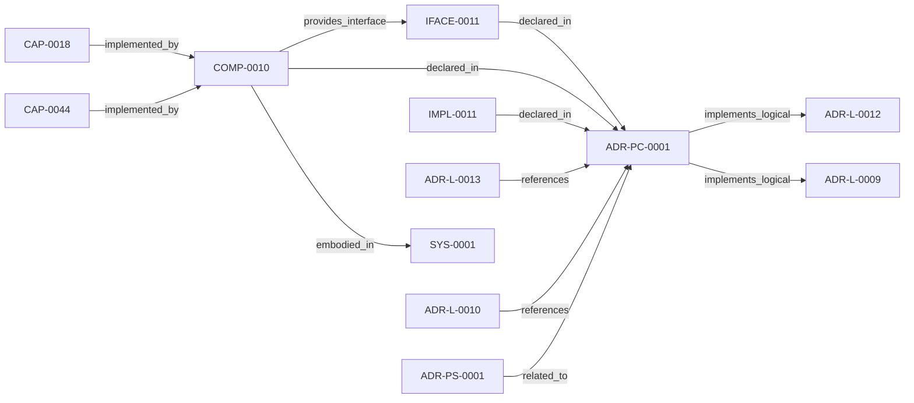

<!--
integrity_schema_version: 1
generated: deterministic_projection_v1
artifact_kind: rendered_adr_markdown
generator_id: adr-projection-markdown
generator_version: 2
hash_algorithm: sha256
source_hash: 0dfa0512312fb956793c01030309774612c68d1a924fef52835ae79ca9ce0f17
rendered_hash: 7a5715e2df926c830d8a301e8c618d000d7f24908bd8ae1b700a1c243c75e4b1
-->

# ADR-PC-0001: Entity Registry and Discovery Index

**Status:** accepted  
**Created:** 2026-03-13  
**Modified:** 2026-08-27  
**Authors:** adr-architecture-kit  
**Domains:** discovery, indexing, tooling  
**Alias name:** entity-registry-and-discovery-index  

**Implements Logical:** [ADR-L-0009](../logical/ADR-L-0009-derived-architecture-discovery-surfaces.md), [ADR-L-0012](../logical/ADR-L-0012-federation-authority-and-qualified-identity-model.md)  
**Technologies:** python, pyyaml, click  

**Implements System:** [ADR-PS-0001](../physical-system/ADR-PS-0001-adr-architecture-kit-discovery-and-indexing-system.md)  

## Context

The discovery/indexing component now centers on the unified compiler path. It
generates the normalized discovery bundle under `adrs/index/`, emits the
legacy compatibility registry at `adrs/entities/registry.yaml`, generates
manifest and rendered ADR markdown outputs through the same compiler-owned
path for single-scope use, and exposes exact-ID and filtered CLI query
operations over generated registry state.

It also serves as the file-format discovery surface for cross-language or
out-of-process consumers such as `ste-runtime`, which must bootstrap from the
indexed bundle rather than reparsing source ADRs.

## Technology Stack

### Python (language)

**Version:** >=3.14

**Rationale:**
Minimum supported Python minor is 3.14 (`requires-python >=3.14`); currently qualified released minor line is 3.14; repository reference interpreter is currently 3.14.7; new GA Python minors require explicit qualification before support is advertised. 

### PyYAML (library)

**Version:** 6.x

**Rationale:**
Stable YAML parsing and rendering for registry artifacts.

### Click (tooling)

**Version:** 8.x

**Rationale:**
Existing CLI framework for scope-aware commands.

## Relationship graph

## Related ADRs

### ADR-L-0009 — Derived Architecture Discovery Surfaces

**Relationships:**
- this ADR -[:implements_logical]-> 019fee89-e616-770c-a025-2c241a720730

**Context:** adr-architecture-kit is primarily machine-facing tooling used by agents to
reason over canonical architecture artifacts. Relying on agents to scan raw
ADR bodies for discovery is inconsistent with the toolkit's AI-first design
theory: discovery surfaces should be explicit, deterministic, cheap to query,
and derived from canonical authority.

[Open projection](../logical/ADR-L-0009-derived-architecture-discovery-surfaces.md)
### ADR-L-0010 — Kernel Interface Contract and Validation Profiles

**Relationships:**
- 019fee89-e616-7d61-8e35-f11ba2ddd75d -[:references]-> this ADR

**Context:** adr-architecture-kit is transitioning from an implicit generator toolkit into
an explicit architecture compiler with a defined contract boundary to the STE
kernel. The plan work established that the compiler's guaranteed contract
surface is broader than the kernel's minimal load subset: the contract family
is all generated artifacts under `adrs/index/` plus `manifest.yaml`, while
individual consumers may rely on narrower subsets.

[Open projection](../logical/ADR-L-0010-kernel-interface-contract-and-validation-profiles.md)
### ADR-L-0012 — Federation Authority and Qualified Identity Model

**Relationships:**
- this ADR -[:implements_logical]-> 019fee89-e616-744f-b63e-5ecddf344faa

**Context:** The compiler and recursive multi-scope model preserve repository-local
compilation boundaries, while STE federation spans independently compiled
repositories. Federation therefore requires global identity without weakening
provider authority or allowing the aggregation layer to rewrite canonical
repository state.

[Open projection](../logical/ADR-L-0012-federation-authority-and-qualified-identity-model.md)
### ADR-L-0013 — Architecture Repository Boundary and Normalized Semantic Model

**Relationships:**
- 019fee89-e616-7c4e-953c-b7349412a784 -[:references]-> this ADR

**Context:** adr-architecture-kit now has an explicit compiler pipeline, a compiler IR
(`ArchModel`), compiled registry bundles, and an additive architecture graph.
Those pieces are sufficient to produce deterministic machine-facing artifacts,
and ArchitectureRepository already defines the semantic in-process boundary.
Phase 1 adds a narrow supported authoring facade that reuses that seam without
expanding the normalized model or exposing compiler internals.

[Open projection](../logical/ADR-L-0013-architecture-repository-boundary-and-normalized-semantic-model.md)
### ADR-PS-0001 — ADR Architecture Kit Discovery and Indexing System

**Relationships:**
- 019fee89-e618-7b3e-813b-a449881b6adb -[:related_to]-> this ADR

**Context:** The discovery and indexing subsystem provides the derived surfaces that agents
query instead of scanning raw ADR bodies by default. It now includes
normalized discovery bundle generation under `adrs/index/`, legacy
compatibility registry generation under `adrs/entities/registry.yaml`,
manifest generation, rendered ADR markdown generation, CLI query surfaces over
generated registry state, and the unified `adr compile` orchestration path
that emits these derived discovery artifacts together.

[Open projection](../physical-system/ADR-PS-0001-adr-architecture-kit-discovery-and-indexing-system.md)

## Component Specifications

### COMP-0010: Entity Registry Generator and Query Surface (service)

**Responsibilities:**
- Compile canonical ADR and invariant artifacts into a normalized discovery bundle
- Emit deterministic `adrs/index/*.yaml` registry artifacts
- Emit deterministic legacy compatibility registry output at `adrs/entities/registry.yaml`
- Support manifest and rendered markdown emission through the unified compile path
- Provide CLI query access over generated registry state
- Preserve an index-first discovery posture for cross-language consumers

**Interfaces:**
- **IFACE-0011** (CLI): Commands:
- adr compile
- adr generate-architecture-index
- adr generate-manifest
- adr generate-adr...

**Implementation Identifiers:**
- Service Name: `adr-compiler`
- Module Path: `src/adr_kit/compiler/driver.py`

## Implementation Decisions

### IMPL-0011: Route single-scope discovery generation through the unified compiler driver

**Rationale:**
The unified compiler path keeps normalized registries, the legacy
compatibility registry, manifest generation, and rendered markdown emission
aligned while preserving the older single-scope commands as compatibility
wrappers. Registry backend emission remains compiler-owned rather than
isolated in the older standalone registry generator.

---

*Generated from ADR-PC-0001 by ADR Architecture Kit*