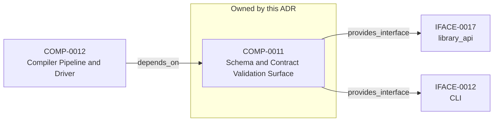

<!--
integrity_schema_version: 1
generated: deterministic_projection_v1
artifact_kind: rendered_adr_markdown
generator_id: adr-projection-markdown
generator_version: 3
hash_algorithm: sha256
source_hash: e6b65ab897645896767cded43f88375d95f8b9efbfc724624c5e30efefa662b5
rendered_hash: fc8d2b9047e187d2501db7c9527b2bb0bbb326a84b95463473c76534b6fbd91c
-->

# ADR-PC-0002: Schema and Contract Validation

## Identity / Status

**Type:** physical-component  
**Status:** accepted  
**Alias:** ADR-PC-0002  
**Authoring contract:** authoring v1.5  
**Created:** 2026-03-15  
**Modified:** 2026-08-27  
**Authors:** adr-architecture-kit  
**Domains:** validation, schema, contracts  
**Implements Logical:** [ADR-L-0008](../logical/ADR-L-0008-validation-modes-for-draft-and-complete-adrs.md), [ADR-L-0010](../logical/ADR-L-0010-kernel-interface-contract-and-validation-profiles.md), [ADR-L-0011](../logical/ADR-L-0011-metadata-schemas-and-remediation-ledger-enforcement.md), [ADR-L-0020](../logical/ADR-L-0020-semantic-implementation-attribution-and-cross-layer-architecture-relationships.md), [ADR-L-0002](../logical/ADR-L-0002-multi-scope-adr-architecture-for-sub-module-development.md)  
**Implements System:** [ADR-PS-0002](../physical-system/ADR-PS-0002-adr-kit-authoring-compiler-and-validation-system.md)  

## Architecture at a Glance

| | |
| --- | --- |
| Component | COMP-0011 — Schema and Contract Validation Surface |
| Type | service |
| System | [ADR-PS-0002](../physical-system/ADR-PS-0002-adr-kit-authoring-compiler-and-validation-system.md) |
| Purpose | Validate canonical architecture artifacts before downstream use. |
| Depended on by | Compiler Pipeline and Driver (COMP-0012) |
| Interfaces | IFACE-0012 — CLI; IFACE-0017 — library_api |
| Primary implementation | `src/adr_kit/schema/contract_validation.py` |

**Logical authority**
- [ADR-L-0008](../logical/ADR-L-0008-validation-modes-for-draft-and-complete-adrs.md)
- [ADR-L-0010](../logical/ADR-L-0010-kernel-interface-contract-and-validation-profiles.md)
- [ADR-L-0011](../logical/ADR-L-0011-metadata-schemas-and-remediation-ledger-enforcement.md)
- [ADR-L-0020](../logical/ADR-L-0020-semantic-implementation-attribution-and-cross-layer-architecture-relationships.md)
- [ADR-L-0002](../logical/ADR-L-0002-multi-scope-adr-architecture-for-sub-module-development.md)

## Change Safety

**Must preserve**
- Validation authority must remain canonical-artifact-first
- Consumer code must not invent a second contract interpretation path

**Known architectural surface**
- Depended on by: Compiler Pipeline and Driver (COMP-0012)
- Provided interfaces: IFACE-0012 — CLI; IFACE-0017 — library_api

**Verification**
- Primary tests: `tests/test_kernel_contract_validation.py`
- Unit coverage: >= 80%
- Success criteria: 2
- Integration checks: 3

## Context

Schema and contract validation is now a stable component boundary rather than
a generic legacy physical slice. It validates canonical ADR structure,
profile-specific contract requirements, project metadata, and implementation
attribution evidence. Validation of that evidence is structural for schema shape and architecture-aware when claims must resolve to canonical UUIDs and entity types. Legacy 1.0/1.2 evidence normalizes to the v1.5 claim shape only with repository or model 2.0 context.

## Architecture & Relationships

### Component Relationships

**Depended on by**
- Compiler Pipeline and Driver (COMP-0012)

  `COMP-0012 -[:depends_on]-> COMP-0011`

**Provides interface**
- CLI (IFACE-0012)

  `COMP-0011 -[:provides_interface]-> IFACE-0012`
- library_api (IFACE-0017)

  `COMP-0011 -[:provides_interface]-> IFACE-0017`

**Implements logical authority**
- Multi-Scope ADR Architecture for Sub-Module Development (ADR-L-0002)

  `ADR-PC-0002 -[:implements_logical]-> ADR-L-0002`
- Validation Modes for Draft and Complete ADRs (ADR-L-0008)

  `ADR-PC-0002 -[:implements_logical]-> ADR-L-0008`
- Kernel Interface Contract and Validation Profiles (ADR-L-0010)

  `ADR-PC-0002 -[:implements_logical]-> ADR-L-0010`
- Metadata Schemas and Remediation Ledger Enforcement (ADR-L-0011)

  `ADR-PC-0002 -[:implements_logical]-> ADR-L-0011`
- Semantic Implementation Attribution and Cross-Layer Architecture Relationships (ADR-L-0020)

  `ADR-PC-0002 -[:implements_logical]-> ADR-L-0020`

## Component Contract

### COMP-0011: Schema and Contract Validation Surface

**Type:** service

**Purpose:**

Validate canonical architecture artifacts before downstream use.

**Responsibilities:**

- Validate canonical ADR artifacts against schema and business rules
- Validate kernel-facing contract profiles
- Validate project metadata and implementation attribution evidence
- Provide CLI entrypoints for validation workflows

**Key Responsibilities:**
- Enforce schema and contract expectations
- Produce deterministic validation issues
- Fail closed on invalid contract inputs

**Success Criteria:**
- Contract/profile validation runs through shared validation surfaces
- Validation failures are deterministic and actionable

## Interfaces

### IFACE-0012 — CLI

**Type:** CLI

**Specification:**

Commands:
- adr validate
- adr validate-contract
- adr validate-project-metadata
- adr validate-generated-docs

### IFACE-0017 — library_api

**Type:** library_api

**Specification:**

A private validation application service supports both the compatibility-
preserved CLI adapter and the `adr_kit.api.validate_architecture` adapter.
The public adapter accepts one explicit project root, `complete` or
`structural` mode, and optional cross-reference validation, then translates
completed schema and semantic failures into immutable public diagnostics.

## Implementation Decisions

### IMPL-0012 — Treat schema and contract validation as a component boundary

**Rationale:**

Validation surfaces are independently public, stable, and reused across CLI
and downstream canonicalization workflows.

### IMPL-0018 — Translate shared validation service results at the public SDK boundary

**Rationale:**

CLI presentation and public SDK contracts have different compatibility
responsibilities. One private application service prevents divergent
validation semantics while adapters preserve CLI bytes and exclude validator
implementation objects from the SDK result graph.

## Engineering Contract

### Failure Semantics

Fail closed on invalid schema, invalid contract input, and invalid attribution evidence.

### Observability

**Logging:**
- Level: info
- Structured: false

**Metrics:**
- validation_runs_total (counter)

### Verification

**Unit test coverage:** >= 80%

**Integration tests:**

- Contract validation profile checks
- Project metadata validation
- Generated docs validation

## Implementation Map

| Role | Location |
| --- | --- |
| Primary implementation | `src/adr_kit/schema/contract_validation.py` |
| Entry point | `src/adr_kit/cli/main.py` |
| Primary tests | `tests/test_kernel_contract_validation.py` |

## Technology & Dependencies

### Python (language)
**Version:** >=3.14

**Rationale:**
Minimum supported Python minor is 3.14 (`requires-python >=3.14`); currently qualified released minor line is 3.14; repository reference interpreter is currently 3.14.7; new GA Python minors require explicit qualification before support is advertised.

### jsonschema (library)
**Version:** 4.x

**Rationale:**
Structural schema validation.

### Pydantic (library)
**Version:** 2.x

**Rationale:**
Typed contract and validation result models.

## Internal Structure

| Kind | Entity |
| --- | --- |
| Component | COMP-0011 — Schema and Contract Validation Surface |
| Implementation Decision | IMPL-0012 — Treat schema and contract validation as a component boundary |
| Implementation Decision | IMPL-0018 — Translate shared validation service results at the public SDK boundary |
| Interface | IFACE-0012 — CLI |
| Interface | IFACE-0017 — library_api |

## Neighbor Relationships

| Neighbor | Relationship | Exact Path |
| --- | --- | --- |
| [ADR-L-0002 — Multi-Scope ADR Architecture for Sub-Module Development](../logical/ADR-L-0002-multi-scope-adr-architecture-for-sub-module-development.md) | Schema and Contract Validation (ADR-PC-0002) → Multi-Scope ADR Architecture for Sub-Module Development (ADR-L-0002) | `ADR-PC-0002 -[:implements_logical]-> ADR-L-0002` |
| [ADR-L-0008 — Validation Modes for Draft and Complete ADRs](../logical/ADR-L-0008-validation-modes-for-draft-and-complete-adrs.md) | Schema and Contract Validation (ADR-PC-0002) → Validation Modes for Draft and Complete ADRs (ADR-L-0008) | `ADR-PC-0002 -[:implements_logical]-> ADR-L-0008` |
| [ADR-L-0010 — Kernel Interface Contract and Validation Profiles](../logical/ADR-L-0010-kernel-interface-contract-and-validation-profiles.md) | Schema and Contract Validation (ADR-PC-0002) → Kernel Interface Contract and Validation Profiles (ADR-L-0010) | `ADR-PC-0002 -[:implements_logical]-> ADR-L-0010` |
| [ADR-L-0011 — Metadata Schemas and Remediation Ledger Enforcement](../logical/ADR-L-0011-metadata-schemas-and-remediation-ledger-enforcement.md) | Schema and Contract Validation (ADR-PC-0002) → Metadata Schemas and Remediation Ledger Enforcement (ADR-L-0011) | `ADR-PC-0002 -[:implements_logical]-> ADR-L-0011` |
| [ADR-L-0020 — Semantic Implementation Attribution and Cross-Layer Architecture Relationships](../logical/ADR-L-0020-semantic-implementation-attribution-and-cross-layer-architecture-relationships.md) | Schema and Contract Validation (ADR-PC-0002) → Semantic Implementation Attribution and Cross-Layer Architecture Relationships (ADR-L-0020) | `ADR-PC-0002 -[:implements_logical]-> ADR-L-0020` |
| [ADR-PC-0003 — Compiler Pipeline and Driver](ADR-PC-0003-compiler-pipeline-and-driver.md) | Compiler Pipeline and Driver (COMP-0012) → Schema and Contract Validation Surface (COMP-0011) | `COMP-0012 -[:depends_on]-> COMP-0011` |

---

*Generated from ADR-PC-0002 by ADR Architecture Kit (projection v3)*