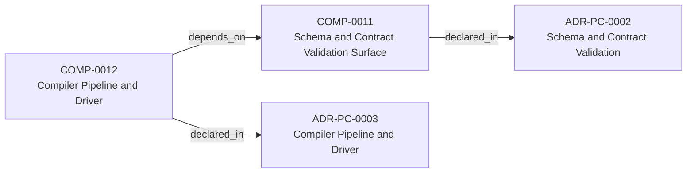
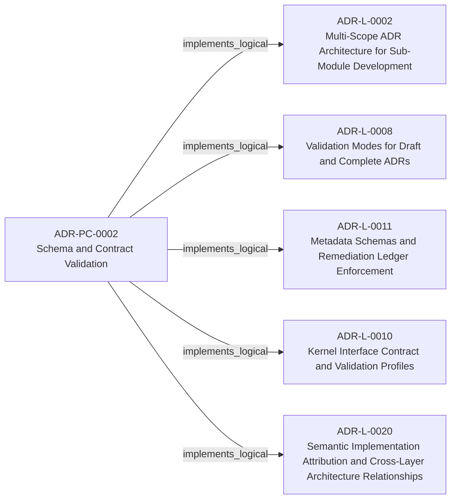
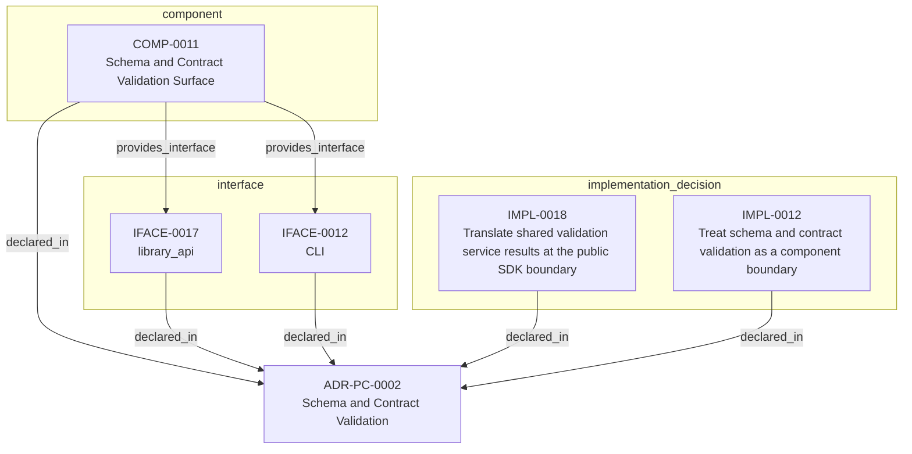

<!--
integrity_schema_version: 1
generated: deterministic_projection_v1
artifact_kind: rendered_adr_markdown
generator_id: adr-projection-markdown
generator_version: 3
hash_algorithm: sha256
source_hash: dd24c816f2cac209706713bd093ac5d7def8341b13f0946e186346a99a3db762
rendered_hash: a0b57bfb3fe5958945babc44a2bbcb917835703cef28e6794519aa27a5a8423b
-->

# ADR-PC-0002: Schema and Contract Validation

## Identity / Status

**Type:** physical-component  
**Status:** accepted  
**Alias:** ADR-PC-0002  
**Authoring contract:** authoring v1.5  
**Created:** 2026-03-15  
**Modified:** 2026-08-27  
**Authors:** adr-architecture-kit  
**Domains:** validation, schema, contracts  
**Implements Logical:** [ADR-L-0008](../logical/ADR-L-0008-validation-modes-for-draft-and-complete-adrs.md), [ADR-L-0010](../logical/ADR-L-0010-kernel-interface-contract-and-validation-profiles.md), [ADR-L-0011](../logical/ADR-L-0011-metadata-schemas-and-remediation-ledger-enforcement.md), [ADR-L-0020](../logical/ADR-L-0020-semantic-implementation-attribution-and-cross-layer-architecture-relationships.md), [ADR-L-0002](../logical/ADR-L-0002-multi-scope-adr-architecture-for-sub-module-development.md)  
**Implements System:** [ADR-PS-0002](../physical-system/ADR-PS-0002-adr-kit-authoring-compiler-and-validation-system.md)  

## Architecture Position

Physical-component ADRs author component, interface, and implementation entities. Topology is not authored here; neighborhood uses compiled semantic architecture edges plus structural bridges.

**Containing system(s):**
- [ADR-PS-0002](../physical-system/ADR-PS-0002-adr-kit-authoring-compiler-and-validation-system.md)

**Logical authority implemented:**
- [ADR-L-0008](../logical/ADR-L-0008-validation-modes-for-draft-and-complete-adrs.md)
- [ADR-L-0010](../logical/ADR-L-0010-kernel-interface-contract-and-validation-profiles.md)
- [ADR-L-0011](../logical/ADR-L-0011-metadata-schemas-and-remediation-ledger-enforcement.md)
- [ADR-L-0020](../logical/ADR-L-0020-semantic-implementation-attribution-and-cross-layer-architecture-relationships.md)
- [ADR-L-0002](../logical/ADR-L-0002-multi-scope-adr-architecture-for-sub-module-development.md)

**Component(s) owned by this ADR:**
- COMP-0011 — Schema and Contract Validation Surface (service)

**Component type(s):** service

**Authored purpose:**
- Validate canonical architecture artifacts before downstream use.

**Depended on by:**
- Compiler Pipeline and Driver (COMP-0012)

**Provided interface types:** CLI, library_api

**Implementation location(s):**
- Primary implementation: src/adr_kit/schema/contract_validation.py
- Entry point: src/adr_kit/cli/main.py
- Primary tests: tests/test_kernel_contract_validation.py

## Architecture Neighborhood

### Semantic architecture inventory

- `depends_on`: COMP-0012 → COMP-0011
- `implements_logical`: ADR-PC-0002 → ADR-L-0002
- `implements_logical`: ADR-PC-0002 → ADR-L-0008
- `implements_logical`: ADR-PC-0002 → ADR-L-0011
- `implements_logical`: ADR-PC-0002 → ADR-L-0010
- `implements_logical`: ADR-PC-0002 → ADR-L-0020

### Component Relationships

**Depended on by**
- Compiler Pipeline and Driver (COMP-0012)
  - `COMP-0012 -[:depends_on]-> COMP-0011`

**Provides interface**
- CLI (IFACE-0012)
  - `COMP-0011 -[:provides_interface]-> IFACE-0012`
- library_api (IFACE-0017)
  - `COMP-0011 -[:provides_interface]-> IFACE-0017`

**Implements logical authority**
- Multi-Scope ADR Architecture for Sub-Module Development (ADR-L-0002)
  - `ADR-PC-0002 -[:implements_logical]-> ADR-L-0002`
- Validation Modes for Draft and Complete ADRs (ADR-L-0008)
  - `ADR-PC-0002 -[:implements_logical]-> ADR-L-0008`
- Kernel Interface Contract and Validation Profiles (ADR-L-0010)
  - `ADR-PC-0002 -[:implements_logical]-> ADR-L-0010`
- Metadata Schemas and Remediation Ledger Enforcement (ADR-L-0011)
  - `ADR-PC-0002 -[:implements_logical]-> ADR-L-0011`
- Semantic Implementation Attribution and Cross-Layer Architecture Relationships (ADR-L-0020)
  - `ADR-PC-0002 -[:implements_logical]-> ADR-L-0020`

## Neighbor Relationships

### ADR-L-0002 — Multi-Scope ADR Architecture for Sub-Module Development

Schema and Contract Validation (ADR-PC-0002)
    -[:implements_logical]->
Multi-Scope ADR Architecture for Sub-Module Development (ADR-L-0002)

`ADR-PC-0002 -[:implements_logical]-> ADR-L-0002`

**Peer context:** The adr-architecture-kit is being actively developed in a single workspace alongside
multiple sub-modules (ste-runtime, future services) that will eventually become
independent services. Each sub-module needs to leverage the ADR system for its own
architectural documentation while being developed in parallel within the monorepo.

[Open projection](../logical/ADR-L-0002-multi-scope-adr-architecture-for-sub-module-development.md)
### ADR-L-0008 — Validation Modes for Draft and Complete ADRs

Schema and Contract Validation (ADR-PC-0002)
    -[:implements_logical]->
Validation Modes for Draft and Complete ADRs (ADR-L-0008)

`ADR-PC-0002 -[:implements_logical]-> ADR-L-0008`

**Peer context:** The ADR Architecture Kit currently couples schema validation to completeness for
several ADR types. That behavior is useful for acceptance gates, but it is too
strict for the actual design workflow used in this workspace.

[Open projection](../logical/ADR-L-0008-validation-modes-for-draft-and-complete-adrs.md)
### ADR-L-0010 — Kernel Interface Contract and Validation Profiles

Schema and Contract Validation (ADR-PC-0002)
    -[:implements_logical]->
Kernel Interface Contract and Validation Profiles (ADR-L-0010)

`ADR-PC-0002 -[:implements_logical]-> ADR-L-0010`

**Peer context:** adr-architecture-kit is transitioning from an implicit generator toolkit into
an explicit architecture compiler with a defined contract boundary to the STE
kernel. The plan work established that the compiler's guaranteed contract
surface is broader than the kernel's minimal load subset: the contract family
is all generated artifacts under `adrs/index/` plus `manifest.yaml`, while
individual consumers may rely on narrower subsets.

[Open projection](../logical/ADR-L-0010-kernel-interface-contract-and-validation-profiles.md)
### ADR-L-0011 — Metadata Schemas and Remediation Ledger Enforcement

Schema and Contract Validation (ADR-PC-0002)
    -[:implements_logical]->
Metadata Schemas and Remediation Ledger Enforcement (ADR-L-0011)

`ADR-PC-0002 -[:implements_logical]-> ADR-L-0011`

**Peer context:** The compiler contract now distinguishes fully compliant bundles from
sentinel-backed brownfield and migration bundles. That boundary is only safe
if sentinel use is narrow, explicitly tracked, and moved toward approved
canonical content through a monotonic workflow.

[Open projection](../logical/ADR-L-0011-metadata-schemas-and-remediation-ledger-enforcement.md)
### ADR-L-0020 — Semantic Implementation Attribution and Cross-Layer Architecture Relationships

Schema and Contract Validation (ADR-PC-0002)
    -[:implements_logical]->
Semantic Implementation Attribution and Cross-Layer Architecture Relationships (ADR-L-0020)

`ADR-PC-0002 -[:implements_logical]-> ADR-L-0020`

**Peer context:** ADR-L-0004 established implementation attribution as an explicit intent
surface. ADR-L-0019 made canonical machine identity a lowercase UUIDv7.
Attribution evidence still cited human aliases (`ADR-L-*`, `INV-*`) and
could not name typed relationships to nested architecture entities.

[Open projection](../logical/ADR-L-0020-semantic-implementation-attribution-and-cross-layer-architecture-relationships.md)
### ADR-PC-0003 — Compiler Pipeline and Driver

Compiler Pipeline and Driver (COMP-0012)
    -[:depends_on]->
Schema and Contract Validation Surface (COMP-0011)

`COMP-0012 -[:depends_on]-> COMP-0011`

**Peer context:** The compiler driver and explicit pipeline now own deterministic architecture
compilation across parse, analysis, emission, and recursive scope
orchestration. The command-line behavior is compatibility-relevant, while the
Python compiler pipeline, passes, `ArchModel`, emitters, and result plumbing are
internal reference implementation and are not a supported SDK facade.

[Open projection](ADR-PC-0003-compiler-pipeline-and-driver.md)

## Context

Schema and contract validation is now a stable component boundary rather than
a generic legacy physical slice. It validates canonical ADR structure,
profile-specific contract requirements, project metadata, and implementation
attribution evidence. Validation of that evidence is structural for schema shape and architecture-aware when claims must resolve to canonical UUIDs and entity types. Legacy 1.0/1.2 evidence normalizes to the v1.5 claim shape only with repository or model 2.0 context.

## Internal Structure

- `component` COMP-0011 — Schema and Contract Validation Surface
- `implementation_decision` IMPL-0012 — Treat schema and contract validation as a component boundary
- `implementation_decision` IMPL-0018 — Translate shared validation service results at the public SDK boundary
- `interface` IFACE-0012 — CLI
- `interface` IFACE-0017 — library_api

## Type-specific Detail

### Before You Change This Component
**Must preserve:**
- Validation authority must remain canonical-artifact-first
- Consumer code must not invent a second contract interpretation path

**Public / exposed interfaces:**
- IFACE-0012 — CLI
- IFACE-0017 — library_api

**Depended on by:**
- Compiler Pipeline and Driver (COMP-0012)

**Verify with:**
- Contract/profile validation runs through shared validation surfaces
- Validation failures are deterministic and actionable
- tests/test_kernel_contract_validation.py
- >= 80%
- - Contract validation profile checks
- Project metadata validation
- Generated docs validation

### COMP-0011: Schema and Contract Validation Surface

**Type:** service

**Purpose:**

Validate canonical architecture artifacts before downstream use.

**Responsibilities:**

- Validate canonical ADR artifacts against schema and business rules
- Validate kernel-facing contract profiles
- Validate project metadata and implementation attribution evidence
- Provide CLI entrypoints for validation workflows

**Key Responsibilities:**
- Enforce schema and contract expectations
- Produce deterministic validation issues
- Fail closed on invalid contract inputs

**Must Remain True:**
- Validation authority must remain canonical-artifact-first
- Consumer code must not invent a second contract interpretation path

**Success Criteria:**
- Contract/profile validation runs through shared validation surfaces
- Validation failures are deterministic and actionable

### IFACE-0012 — CLI

**Type:** CLI

**Specification:**

Commands:
- adr validate
- adr validate-contract
- adr validate-project-metadata
- adr validate-generated-docs

### IFACE-0017 — library_api

**Type:** library_api

**Specification:**

A private validation application service supports both the compatibility-
preserved CLI adapter and the `adr_kit.api.validate_architecture` adapter.
The public adapter accepts one explicit project root, `complete` or
`structural` mode, and optional cross-reference validation, then translates
completed schema and semantic failures into immutable public diagnostics.

### IMPL-0012 — Treat schema and contract validation as a component boundary

**Decision:**

Treat schema and contract validation as a component boundary

**Rationale:**

Validation surfaces are independently public, stable, and reused across CLI
and downstream canonicalization workflows.

### IMPL-0018 — Translate shared validation service results at the public SDK boundary

**Decision:**

Translate shared validation service results at the public SDK boundary

**Rationale:**

CLI presentation and public SDK contracts have different compatibility
responsibilities. One private application service prevents divergent
validation semantics while adapters preserve CLI bytes and exclude validator
implementation objects from the SDK result graph.

## Engineering Contract

### Failure Semantics

Fail closed on invalid schema, invalid contract input, and invalid attribution evidence.

### Observability

**Logging:**
- Level: info
- Structured: false

**Metrics:**
- validation_runs_total (counter)

### Verification

**Unit test coverage:** >= 80%

**Integration tests:**

- Contract validation profile checks
- Project metadata validation
- Generated docs validation

## Implementation Locations

| Role | Location |
| --- | --- |
| Primary implementation | `src/adr_kit/schema/contract_validation.py` |
| Entry point | `src/adr_kit/cli/main.py` |
| Primary tests | `tests/test_kernel_contract_validation.py` |

## Technology Stack

### Python (language)
**Version:** >=3.14

**Rationale:**
Minimum supported Python minor is 3.14 (`requires-python >=3.14`); currently qualified released minor line is 3.14; repository reference interpreter is currently 3.14.7; new GA Python minors require explicit qualification before support is advertised.

### jsonschema (library)
**Version:** 4.x

**Rationale:**
Structural schema validation.

### Pydantic (library)
**Version:** 2.x

**Rationale:**
Typed contract and validation result models.

---

*Generated from ADR-PC-0002 by ADR Architecture Kit (projection v3)*