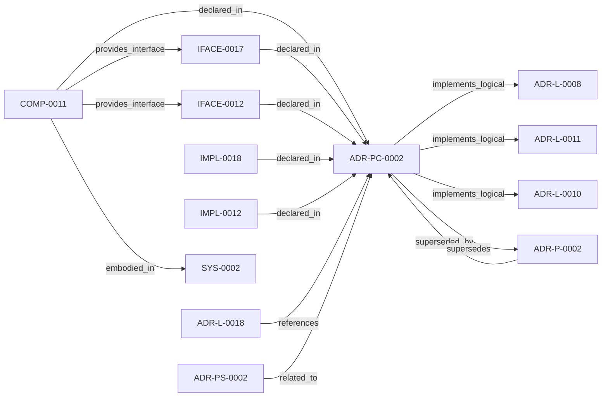

<!--
integrity_schema_version: 1
generated: deterministic_projection_v1
artifact_kind: rendered_adr_markdown
generator_id: adr-projection-markdown
generator_version: 2
hash_algorithm: sha256
source_hash: 9c76f9c1869f8f33d9f98c1d67b82ed207d0ce7123d5b5185e5deb3e2ee3b10f
rendered_hash: 81de24ce757337a6b0e2bf14fb0331921a1d5a64f740133da5e5c4f1788293e3
-->

# ADR-PC-0002: Schema and Contract Validation

**Status:** proposed  
**Created:** 2026-03-15  
**Modified:** 2026-08-06  
**Authors:** adr-architecture-kit  
**Domains:** validation, schema, contracts  
**Alias name:** schema-and-contract-validation  

**Implements Logical:** [ADR-L-0008](../logical/ADR-L-0008-validation-modes-for-draft-and-complete-adrs.md), [ADR-L-0010](../logical/ADR-L-0010-kernel-interface-contract-and-validation-profiles.md), [ADR-L-0011](../logical/ADR-L-0011-metadata-schemas-and-remediation-ledger-enforcement.md)  
**Technologies:** python, jsonschema, pydantic  

**Implements System:** [ADR-PS-0002](../physical-system/ADR-PS-0002-adr-kit-authoring-compiler-and-validation-system.md)  

## Context

Schema and contract validation is now a stable component boundary rather than
a generic legacy physical slice. It validates canonical ADR structure,
profile-specific contract requirements, project metadata, and implementation
attribution evidence.

## Technology Stack

### Python (language)

**Version:** 3.11

**Rationale:**
Existing implementation language.

### jsonschema (library)

**Version:** 4.x

**Rationale:**
Structural schema validation.

### Pydantic (library)

**Version:** 2.x

**Rationale:**
Typed contract and validation result models.

## Relationship graph

## Related ADRs

### ADR-L-0008 — Validation Modes for Draft and Complete ADRs

**Relationships:**
- this ADR -[:implements_logical]-> 019fee89-e616-7066-8d2f-3acc7f469f72

**Context:** The ADR Architecture Kit currently couples schema validation to completeness for
several ADR types. That behavior is useful for acceptance gates, but it is too
strict for the actual design workflow used in this workspace.

[Open projection](../logical/ADR-L-0008-validation-modes-for-draft-and-complete-adrs.md)
### ADR-L-0010 — Kernel Interface Contract and Validation Profiles

**Relationships:**
- this ADR -[:implements_logical]-> 019fee89-e616-7d61-8e35-f11ba2ddd75d

**Context:** adr-architecture-kit is transitioning from an implicit generator toolkit into
an explicit architecture compiler with a defined contract boundary to the STE
kernel. The plan work established that the compiler's guaranteed contract
surface is broader than the kernel's minimal load subset: the contract family
is all generated artifacts under `adrs/index/` plus `manifest.yaml`, while
individual consumers may rely on narrower subsets.

[Open projection](../logical/ADR-L-0010-kernel-interface-contract-and-validation-profiles.md)
### ADR-L-0011 — Metadata Schemas and Remediation Ledger Enforcement

**Relationships:**
- this ADR -[:implements_logical]-> 019fee89-e616-7b97-971d-ae165d13bf9c

**Context:** The compiler contract now distinguishes fully compliant bundles from
sentinel-backed brownfield and migration bundles. That boundary is only safe
if sentinel use is narrow, explicitly tracked, and moved toward approved
canonical content through a monotonic workflow.

[Open projection](../logical/ADR-L-0011-metadata-schemas-and-remediation-ledger-enforcement.md)
### ADR-L-0018 — Schema v1.2 and Normalized Semantic Foundation

**Relationships:**
- 019fee89-e617-7f4d-811d-4862645a55c5 -[:references]-> this ADR

**Context:** Phase 1 established a narrow supported authoring SDK while explicitly deferring
schema expansion, normalized-model expansion, assertion identity, bindings, and
topology identity. The repository now needs those contracts as an additive
semantic foundation for future consumers, without implementing the Phase 3 graph
bundle or absorbing authority owned by runtime, rules, substrate, or admission
systems.

[Open projection](../logical/ADR-L-0018-schema-v1-2-and-normalized-semantic-foundation.md)
### ADR-P-0002 — JSON Schema Validation with YAML Document Format

**Relationships:**
- 019fee89-e618-7a2f-aa3e-1f892cdf9410 -[:superseded_by]-> this ADR
- this ADR -[:supersedes]-> 019fee89-e618-7a2f-aa3e-1f892cdf9410

**Context:** This ADR specifies the use of JSON Schema for validation with YAML as the document
format. This combination provides deterministic validation (JSON Schema) with
human-readable authoring (YAML with embedded markdown).

[Open projection](../physical/ADR-P-0002-json-schema-validation-with-yaml-document-format.md)
### ADR-PS-0002 — ADR Kit Authoring Compiler and Validation System

**Relationships:**
- 019fee89-e618-7d04-9337-4aa2d3258507 -[:related_to]-> this ADR

**Context:** adr-architecture-kit operates as an authoring-time compiler and validation system rather
than a collection of unrelated generators. The implementation includes an
explicit compiler pipeline, contract validation, normalized repository/model
access, integrity verification, and CLI orchestration over those surfaces.

[Open projection](../physical-system/ADR-PS-0002-adr-kit-authoring-compiler-and-validation-system.md)

## Component Specifications

### COMP-0011: Schema and Contract Validation Surface (service)

**Responsibilities:**
- Validate canonical ADR artifacts against schema and business rules
- Validate kernel-facing contract profiles
- Validate project metadata and implementation attribution evidence
- Provide CLI entrypoints for validation workflows

**Interfaces:**
- **IFACE-0012** (CLI): Commands:
- adr validate
- adr validate-contract
- adr validate-project-metadata
- adr validate-gene...- **IFACE-0017** (library_api): A private validation application service supports both the compatibility-
preserved CLI adapter and ...

**Implementation Identifiers:**
- Module Path: `src/adr_kit/schema/contract_validation.py`

## Implementation Decisions

### IMPL-0012: Treat schema and contract validation as a component boundary

**Rationale:**
Validation surfaces are independently public, stable, and reused across CLI
and downstream canonicalization workflows.

### IMPL-0018: Translate shared validation service results at the public SDK boundary

**Rationale:**
CLI presentation and public SDK contracts have different compatibility
responsibilities. One private application service prevents divergent
validation semantics while adapters preserve CLI bytes and exclude validator
implementation objects from the SDK result graph.

---

*Generated from ADR-PC-0002 by ADR Architecture Kit*