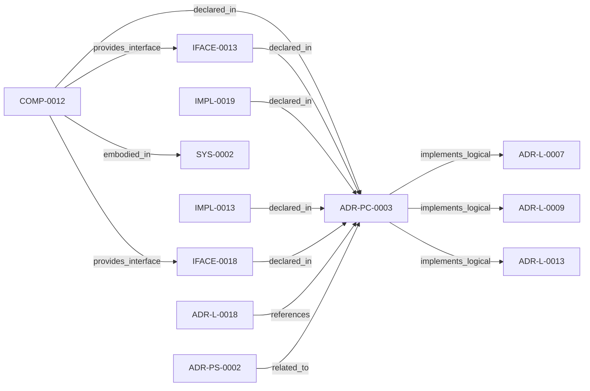

<!--
integrity_schema_version: 1
generated: deterministic_projection_v1
artifact_kind: rendered_adr_markdown
generator_id: adr-projection-markdown
generator_version: 2
hash_algorithm: sha256
source_hash: 27b9f31d3bdf5bd5c6197c4e0cec900c965d2b53de779b5642d33b5e5e9d3bff
rendered_hash: 6ef78ac56975d31c57c2075df9ecc10d7487457bc5f5dc527cc89c20826b39a9
-->

# ADR-PC-0003: Compiler Pipeline and Driver

**Status:** proposed  
**Created:** 2026-03-15  
**Modified:** 2026-08-05  **Authors:** adr-architecture-kit  
**Domains:** compiler, pipeline, tooling  
**Alias name:** adr-pc-0003-compiler-pipeline-and-driver  
**Implements Logical:** [ADR-L-0007](../logical/ADR-L-0007-deterministic-documentation-projection.md), [ADR-L-0009](../logical/ADR-L-0009-derived-architecture-discovery-surfaces.md), [ADR-L-0013](../logical/ADR-L-0013-architecture-repository-boundary-and-normalized-semantic-model.md)  
**Technologies:** python, yaml, click
**Implements System:** [ADR-PS-0002](../physical-system/ADR-PS-0002-adr-kit-authoring-compiler-and-validation-system.md)
## Context

The compiler driver and explicit pipeline now own deterministic architecture
compilation across parse, analysis, emission, and recursive scope
orchestration. The command-line behavior is compatibility-relevant, while the
Python compiler pipeline, passes, `ArchModel`, emitters, and result plumbing are
internal reference implementation and are not a supported SDK facade.

## Technology Stack

### Python (language)

**Version:** 3.11

**Rationale:**
Existing compiler implementation language.

### Click (tooling)

**Version:** 8.x

**Rationale:**
CLI orchestration for compile entrypoints.

## Relationship graph

## Related ADRs

### ADR-L-0007 — Deterministic Documentation Projection

**Relationships:**
- this ADR -[:implements_logical]-> 019fee89-e615-7b9c-8e3f-32ceeda01491

**Context:** The repository already treats several human-readable artifacts as derived state:
ADR human projections under adrs/adr-projection/, manifest summaries, and the AI-first SYSTEM-OVERVIEW
are generated from structured or code-defined sources. That behavior now needs
explicit architectural authority so future contributors do not reintroduce
manually maintained documentation that drifts from canonical artifacts.

[Open projection](../logical/ADR-L-0007-deterministic-documentation-projection.md)
### ADR-L-0009 — Derived Architecture Discovery Surfaces

**Relationships:**
- this ADR -[:implements_logical]-> 019fee89-e616-770c-a025-2c241a720730

**Context:** adr-architecture-kit is primarily machine-facing tooling used by agents to
reason over canonical architecture artifacts. Relying on agents to scan raw
ADR bodies for discovery is inconsistent with the toolkit's AI-first design
theory: discovery surfaces should be explicit, deterministic, cheap to query,
and derived from canonical authority.

[Open projection](../logical/ADR-L-0009-derived-architecture-discovery-surfaces.md)
### ADR-L-0013 — Architecture Repository Boundary and Normalized Semantic Model

**Relationships:**
- this ADR -[:implements_logical]-> 019fee89-e616-7c4e-953c-b7349412a784

**Context:** adr-architecture-kit now has an explicit compiler pipeline, a compiler IR
(`ArchModel`), compiled registry bundles, and an additive architecture graph.
Those pieces are sufficient to produce deterministic machine-facing artifacts,
and ArchitectureRepository already defines the semantic in-process boundary.
Phase 1 adds a narrow supported authoring facade that reuses that seam without
expanding the normalized model or exposing compiler internals.

[Open projection](../logical/ADR-L-0013-architecture-repository-boundary-and-normalized-semantic-model.md)
### ADR-L-0018 — Schema v1.2 and Normalized Semantic Foundation

**Relationships:**
- 019fee89-e617-7f4d-811d-4862645a55c5 -[:references]-> this ADR

**Context:** Phase 1 established a narrow supported authoring SDK while explicitly deferring
schema expansion, normalized-model expansion, assertion identity, bindings, and
topology identity. The repository now needs those contracts as an additive
semantic foundation for future consumers, without implementing the Phase 3 graph
bundle or absorbing authority owned by runtime, rules, substrate, or admission
systems.

[Open projection](../logical/ADR-L-0018-schema-v1-2-and-normalized-semantic-foundation.md)
### ADR-PS-0002 — ADR Kit Authoring Compiler and Validation System

**Relationships:**
- 019fee89-e618-7d04-9337-4aa2d3258507 -[:related_to]-> this ADR

**Context:** adr-architecture-kit operates as an authoring-time compiler and validation system rather
than a collection of unrelated generators. The implementation includes an
explicit compiler pipeline, contract validation, normalized repository/model
access, integrity verification, and CLI orchestration over those surfaces.

[Open projection](../physical-system/ADR-PS-0002-adr-kit-authoring-compiler-and-validation-system.md)

## Component Specifications

### COMP-0012: Compiler Pipeline and Driver (service)

**Responsibilities:**
- Build compiler pipeline state from canonical scope inputs
- Execute deterministic pass ordering
- Emit architecture bundle, manifest, graph, and rendered outputs
- Support recursive multi-scope compilation and reporting
- Preserve existing CLI commands, options, outputs, diagnostics, and exit behavior

**Interfaces:**
- **IFACE-0013** (CLI): Commands:
- adr compile
- adr generate-architecture-index
- adr generate-manifest
- adr generate-adr...- **IFACE-0018** (library_api): A private compilation application service supports a restricted
`adr_kit.api.compile_architecture` a...

**Implementation Identifiers:**
- Service Name: `adr-compiler`
- Module Path: `src/adr_kit/compiler/driver.py`

## Implementation Decisions

### IMPL-0013: Keep compiler orchestration as a dedicated component

**Rationale:**
The explicit pipeline and driver are a dedicated authoring-time implementation
component. Their CLI behavior and generated compatibility surfaces are guarded,
but their Python internals remain evolvable and must not be described as a
stable public runtime API.

### IMPL-0019: Contain compiler internals behind public and CLI application-service adapters

**Rationale:**
Shared orchestration preserves output and diagnostic semantics without
promoting `ArchModel`, compiler configuration, passes, emitters, internal
artifacts, or mutable diagnostic logs into the supported SDK. CLI behavioral
snapshots guard delegation independently from the narrower facade contract.

---

*Generated from ADR-PC-0003 by ADR Architecture Kit*