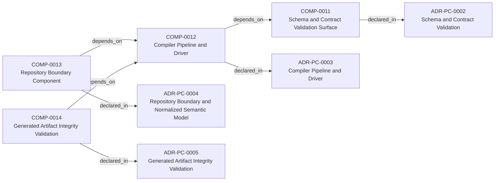
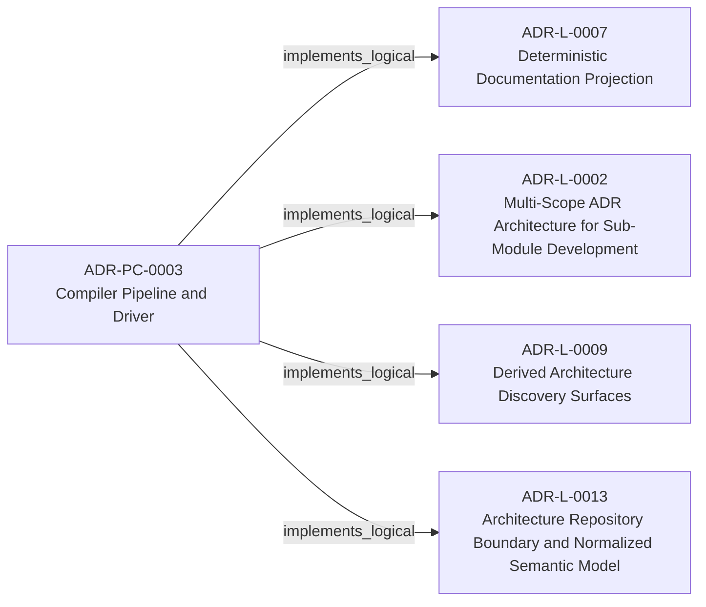
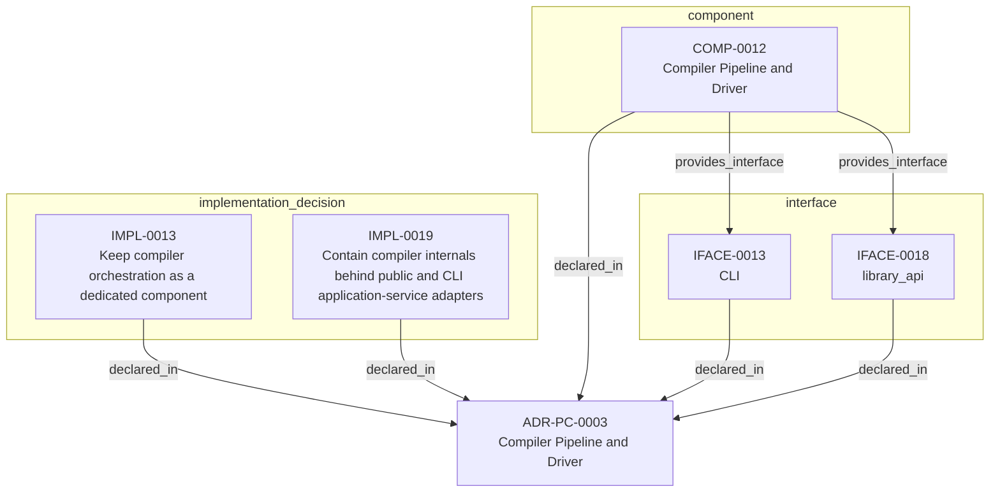

<!--
integrity_schema_version: 1
generated: deterministic_projection_v1
artifact_kind: rendered_adr_markdown
generator_id: adr-projection-markdown
generator_version: 3
hash_algorithm: sha256
source_hash: 76bf6707ecd190fd5301c646691c917234b6ab143d732a09c57bda67bb380df6
rendered_hash: 77e33335e4547a5ca708b9af96be5d0ab78d2246864511472d0f25980d538c6e
-->

# ADR-PC-0003: Compiler Pipeline and Driver

## Identity / Status

**Type:** physical-component  
**Status:** accepted  
**Alias:** ADR-PC-0003  
**Authoring contract:** authoring v1.5  
**Created:** 2026-03-15  
**Modified:** 2026-08-27  
**Authors:** adr-architecture-kit  
**Domains:** compiler, pipeline, tooling  
**Implements Logical:** [ADR-L-0007](../logical/ADR-L-0007-deterministic-documentation-projection.md), [ADR-L-0009](../logical/ADR-L-0009-derived-architecture-discovery-surfaces.md), [ADR-L-0013](../logical/ADR-L-0013-architecture-repository-boundary-and-normalized-semantic-model.md), [ADR-L-0002](../logical/ADR-L-0002-multi-scope-adr-architecture-for-sub-module-development.md)  
**Implements System:** [ADR-PS-0002](../physical-system/ADR-PS-0002-adr-kit-authoring-compiler-and-validation-system.md)  

## Architecture Position

Physical-component ADRs author component, interface, and implementation entities. Topology is not authored here; neighborhood uses compiled semantic architecture edges plus structural bridges.

**Containing system(s):**
- [ADR-PS-0002](../physical-system/ADR-PS-0002-adr-kit-authoring-compiler-and-validation-system.md)

**Logical authority implemented:**
- [ADR-L-0007](../logical/ADR-L-0007-deterministic-documentation-projection.md)
- [ADR-L-0009](../logical/ADR-L-0009-derived-architecture-discovery-surfaces.md)
- [ADR-L-0013](../logical/ADR-L-0013-architecture-repository-boundary-and-normalized-semantic-model.md)
- [ADR-L-0002](../logical/ADR-L-0002-multi-scope-adr-architecture-for-sub-module-development.md)

**Component(s) owned by this ADR:**
- COMP-0012 — Compiler Pipeline and Driver (service)

**Component type(s):** service

**Authored purpose:**
- Compile canonical architecture artifacts into derived outputs.

**Depends on:**
- Schema and Contract Validation Surface (COMP-0011)

**Depended on by:**
- Repository Boundary Component (COMP-0013)
- Generated Artifact Integrity Validation (COMP-0014)

**Provided interface types:** CLI, library_api

**Implementation location(s):**
- Primary implementation: src/adr_kit/compiler/driver.py
- Service: adr-compiler
- Entry point: src/adr_kit/cli/main.py
- Primary tests: tests/test_compiler_driver.py

## Architecture Neighborhood

### Semantic architecture inventory

- `depends_on`: COMP-0012 → COMP-0011
- `depends_on`: COMP-0013 → COMP-0012
- `depends_on`: COMP-0014 → COMP-0012
- `implements_logical`: ADR-PC-0003 → ADR-L-0007
- `implements_logical`: ADR-PC-0003 → ADR-L-0002
- `implements_logical`: ADR-PC-0003 → ADR-L-0009
- `implements_logical`: ADR-PC-0003 → ADR-L-0013

### Component Relationships

**Depends on**
- Schema and Contract Validation Surface (COMP-0011)
  - `COMP-0012 -[:depends_on]-> COMP-0011`

**Depended on by**
- Repository Boundary Component (COMP-0013)
  - `COMP-0013 -[:depends_on]-> COMP-0012`
- Generated Artifact Integrity Validation (COMP-0014)
  - `COMP-0014 -[:depends_on]-> COMP-0012`

**Provides interface**
- CLI (IFACE-0013)
  - `COMP-0012 -[:provides_interface]-> IFACE-0013`
- library_api (IFACE-0018)
  - `COMP-0012 -[:provides_interface]-> IFACE-0018`

**Implements logical authority**
- Multi-Scope ADR Architecture for Sub-Module Development (ADR-L-0002)
  - `ADR-PC-0003 -[:implements_logical]-> ADR-L-0002`
- Deterministic Documentation Projection (ADR-L-0007)
  - `ADR-PC-0003 -[:implements_logical]-> ADR-L-0007`
- Derived Architecture Discovery Surfaces (ADR-L-0009)
  - `ADR-PC-0003 -[:implements_logical]-> ADR-L-0009`
- Architecture Repository Boundary and Normalized Semantic Model (ADR-L-0013)
  - `ADR-PC-0003 -[:implements_logical]-> ADR-L-0013`

## Neighbor Relationships

### ADR-L-0002 — Multi-Scope ADR Architecture for Sub-Module Development

Compiler Pipeline and Driver (ADR-PC-0003)
    -[:implements_logical]->
Multi-Scope ADR Architecture for Sub-Module Development (ADR-L-0002)

`ADR-PC-0003 -[:implements_logical]-> ADR-L-0002`

**Peer context:** The adr-architecture-kit is being actively developed in a single workspace alongside
multiple sub-modules (ste-runtime, future services) that will eventually become
independent services. Each sub-module needs to leverage the ADR system for its own
architectural documentation while being developed in parallel within the monorepo.

[Open projection](../logical/ADR-L-0002-multi-scope-adr-architecture-for-sub-module-development.md)
### ADR-L-0007 — Deterministic Documentation Projection

Compiler Pipeline and Driver (ADR-PC-0003)
    -[:implements_logical]->
Deterministic Documentation Projection (ADR-L-0007)

`ADR-PC-0003 -[:implements_logical]-> ADR-L-0007`

**Peer context:** The repository already treats several human-readable artifacts as derived state:
ADR human projections under adrs/adr-projection/, manifest summaries, and the AI-first SYSTEM-OVERVIEW
are generated from structured or code-defined sources. That behavior now needs
explicit architectural authority so future contributors do not reintroduce
manually maintained documentation that drifts from canonical artifacts.

[Open projection](../logical/ADR-L-0007-deterministic-documentation-projection.md)
### ADR-L-0009 — Derived Architecture Discovery Surfaces

Compiler Pipeline and Driver (ADR-PC-0003)
    -[:implements_logical]->
Derived Architecture Discovery Surfaces (ADR-L-0009)

`ADR-PC-0003 -[:implements_logical]-> ADR-L-0009`

**Peer context:** adr-architecture-kit is primarily machine-facing tooling used by agents to
reason over canonical architecture artifacts. Relying on agents to scan raw
ADR bodies for discovery is inconsistent with the toolkit's AI-first design
theory: discovery surfaces should be explicit, deterministic, cheap to query,
and derived from canonical authority.

[Open projection](../logical/ADR-L-0009-derived-architecture-discovery-surfaces.md)
### ADR-L-0013 — Architecture Repository Boundary and Normalized Semantic Model

Compiler Pipeline and Driver (ADR-PC-0003)
    -[:implements_logical]->
Architecture Repository Boundary and Normalized Semantic Model (ADR-L-0013)

`ADR-PC-0003 -[:implements_logical]-> ADR-L-0013`

**Peer context:** adr-architecture-kit now has an explicit compiler pipeline, a compiler IR
(`ArchModel`), compiled registry bundles, and an additive architecture graph.
Those pieces are sufficient to produce deterministic machine-facing artifacts,
and ArchitectureRepository already defines the semantic in-process boundary.
Phase 1 adds a narrow supported authoring facade that reuses that seam without
expanding the normalized model or exposing compiler internals.

[Open projection](../logical/ADR-L-0013-architecture-repository-boundary-and-normalized-semantic-model.md)
### ADR-PC-0002 — Schema and Contract Validation

Compiler Pipeline and Driver (COMP-0012)
    -[:depends_on]->
Schema and Contract Validation Surface (COMP-0011)

`COMP-0012 -[:depends_on]-> COMP-0011`

**Peer context:** Schema and contract validation is now a stable component boundary rather than
a generic legacy physical slice. It validates canonical ADR structure,
profile-specific contract requirements, project metadata, and implementation
attribution evidence. Validation of that evidence is structural for schema shape and architecture-aware when claims must resolve to canonical UUIDs and entity types. Legacy 1.0/1.2 evidence normalizes to the v1.5 claim shape only with repository or model 2.0 context.

[Open projection](ADR-PC-0002-schema-and-contract-validation.md)
### ADR-PC-0004 — Repository Boundary and Normalized Semantic Model

Repository Boundary Component (COMP-0013)
    -[:depends_on]->
Compiler Pipeline and Driver (COMP-0012)

`COMP-0013 -[:depends_on]-> COMP-0012`

**Peer context:** ArchitectureRepository and NormalizedArchitectureModel are the stable
in-process semantic boundary for consumers. Phase 1 adds a narrow supported
authoring facade that reuses those contracts without wrapping or changing the
normalized model and without making registry loaders or path helpers public.

[Open projection](ADR-PC-0004-repository-boundary-and-normalized-semantic-model.md)
### ADR-PC-0005 — Generated Artifact Integrity Validation

Generated Artifact Integrity Validation (COMP-0014)
    -[:depends_on]->
Compiler Pipeline and Driver (COMP-0012)

`COMP-0014 -[:depends_on]-> COMP-0012`

**Peer context:** Generated artifact integrity validation verifies freshness, tamper status,
integrity headers, and scope-local generated outputs. It is a distinct public
subsystem used by validator and governance flows.

[Open projection](ADR-PC-0005-generated-artifact-integrity-validation.md)

## Context

The compiler driver and explicit pipeline now own deterministic architecture
compilation across parse, analysis, emission, and recursive scope
orchestration. The command-line behavior is compatibility-relevant, while the
Python compiler pipeline, passes, `ArchModel`, emitters, and result plumbing are
internal reference implementation and are not a supported SDK facade.

## Internal Structure

- `component` COMP-0012 — Compiler Pipeline and Driver
- `implementation_decision` IMPL-0013 — Keep compiler orchestration as a dedicated component
- `implementation_decision` IMPL-0019 — Contain compiler internals behind public and CLI application-service adapters
- `interface` IFACE-0013 — CLI
- `interface` IFACE-0018 — library_api

## Type-specific Detail

### Before You Change This Component
**Must preserve:**
- Derived outputs remain non-authoritative
- Pass ordering must stay compiler-owned and explicit
- Internal compiler types must not cross the supported public facade

**Public / exposed interfaces:**
- IFACE-0013 — CLI
- IFACE-0018 — library_api

**Depends on:**
- Schema and Contract Validation Surface (COMP-0011)

**Depended on by:**
- Repository Boundary Component (COMP-0013)
- Generated Artifact Integrity Validation (COMP-0014)

**Verify with:**
- adr compile remains the compatibility-preserved authoring CLI orchestration path
- Runtime machine-artifact authority remains owned by ste-runtime
- Recursive compilation produces scope-local artifacts deterministically
- tests/test_compiler_driver.py
- >= 80%
- - Single-scope compilation
- Recursive workspace compilation
- Bundle and graph emission

### COMP-0012: Compiler Pipeline and Driver

**Type:** service

**Purpose:**

Compile canonical architecture artifacts into derived outputs.

**Responsibilities:**

- Build compiler pipeline state from canonical scope inputs
- Execute deterministic pass ordering
- Emit architecture bundle, manifest, graph, and rendered outputs
- Support recursive multi-scope compilation and reporting
- Preserve existing CLI commands, options, outputs, diagnostics, and exit behavior

**Key Responsibilities:**
- Own compile orchestration
- Keep emission deterministic
- Support recursive workspace compilation

**Must Remain True:**
- Derived outputs remain non-authoritative
- Pass ordering must stay compiler-owned and explicit
- Internal compiler types must not cross the supported public facade

**Success Criteria:**
- adr compile remains the compatibility-preserved authoring CLI orchestration path
- Runtime machine-artifact authority remains owned by ste-runtime
- Recursive compilation produces scope-local artifacts deterministically

### IFACE-0013 — CLI

**Type:** CLI

**Specification:**

Commands:
- adr compile
- adr generate-architecture-index
- adr generate-manifest
- adr generate-adr-projection - adr generate-rendered-docs

### IFACE-0018 — library_api

**Type:** library_api

**Specification:**

A private compilation application service supports a restricted
`adr_kit.api.compile_architecture` adapter and a compatibility CLI adapter.
The public adapter accepts one explicit scope and only registries, manifest,
and markdown groups. The CLI adapter retains graph, recursive, check,
strict/lenient, contract-profile, output, diagnostic, and exit behavior.

### IMPL-0013 — Keep compiler orchestration as a dedicated component

**Decision:**

Keep compiler orchestration as a dedicated component

**Rationale:**

The explicit pipeline and driver are a dedicated authoring-time implementation
component. Their CLI behavior and generated compatibility surfaces are guarded,
but their Python internals remain evolvable and must not be described as a
stable public runtime API.

### IMPL-0019 — Contain compiler internals behind public and CLI application-service adapters

**Decision:**

Contain compiler internals behind public and CLI application-service adapters

**Rationale:**

Shared orchestration preserves output and diagnostic semantics without
promoting `ArchModel`, compiler configuration, passes, emitters, internal
artifacts, or mutable diagnostic logs into the supported SDK. CLI behavioral
snapshots guard delegation independently from the narrower facade contract.

## Engineering Contract

### Failure Semantics

Surface compilation diagnostics and fail closed on invalid bundles when required.

### Observability

**Logging:**
- Level: info
- Structured: false

**Metrics:**
- compiler_runs_total (counter)

### Verification

**Unit test coverage:** >= 80%

**Integration tests:**

- Single-scope compilation
- Recursive workspace compilation
- Bundle and graph emission

## Implementation Locations

| Role | Location |
| --- | --- |
| Primary implementation | `src/adr_kit/compiler/driver.py` |
| Service | `adr-compiler` |
| Entry point | `src/adr_kit/cli/main.py` |
| Primary tests | `tests/test_compiler_driver.py` |

## Technology Stack

### Python (language)
**Version:** >=3.14

**Rationale:**
Minimum supported Python minor is 3.14 (`requires-python >=3.14`); currently qualified released minor line is 3.14; repository reference interpreter is currently 3.14.7; new GA Python minors require explicit qualification before support is advertised.

### Click (tooling)
**Version:** 8.x

**Rationale:**
CLI orchestration for compile entrypoints.

---

*Generated from ADR-PC-0003 by ADR Architecture Kit (projection v3)*