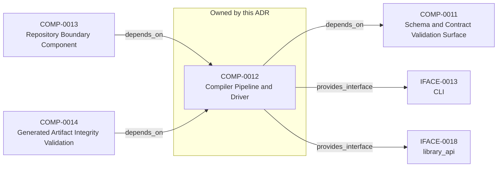

<!--
integrity_schema_version: 1
generated: deterministic_projection_v1
artifact_kind: rendered_adr_markdown
generator_id: adr-projection-markdown
generator_version: 3
hash_algorithm: sha256
source_hash: 58de8d65865d9c476c2c69d0b267d1245c01f1e44e3224268f0a49a1bcace7d1
rendered_hash: 8df0682bbd55f8e829e5c09795c1eae927c6c36aeb4792d7931662cade7bc984
-->

# ADR-PC-0003: Compiler Pipeline and Driver

## Identity / Status

**Type:** physical-component  
**Status:** accepted  
**Alias:** ADR-PC-0003  
**Authoring contract:** authoring v1.5  
**Created:** 2026-03-15  
**Modified:** 2026-08-27  
**Authors:** erik.gallmann  
**Domains:** compiler, pipeline, tooling  
**Implements Logical:** [ADR-L-0007](../logical/ADR-L-0007-deterministic-documentation-projection.md), [ADR-L-0009](../logical/ADR-L-0009-derived-architecture-discovery-surfaces.md), [ADR-L-0013](../logical/ADR-L-0013-architecture-repository-boundary-and-normalized-semantic-model.md), [ADR-L-0002](../logical/ADR-L-0002-multi-scope-adr-architecture-for-sub-module-development.md)  
**Implements System:** [ADR-PS-0002](../physical-system/ADR-PS-0002-adr-kit-authoring-compiler-and-validation-system.md)  

## Architecture at a Glance

| | |
| --- | --- |
| Component | COMP-0012 — Compiler Pipeline and Driver |
| Type | service |
| System | [ADR-PS-0002](../physical-system/ADR-PS-0002-adr-kit-authoring-compiler-and-validation-system.md) |
| Purpose | Compile canonical architecture artifacts into derived outputs. |
| Depends on | Schema and Contract Validation Surface (COMP-0011) |
| Depended on by | Repository Boundary Component (COMP-0013); Generated Artifact Integrity Validation (COMP-0014) |
| Interfaces | IFACE-0013 — CLI; IFACE-0018 — library_api |
| Primary implementation | `src/adr_kit/compiler/driver.py` |

**Logical authority**
- [ADR-L-0007](../logical/ADR-L-0007-deterministic-documentation-projection.md)
- [ADR-L-0009](../logical/ADR-L-0009-derived-architecture-discovery-surfaces.md)
- [ADR-L-0013](../logical/ADR-L-0013-architecture-repository-boundary-and-normalized-semantic-model.md)
- [ADR-L-0002](../logical/ADR-L-0002-multi-scope-adr-architecture-for-sub-module-development.md)

## Change Safety

**Must preserve**
- Derived outputs remain non-authoritative
- Pass ordering must stay compiler-owned and explicit
- Internal compiler types must not cross the supported public facade

**Known architectural surface**
- Depends on: Schema and Contract Validation Surface (COMP-0011)
- Depended on by: Repository Boundary Component (COMP-0013); Generated Artifact Integrity Validation (COMP-0014)
- Provided interfaces: IFACE-0013 — CLI; IFACE-0018 — library_api

**Verification**
- Primary tests: `tests/test_compiler_driver.py`
- Unit coverage: >= 80%
- Success criteria: 3
- Integration checks: 3

## Context

The compiler driver and explicit pipeline now own deterministic architecture
compilation across parse, analysis, emission, and recursive scope
orchestration. The command-line behavior is compatibility-relevant, while the
Python compiler pipeline, passes, `ArchModel`, emitters, and result plumbing are
internal reference implementation and are not a supported SDK facade.

## Architecture & Relationships

### Component Relationships

**Depends on**
- Schema and Contract Validation Surface (COMP-0011)

  `COMP-0012 -[:depends_on]-> COMP-0011`

**Depended on by**
- Repository Boundary Component (COMP-0013)

  `COMP-0013 -[:depends_on]-> COMP-0012`
- Generated Artifact Integrity Validation (COMP-0014)

  `COMP-0014 -[:depends_on]-> COMP-0012`

**Provides interface**
- CLI (IFACE-0013)

  `COMP-0012 -[:provides_interface]-> IFACE-0013`
- library_api (IFACE-0018)

  `COMP-0012 -[:provides_interface]-> IFACE-0018`

**Implements logical authority**
- Multi-Scope ADR Architecture for Sub-Module Development (ADR-L-0002)

  `ADR-PC-0003 -[:implements_logical]-> ADR-L-0002`
- Deterministic Documentation Projection (ADR-L-0007)

  `ADR-PC-0003 -[:implements_logical]-> ADR-L-0007`
- Derived Architecture Discovery Surfaces (ADR-L-0009)

  `ADR-PC-0003 -[:implements_logical]-> ADR-L-0009`
- Architecture Repository Boundary and Normalized Semantic Model (ADR-L-0013)

  `ADR-PC-0003 -[:implements_logical]-> ADR-L-0013`

## Component Contract

### COMP-0012: Compiler Pipeline and Driver

**Type:** service

**Purpose:**

Compile canonical architecture artifacts into derived outputs.

**Responsibilities:**

- Build compiler pipeline state from canonical scope inputs
- Execute deterministic pass ordering
- Emit architecture bundle, manifest, graph, and rendered outputs
- Support recursive multi-scope compilation and reporting
- Preserve existing CLI commands, options, outputs, diagnostics, and exit behavior

**Key Responsibilities:**
- Own compile orchestration
- Keep emission deterministic
- Support recursive workspace compilation

**Success Criteria:**
- adr compile remains the compatibility-preserved authoring CLI orchestration path
- Runtime machine-artifact authority remains owned by ste-runtime
- Recursive compilation produces scope-local artifacts deterministically

## Interfaces

### IFACE-0013 — CLI

**Type:** CLI

**Specification:**

Commands:
- adr compile
- adr generate-architecture-index
- adr generate-manifest
- adr generate-adr-projection
- adr generate-rendered-docs

### IFACE-0018 — library_api

**Type:** library_api

**Specification:**

A private compilation application service supports a restricted
`adr_kit.api.compile_architecture` adapter and a compatibility CLI adapter.
The public adapter accepts one explicit scope and only registries, manifest,
and markdown groups. The CLI adapter retains graph, recursive, check,
strict/lenient, contract-profile, output, diagnostic, and exit behavior.

## Implementation Decisions

### IMPL-0013 — Keep compiler orchestration as a dedicated component

**Rationale:**

The explicit pipeline and driver are a dedicated authoring-time implementation
component. Their CLI behavior and generated compatibility surfaces are guarded,
but their Python internals remain evolvable and must not be described as a
stable public runtime API.

### IMPL-0019 — Contain compiler internals behind public and CLI application-service adapters

**Rationale:**

Shared orchestration preserves output and diagnostic semantics without
promoting `ArchModel`, compiler configuration, passes, emitters, internal
artifacts, or mutable diagnostic logs into the supported SDK. CLI behavioral
snapshots guard delegation independently from the narrower facade contract.

## Engineering Contract

### Failure Semantics

Surface compilation diagnostics and fail closed on invalid bundles when required.

### Observability

**Logging:**
- Level: info
- Structured: false

**Metrics:**
- compiler_runs_total (counter)

### Verification

**Unit test coverage:** >= 80%

**Integration tests:**

- Single-scope compilation
- Recursive workspace compilation
- Bundle and graph emission

## Implementation Map

| Role | Location |
| --- | --- |
| Primary implementation | `src/adr_kit/compiler/driver.py` |
| Service | `adr-compiler` |
| Entry point | `src/adr_kit/cli/main.py` |
| Primary tests | `tests/test_compiler_driver.py` |

## Technology & Dependencies

### Python (language)
**Version:** >=3.14

**Rationale:**
Minimum supported Python minor is 3.14 (`requires-python >=3.14`); currently qualified released minor line is 3.14; repository reference interpreter is currently 3.14.7; new GA Python minors require explicit qualification before support is advertised.

### Click (tooling)
**Version:** 8.x

**Rationale:**
CLI orchestration for compile entrypoints.

## Internal Structure

| Kind | Entity |
| --- | --- |
| Component | COMP-0012 — Compiler Pipeline and Driver |
| Implementation Decision | IMPL-0013 — Keep compiler orchestration as a dedicated component |
| Implementation Decision | IMPL-0019 — Contain compiler internals behind public and CLI application-service adapters |
| Interface | IFACE-0013 — CLI |
| Interface | IFACE-0018 — library_api |

## Neighbor Relationships

| Neighbor | Relationship | Exact Path |
| --- | --- | --- |
| [ADR-L-0002 — Multi-Scope ADR Architecture for Sub-Module Development](../logical/ADR-L-0002-multi-scope-adr-architecture-for-sub-module-development.md) | Compiler Pipeline and Driver (ADR-PC-0003) → Multi-Scope ADR Architecture for Sub-Module Development (ADR-L-0002) | `ADR-PC-0003 -[:implements_logical]-> ADR-L-0002` |
| [ADR-L-0007 — Deterministic Documentation Projection](../logical/ADR-L-0007-deterministic-documentation-projection.md) | Compiler Pipeline and Driver (ADR-PC-0003) → Deterministic Documentation Projection (ADR-L-0007) | `ADR-PC-0003 -[:implements_logical]-> ADR-L-0007` |
| [ADR-L-0009 — Derived Architecture Discovery Surfaces](../logical/ADR-L-0009-derived-architecture-discovery-surfaces.md) | Compiler Pipeline and Driver (ADR-PC-0003) → Derived Architecture Discovery Surfaces (ADR-L-0009) | `ADR-PC-0003 -[:implements_logical]-> ADR-L-0009` |
| [ADR-L-0013 — Architecture Repository Boundary and Normalized Semantic Model](../logical/ADR-L-0013-architecture-repository-boundary-and-normalized-semantic-model.md) | Compiler Pipeline and Driver (ADR-PC-0003) → Architecture Repository Boundary and Normalized Semantic Model (ADR-L-0013) | `ADR-PC-0003 -[:implements_logical]-> ADR-L-0013` |
| [ADR-PC-0002 — Schema and Contract Validation](ADR-PC-0002-schema-and-contract-validation.md) | Compiler Pipeline and Driver (COMP-0012) → Schema and Contract Validation Surface (COMP-0011) | `COMP-0012 -[:depends_on]-> COMP-0011` |
| [ADR-PC-0004 — Repository Boundary and Normalized Semantic Model](ADR-PC-0004-repository-boundary-and-normalized-semantic-model.md) | Repository Boundary Component (COMP-0013) → Compiler Pipeline and Driver (COMP-0012) | `COMP-0013 -[:depends_on]-> COMP-0012` |
| [ADR-PC-0005 — Generated Artifact Integrity Validation](ADR-PC-0005-generated-artifact-integrity-validation.md) | Generated Artifact Integrity Validation (COMP-0014) → Compiler Pipeline and Driver (COMP-0012) | `COMP-0014 -[:depends_on]-> COMP-0012` |

---

*Generated from ADR-PC-0003 by ADR Architecture Kit (projection v3)*