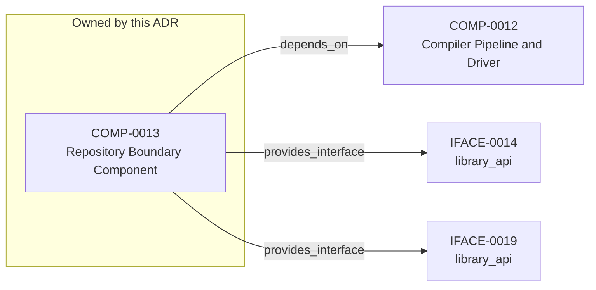

<!--
integrity_schema_version: 1
generated: deterministic_projection_v1
artifact_kind: rendered_adr_markdown
generator_id: adr-projection-markdown
generator_version: 3
hash_algorithm: sha256
source_hash: a809a91cc9d4b7d9e0b2fe3b8f4e0687fea43db5efd28f9e026ad0eeb5fe1ad0
rendered_hash: 2c083658e8609a89c6a2aa38b14dd16916624ddda9c6c9ed9ec17b249acdce83
-->

# ADR-PC-0004: Repository Boundary and Normalized Semantic Model

## Identity / Status

**Type:** physical-component  
**Status:** accepted  
**Alias:** ADR-PC-0004  
**Authoring contract:** authoring v1.5  
**Created:** 2026-03-15  
**Modified:** 2026-08-27  
**Authors:** erik.gallmann  
**Domains:** repository, semantic-model, tooling  
**Implements Logical:** [ADR-L-0013](../logical/ADR-L-0013-architecture-repository-boundary-and-normalized-semantic-model.md)  
**Implements System:** [ADR-PS-0002](../physical-system/ADR-PS-0002-adr-kit-authoring-compiler-and-validation-system.md)  

## Architecture at a Glance

| | |
| --- | --- |
| Component | COMP-0013 — Repository Boundary Component |
| Type | service |
| System | [ADR-PS-0002](../physical-system/ADR-PS-0002-adr-kit-authoring-compiler-and-validation-system.md) |
| Purpose | Provide a stable semantic boundary for in-process consumers. |
| Depends on | Compiler Pipeline and Driver (COMP-0012) |
| Interfaces | IFACE-0014 — library_api; IFACE-0019 — library_api |
| Primary implementation | `src/adr_kit/repository/architecture_repository.py` |

**Logical authority**
- [ADR-L-0013](../logical/ADR-L-0013-architecture-repository-boundary-and-normalized-semantic-model.md)

## Change Safety

**Must preserve**
- Consumers should not bypass the boundary for normal semantic access
- Boundary changes must remain additive

**Known architectural surface**
- Depends on: Compiler Pipeline and Driver (COMP-0012)
- Provided interfaces: IFACE-0014 — library_api; IFACE-0019 — library_api

**Verification**
- Primary tests: `tests/test_architecture_repository.py`
- Unit coverage: >= 80%
- Success criteria: 2
- Integration checks: 3

## Context

ArchitectureRepository and NormalizedArchitectureModel are the stable
in-process semantic boundary for consumers. Phase 1 adds a narrow supported
authoring facade that reuses those contracts without wrapping or changing the
normalized model and without making registry loaders or path helpers public.

## Architecture & Relationships

### Component Relationships

**Depends on**
- Compiler Pipeline and Driver (COMP-0012)

  `COMP-0013 -[:depends_on]-> COMP-0012`

**Provides interface**
- library_api (IFACE-0014)

  `COMP-0013 -[:provides_interface]-> IFACE-0014`
- library_api (IFACE-0019)

  `COMP-0013 -[:provides_interface]-> IFACE-0019`

**Implements logical authority**
- Architecture Repository Boundary and Normalized Semantic Model (ADR-L-0013)

  `ADR-PC-0004 -[:implements_logical]-> ADR-L-0013`

## Component Contract

### COMP-0013: Repository Boundary Component

**Type:** service

**Purpose:**

Provide a stable semantic boundary for in-process consumers.

**Responsibilities:**

- Load compiled architecture bundle artifacts
- Expose normalized semantic queries to in-process consumers
- Centralize provenance, unresolved, and ADR/status lookup logic
- Prevent ad hoc re-interpretation of compiled registries

**Key Responsibilities:**
- Load normalized bundle state
- Provide deterministic consumer queries
- Centralize semantic adaptation logic

**Success Criteria:**
- Consumer flows use ArchitectureRepository and NormalizedArchitectureModel
- Semantic adaptation stays centralized

## Interfaces

### IFACE-0014 — library_api

**Type:** library_api

**Specification:**

Public surfaces:
- ArchitectureRepository
- NormalizedArchitectureModel

### IFACE-0019 — library_api

**Type:** library_api

**Specification:**

`adr_kit.api.open_repository` resolves an explicit project root, eagerly
loads it, and returns the existing ArchitectureRepository. Capability
discovery is deterministic and local. Compilation model construction
reuses a private normalized-bundle helper shared with repository loading.
Registry loaders, path helpers, and internal registry models are excluded.

## Implementation Decisions

### IMPL-0014 — Treat the repository/model boundary as a first-class component

**Rationale:**

The repository boundary is stable runtime behavior and should be documented
as its own component authority.

### IMPL-0017 — Record the Phase 0 facade deferral and constrain future Assembler dependencies

**Rationale:**

Phase 0 preserved `ArchitectureRepository` and
`NormalizedArchitectureModel` exactly as the consumer seam and deferred a
facade. Phase 1 completes that bounded deferral through IFACE-0019 without
wrapping or changing either contract.
A future Assembler may depend only on that supported seam and must not bind
to compiler IR, compiler passes, raw ADR parsing, or generated-file layout.

### IMPL-0020 — Reuse private normalized-bundle assembly across repository and SDK compilation

**Rationale:**

Constructing the detached SDK model from the same emitted registry bytes and
private assembly logic used by ArchitectureRepository prevents semantic and
fingerprint drift while preserving the normalized model's existing shape and
behavior.

## Engineering Contract

### Failure Semantics

Fail closed on missing, malformed, or out-of-scope bundle references.

### Observability

**Logging:**
- Level: info
- Structured: false

**Metrics:**
- repository_loads_total (counter)

### Verification

**Unit test coverage:** >= 80%

**Integration tests:**

- Repository load and normalized lookup
- Scope boundary enforcement
- Legacy adaptation parity

## Implementation Map

| Role | Location |
| --- | --- |
| Primary implementation | `src/adr_kit/repository/architecture_repository.py` |
| Primary tests | `tests/test_architecture_repository.py` |

## Technology & Dependencies

### Python (language)
**Version:** >=3.14

**Rationale:**
Minimum supported Python minor is 3.14 (`requires-python >=3.14`); currently qualified released minor line is 3.14; repository reference interpreter is currently 3.14.7; new GA Python minors require explicit qualification before support is advertised.

### Pydantic (library)
**Version:** 2.x

**Rationale:**
Typed normalized semantic models.

## Internal Structure

| Kind | Entity |
| --- | --- |
| Component | COMP-0013 — Repository Boundary Component |
| Implementation Decision | IMPL-0014 — Treat the repository/model boundary as a first-class component |
| Implementation Decision | IMPL-0017 — Record the Phase 0 facade deferral and constrain future Assembler dependencies |
| Implementation Decision | IMPL-0020 — Reuse private normalized-bundle assembly across repository and SDK compilation |
| Interface | IFACE-0014 — library_api |
| Interface | IFACE-0019 — library_api |

## Neighbor Relationships

| Neighbor | Relationship | Exact Path |
| --- | --- | --- |
| [ADR-L-0013 — Architecture Repository Boundary and Normalized Semantic Model](../logical/ADR-L-0013-architecture-repository-boundary-and-normalized-semantic-model.md) | Repository Boundary and Normalized Semantic Model (ADR-PC-0004) → Architecture Repository Boundary and Normalized Semantic Model (ADR-L-0013) | `ADR-PC-0004 -[:implements_logical]-> ADR-L-0013` |
| [ADR-PC-0003 — Compiler Pipeline and Driver](ADR-PC-0003-compiler-pipeline-and-driver.md) | Repository Boundary Component (COMP-0013) → Compiler Pipeline and Driver (COMP-0012) | `COMP-0013 -[:depends_on]-> COMP-0012` |

---

*Generated from ADR-PC-0004 by ADR Architecture Kit (projection v3)*