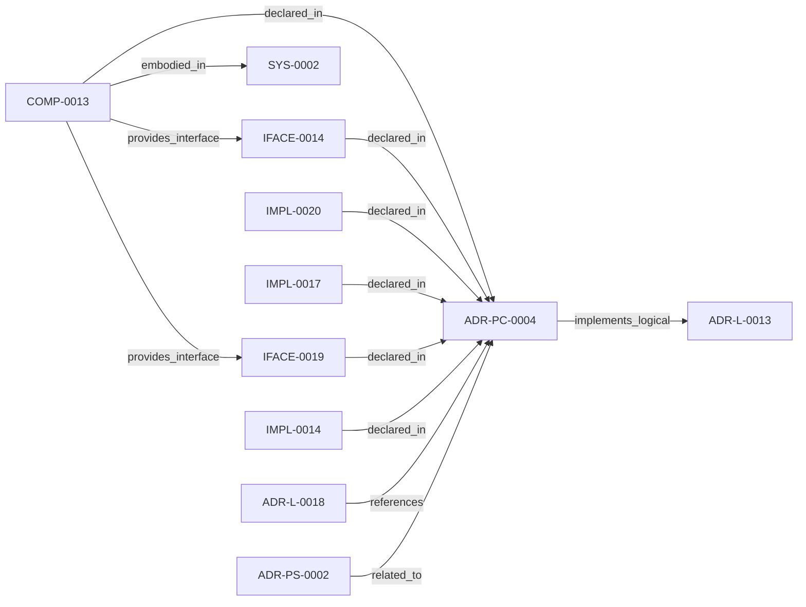

<!--
integrity_schema_version: 1
generated: deterministic_projection_v1
artifact_kind: rendered_adr_markdown
generator_id: adr-projection-markdown
generator_version: 2
hash_algorithm: sha256
source_hash: d69a35184511f3f02deb900ca3377c85b2388c6fb89f941a9a1f9fbbe210ced1
rendered_hash: 3817edce6daad6007fa132021331dcb03d648c379bdba28876ddc2bbfcc1bae8
-->

# ADR-PC-0004: Repository Boundary and Normalized Semantic Model

**Status:** proposed  
**Created:** 2026-03-15  
**Modified:** 2026-08-05  **Authors:** adr-architecture-kit  
**Domains:** repository, semantic-model, tooling  
**Alias name:** repository-boundary-and-normalized-semantic-model  
**Implements Logical:** [ADR-L-0013](../logical/ADR-L-0013-architecture-repository-boundary-and-normalized-semantic-model.md)  
**Technologies:** python, yaml, pydantic
**Implements System:** [ADR-PS-0002](../physical-system/ADR-PS-0002-adr-kit-authoring-compiler-and-validation-system.md)
## Context

ArchitectureRepository and NormalizedArchitectureModel are the stable
in-process semantic boundary for consumers. Phase 1 adds a narrow supported
authoring facade that reuses those contracts without wrapping or changing the
normalized model and without making registry loaders or path helpers public.

## Technology Stack

### Python (language)

**Version:** 3.11

**Rationale:**
Existing implementation language.

### Pydantic (library)

**Version:** 2.x

**Rationale:**
Typed normalized semantic models.

## Relationship graph

## Related ADRs

### ADR-L-0013 — Architecture Repository Boundary and Normalized Semantic Model

**Relationships:**
- this ADR -[:implements_logical]-> 019fee89-e616-7c4e-953c-b7349412a784

**Context:** adr-architecture-kit now has an explicit compiler pipeline, a compiler IR
(`ArchModel`), compiled registry bundles, and an additive architecture graph.
Those pieces are sufficient to produce deterministic machine-facing artifacts,
and ArchitectureRepository already defines the semantic in-process boundary.
Phase 1 adds a narrow supported authoring facade that reuses that seam without
expanding the normalized model or exposing compiler internals.

[Open projection](../logical/ADR-L-0013-architecture-repository-boundary-and-normalized-semantic-model.md)
### ADR-L-0018 — Schema v1.2 and Normalized Semantic Foundation

**Relationships:**
- 019fee89-e617-7f4d-811d-4862645a55c5 -[:references]-> this ADR

**Context:** Phase 1 established a narrow supported authoring SDK while explicitly deferring
schema expansion, normalized-model expansion, assertion identity, bindings, and
topology identity. The repository now needs those contracts as an additive
semantic foundation for future consumers, without implementing the Phase 3 graph
bundle or absorbing authority owned by runtime, rules, substrate, or admission
systems.

[Open projection](../logical/ADR-L-0018-schema-v1-2-and-normalized-semantic-foundation.md)
### ADR-PS-0002 — ADR Kit Authoring Compiler and Validation System

**Relationships:**
- 019fee89-e618-7d04-9337-4aa2d3258507 -[:related_to]-> this ADR

**Context:** adr-architecture-kit operates as an authoring-time compiler and validation system rather
than a collection of unrelated generators. The implementation includes an
explicit compiler pipeline, contract validation, normalized repository/model
access, integrity verification, and CLI orchestration over those surfaces.

[Open projection](../physical-system/ADR-PS-0002-adr-kit-authoring-compiler-and-validation-system.md)

## Component Specifications

### COMP-0013: Repository Boundary Component (service)

**Responsibilities:**
- Load compiled architecture bundle artifacts
- Expose normalized semantic queries to in-process consumers
- Centralize provenance, unresolved, and ADR/status lookup logic
- Prevent ad hoc re-interpretation of compiled registries

**Interfaces:**
- **IFACE-0014** (library_api): Public surfaces:
- ArchitectureRepository
- NormalizedArchitectureModel
...- **IFACE-0019** (library_api): `adr_kit.api.open_repository` resolves an explicit project root, eagerly
loads it, and returns the e...

**Implementation Identifiers:**
- Module Path: `src/adr_kit/repository/architecture_repository.py`

## Implementation Decisions

### IMPL-0014: Treat the repository/model boundary as a first-class component

**Rationale:**
The repository boundary is stable runtime behavior and should be documented
as its own component authority.

### IMPL-0017: Record the Phase 0 facade deferral and constrain future Assembler dependencies

**Rationale:**
Phase 0 preserved `ArchitectureRepository` and
`NormalizedArchitectureModel` exactly as the consumer seam and deferred a
facade. Phase 1 completes that bounded deferral through IFACE-0019 without
wrapping or changing either contract.
A future Assembler may depend only on that supported seam and must not bind
to compiler IR, compiler passes, raw ADR parsing, or generated-file layout.

### IMPL-0020: Reuse private normalized-bundle assembly across repository and SDK compilation

**Rationale:**
Constructing the detached SDK model from the same emitted registry bytes and
private assembly logic used by ArchitectureRepository prevents semantic and
fingerprint drift while preserving the normalized model's existing shape and
behavior.

---

*Generated from ADR-PC-0004 by ADR Architecture Kit*