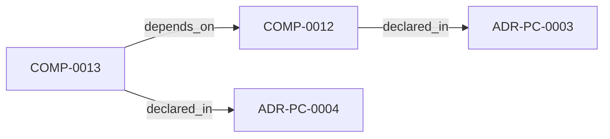
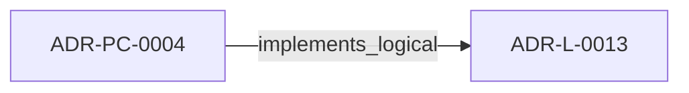
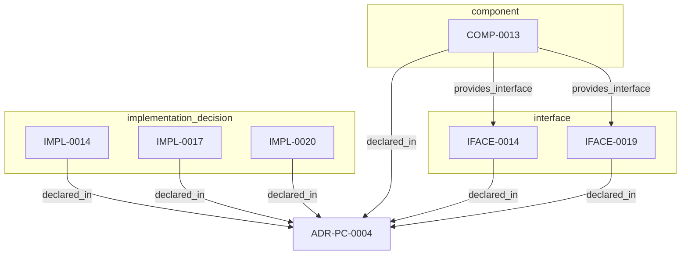

<!--
integrity_schema_version: 1
generated: deterministic_projection_v1
artifact_kind: rendered_adr_markdown
generator_id: adr-projection-markdown
generator_version: 3
hash_algorithm: sha256
source_hash: 6b20720d60dfdb04190ae4fb728924585e66927656a95be40aecea8800b330b2
rendered_hash: 66302385a3be36092726522506f058cb288b3b75920b0d331d0a01077a426c31
-->

# ADR-PC-0004: Repository Boundary and Normalized Semantic Model

## Identity / Status

**Type:** physical-component  
**Status:** accepted  
**Alias:** ADR-PC-0004  
**Alias name:** repository-boundary-and-normalized-semantic-model  
**Created:** 2026-03-15  
**Implements Logical:** [ADR-L-0013](../logical/ADR-L-0013-architecture-repository-boundary-and-normalized-semantic-model.md)  
**Implements System:** [ADR-PS-0002](../physical-system/ADR-PS-0002-adr-kit-authoring-compiler-and-validation-system.md)  

## Architecture Position

Physical-component ADRs author component, interface, and implementation entities. Topology is not authored here; neighborhood uses compiled semantic architecture edges plus structural bridges.

## Architecture Neighborhood

### Semantic architecture inventory

- `depends_on`: COMP-0013 → COMP-0012
- `implements_logical`: ADR-PC-0004 → ADR-L-0013

## Neighbor Relationships

### ADR-L-0013 — Architecture Repository Boundary and Normalized Semantic Model

- ADR-PC-0004 -[:implements_logical]-> ADR-L-0013 (peer ADR-L-0013)

**Context:** adr-architecture-kit now has an explicit compiler pipeline, a compiler IR
(`ArchModel`), compiled registry bundles, and an additive architecture graph.
Those pieces are sufficient to produce deterministic machine-facing artifacts,
and ArchitectureRepository already defines the semantic in-process boundary.
Phase 1 adds a narrow supported authoring facade that reuses that seam without
expanding the normalized model or exposing compiler internals.

[Open projection](../logical/ADR-L-0013-architecture-repository-boundary-and-normalized-semantic-model.md)
### ADR-PC-0003 — Compiler Pipeline and Driver

- COMP-0013 -[:depends_on]-> COMP-0012 (peer ADR-PC-0003)

**Context:** The compiler driver and explicit pipeline now own deterministic architecture
compilation across parse, analysis, emission, and recursive scope
orchestration. The command-line behavior is compatibility-relevant, while the
Python compiler pipeline, passes, `ArchModel`, emitters, and result plumbing are
internal reference implementation and are not a supported SDK facade.

[Open projection](ADR-PC-0003-compiler-pipeline-and-driver.md)

## Context

ArchitectureRepository and NormalizedArchitectureModel are the stable
in-process semantic boundary for consumers. Phase 1 adds a narrow supported
authoring facade that reuses those contracts without wrapping or changing the
normalized model and without making registry loaders or path helpers public.

## Internal Structure

### COMP-0013: Repository Boundary Component (service)

**Responsibilities:**
- Load compiled architecture bundle artifacts
- Expose normalized semantic queries to in-process consumers
- Centralize provenance, unresolved, and ADR/status lookup logic
- Prevent ad hoc re-interpretation of compiled registries

**Interfaces:**
- **IFACE-0014** (library_api): Public surfaces:
- ArchitectureRepository
- NormalizedArchitectureModel

- **IFACE-0019** (library_api): `adr_kit.api.open_repository` resolves an explicit project root, eagerly
loads it, and returns the existing ArchitectureRepository. Capability
discovery is deterministic and local. Compilation model construction
reuses a private normalized-bundle helper shared with repository loading.
Registry loaders, path helpers, and internal registry models are excluded.

**Implementation Identifiers:**
- Module Path: `src/adr_kit/repository/architecture_repository.py`

- `component` COMP-0013 — Repository Boundary Component
- `implementation_decision` IMPL-0014 — Treat the repository/model boundary as a first-class component
- `implementation_decision` IMPL-0017 — Record the Phase 0 facade deferral and constrain future Assembler dependencies
- `implementation_decision` IMPL-0020 — Reuse private normalized-bundle assembly across repository and SDK compilation
- `interface` IFACE-0014 — 019fee89-e618-74e7-882f-04f858aecaf0
- `interface` IFACE-0019 — 019fee89-e618-7dab-893c-05d961de3a7d

## Technology Stack

### Python (language)

**Version:** >=3.14

**Rationale:**
Minimum supported Python minor is 3.14 (`requires-python >=3.14`); currently qualified released minor line is 3.14; repository reference interpreter is currently 3.14.7; new GA Python minors require explicit qualification before support is advertised. 

### Pydantic (library)

**Version:** 2.x

**Rationale:**
Typed normalized semantic models.

---

*Generated from ADR-PC-0004 by ADR Architecture Kit (projection v3)*