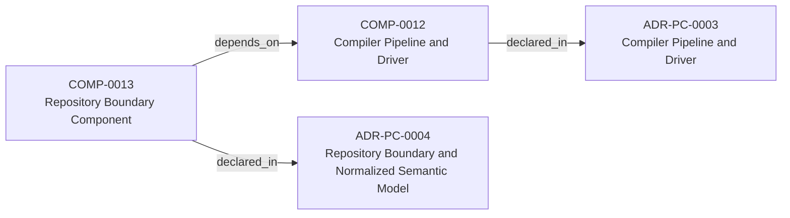
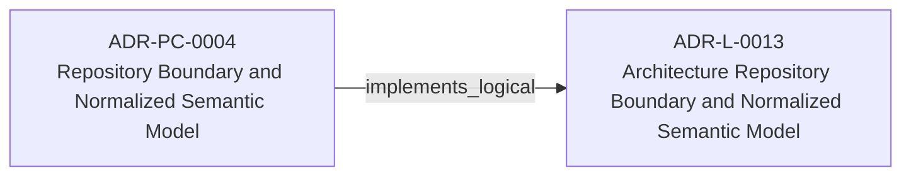
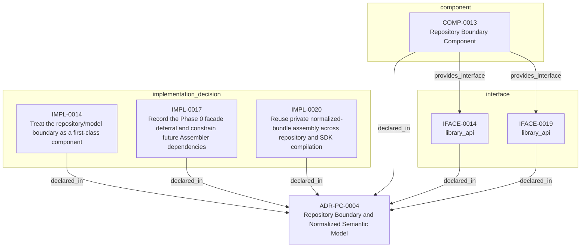

<!--
integrity_schema_version: 1
generated: deterministic_projection_v1
artifact_kind: rendered_adr_markdown
generator_id: adr-projection-markdown
generator_version: 3
hash_algorithm: sha256
source_hash: 14436cb36aa0e46700a92dcd6d5a82b0a794cd25dacfb47d6685888ea460951e
rendered_hash: a568438cec8009a2d3d165aa1be59e78e810b90dcfc58a811f537897090271d7
-->

# ADR-PC-0004: Repository Boundary and Normalized Semantic Model

## Identity / Status

**Type:** physical-component  
**Status:** accepted  
**Alias:** ADR-PC-0004  
**Authoring contract:** authoring v1.5  
**Created:** 2026-03-15  
**Modified:** 2026-08-27  
**Authors:** adr-architecture-kit  
**Domains:** repository, semantic-model, tooling  
**Implements Logical:** [ADR-L-0013](../logical/ADR-L-0013-architecture-repository-boundary-and-normalized-semantic-model.md)  
**Implements System:** [ADR-PS-0002](../physical-system/ADR-PS-0002-adr-kit-authoring-compiler-and-validation-system.md)  

## Architecture Position

Physical-component ADRs author component, interface, and implementation entities. Topology is not authored here; neighborhood uses compiled semantic architecture edges plus structural bridges.

**Containing system(s):**
- [ADR-PS-0002](../physical-system/ADR-PS-0002-adr-kit-authoring-compiler-and-validation-system.md)

**Logical authority implemented:**
- [ADR-L-0013](../logical/ADR-L-0013-architecture-repository-boundary-and-normalized-semantic-model.md)

**Component(s) owned by this ADR:**
- COMP-0013 — Repository Boundary Component (service)

**Component type(s):** service

**Authored purpose:**
- Provide a stable semantic boundary for in-process consumers.

**Depends on:**
- Compiler Pipeline and Driver (COMP-0012)

**Provided interface types:** library_api

**Implementation location(s):**
- Primary implementation: src/adr_kit/repository/architecture_repository.py
- Primary tests: tests/test_architecture_repository.py

## Architecture Neighborhood

### Semantic architecture inventory

- `depends_on`: COMP-0013 → COMP-0012
- `implements_logical`: ADR-PC-0004 → ADR-L-0013

### Component Relationships

**Depends on**
- Compiler Pipeline and Driver (COMP-0012)
  - `COMP-0013 -[:depends_on]-> COMP-0012`

**Provides interface**
- library_api (IFACE-0014)
  - `COMP-0013 -[:provides_interface]-> IFACE-0014`
- library_api (IFACE-0019)
  - `COMP-0013 -[:provides_interface]-> IFACE-0019`

**Implements logical authority**
- Architecture Repository Boundary and Normalized Semantic Model (ADR-L-0013)
  - `ADR-PC-0004 -[:implements_logical]-> ADR-L-0013`

## Neighbor Relationships

### ADR-L-0013 — Architecture Repository Boundary and Normalized Semantic Model

Repository Boundary and Normalized Semantic Model (ADR-PC-0004)
    -[:implements_logical]->
Architecture Repository Boundary and Normalized Semantic Model (ADR-L-0013)

`ADR-PC-0004 -[:implements_logical]-> ADR-L-0013`

**Peer context:** adr-architecture-kit now has an explicit compiler pipeline, a compiler IR
(`ArchModel`), compiled registry bundles, and an additive architecture graph.
Those pieces are sufficient to produce deterministic machine-facing artifacts,
and ArchitectureRepository already defines the semantic in-process boundary.
Phase 1 adds a narrow supported authoring facade that reuses that seam without
expanding the normalized model or exposing compiler internals.

[Open projection](../logical/ADR-L-0013-architecture-repository-boundary-and-normalized-semantic-model.md)
### ADR-PC-0003 — Compiler Pipeline and Driver

Repository Boundary Component (COMP-0013)
    -[:depends_on]->
Compiler Pipeline and Driver (COMP-0012)

`COMP-0013 -[:depends_on]-> COMP-0012`

**Peer context:** The compiler driver and explicit pipeline now own deterministic architecture
compilation across parse, analysis, emission, and recursive scope
orchestration. The command-line behavior is compatibility-relevant, while the
Python compiler pipeline, passes, `ArchModel`, emitters, and result plumbing are
internal reference implementation and are not a supported SDK facade.

[Open projection](ADR-PC-0003-compiler-pipeline-and-driver.md)

## Context

ArchitectureRepository and NormalizedArchitectureModel are the stable
in-process semantic boundary for consumers. Phase 1 adds a narrow supported
authoring facade that reuses those contracts without wrapping or changing the
normalized model and without making registry loaders or path helpers public.

## Internal Structure

- `component` COMP-0013 — Repository Boundary Component
- `implementation_decision` IMPL-0014 — Treat the repository/model boundary as a first-class component
- `implementation_decision` IMPL-0017 — Record the Phase 0 facade deferral and constrain future Assembler dependencies
- `implementation_decision` IMPL-0020 — Reuse private normalized-bundle assembly across repository and SDK compilation
- `interface` IFACE-0014 — library_api
- `interface` IFACE-0019 — library_api

## Type-specific Detail

### Before You Change This Component
**Must preserve:**
- Consumers should not bypass the boundary for normal semantic access
- Boundary changes must remain additive

**Public / exposed interfaces:**
- IFACE-0014 — library_api
- IFACE-0019 — library_api

**Depends on:**
- Compiler Pipeline and Driver (COMP-0012)

**Verify with:**
- Consumer flows use ArchitectureRepository and NormalizedArchitectureModel
- Semantic adaptation stays centralized
- tests/test_architecture_repository.py
- >= 80%
- - Repository load and normalized lookup
- Scope boundary enforcement
- Legacy adaptation parity

### COMP-0013: Repository Boundary Component

**Type:** service

**Purpose:**

Provide a stable semantic boundary for in-process consumers.

**Responsibilities:**

- Load compiled architecture bundle artifacts
- Expose normalized semantic queries to in-process consumers
- Centralize provenance, unresolved, and ADR/status lookup logic
- Prevent ad hoc re-interpretation of compiled registries

**Key Responsibilities:**
- Load normalized bundle state
- Provide deterministic consumer queries
- Centralize semantic adaptation logic

**Must Remain True:**
- Consumers should not bypass the boundary for normal semantic access
- Boundary changes must remain additive

**Success Criteria:**
- Consumer flows use ArchitectureRepository and NormalizedArchitectureModel
- Semantic adaptation stays centralized

### IFACE-0014 — library_api

**Type:** library_api

**Specification:**

Public surfaces:
- ArchitectureRepository
- NormalizedArchitectureModel

### IFACE-0019 — library_api

**Type:** library_api

**Specification:**

`adr_kit.api.open_repository` resolves an explicit project root, eagerly
loads it, and returns the existing ArchitectureRepository. Capability
discovery is deterministic and local. Compilation model construction
reuses a private normalized-bundle helper shared with repository loading.
Registry loaders, path helpers, and internal registry models are excluded.

### IMPL-0014 — Treat the repository/model boundary as a first-class component

**Decision:**

Treat the repository/model boundary as a first-class component

**Rationale:**

The repository boundary is stable runtime behavior and should be documented
as its own component authority.

### IMPL-0017 — Record the Phase 0 facade deferral and constrain future Assembler dependencies

**Decision:**

Record the Phase 0 facade deferral and constrain future Assembler dependencies

**Rationale:**

Phase 0 preserved `ArchitectureRepository` and
`NormalizedArchitectureModel` exactly as the consumer seam and deferred a
facade. Phase 1 completes that bounded deferral through IFACE-0019 without
wrapping or changing either contract.
A future Assembler may depend only on that supported seam and must not bind
to compiler IR, compiler passes, raw ADR parsing, or generated-file layout.

### IMPL-0020 — Reuse private normalized-bundle assembly across repository and SDK compilation

**Decision:**

Reuse private normalized-bundle assembly across repository and SDK compilation

**Rationale:**

Constructing the detached SDK model from the same emitted registry bytes and
private assembly logic used by ArchitectureRepository prevents semantic and
fingerprint drift while preserving the normalized model's existing shape and
behavior.

## Engineering Contract

### Failure Semantics

Fail closed on missing, malformed, or out-of-scope bundle references.

### Observability

**Logging:**
- Level: info
- Structured: false

**Metrics:**
- repository_loads_total (counter)

### Verification

**Unit test coverage:** >= 80%

**Integration tests:**

- Repository load and normalized lookup
- Scope boundary enforcement
- Legacy adaptation parity

## Implementation Locations

| Role | Location |
| --- | --- |
| Primary implementation | `src/adr_kit/repository/architecture_repository.py` |
| Primary tests | `tests/test_architecture_repository.py` |

## Technology Stack

### Python (language)
**Version:** >=3.14

**Rationale:**
Minimum supported Python minor is 3.14 (`requires-python >=3.14`); currently qualified released minor line is 3.14; repository reference interpreter is currently 3.14.7; new GA Python minors require explicit qualification before support is advertised.

### Pydantic (library)
**Version:** 2.x

**Rationale:**
Typed normalized semantic models.

---

*Generated from ADR-PC-0004 by ADR Architecture Kit (projection v3)*