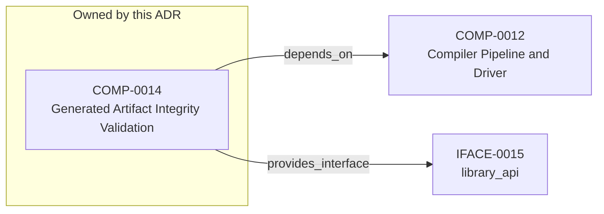

<!--
integrity_schema_version: 1
generated: deterministic_projection_v1
artifact_kind: rendered_adr_markdown
generator_id: adr-projection-markdown
generator_version: 3
hash_algorithm: sha256
source_hash: 6b0ab2f97a9c58dee76a531db9ad86751cdc11089dc4e1628bfccaefe2175ccf
rendered_hash: 4a9a8ce4f5e849b91c74c0fd07c6099475c7a04b6ca11de3c7cd1414f2ff7304
-->

# ADR-PC-0005: Generated Artifact Integrity Validation

## Identity / Status

**Type:** physical-component  
**Status:** accepted  
**Alias:** ADR-PC-0005  
**Authoring contract:** authoring v1.5  
**Created:** 2026-03-15  
**Modified:** 2026-08-27  
**Authors:** adr-architecture-kit  
**Domains:** integrity, validation, projections  
**Implements Logical:** [ADR-L-0007](../logical/ADR-L-0007-deterministic-documentation-projection.md), [ADR-L-0013](../logical/ADR-L-0013-architecture-repository-boundary-and-normalized-semantic-model.md)  
**Implements System:** [ADR-PS-0002](../physical-system/ADR-PS-0002-adr-kit-authoring-compiler-and-validation-system.md)  

## Architecture at a Glance

| | |
| --- | --- |
| Component | COMP-0014 — Generated Artifact Integrity Validation |
| Type | service |
| System | [ADR-PS-0002](../physical-system/ADR-PS-0002-adr-kit-authoring-compiler-and-validation-system.md) |
| Purpose | Protect derived artifacts from silent drift and tampering. |
| Depends on | Compiler Pipeline and Driver (COMP-0012) |
| Interfaces | IFACE-0015 — library_api |
| Primary implementation | `src/adr_kit/integrity/validation.py` |

**Logical authority**
- [ADR-L-0007](../logical/ADR-L-0007-deterministic-documentation-projection.md)
- [ADR-L-0013](../logical/ADR-L-0013-architecture-repository-boundary-and-normalized-semantic-model.md)

## Change Safety

**Must preserve**
- Derived artifacts remain non-authoritative
- Integrity validation must operate scope-locally

**Known architectural surface**
- Depends on: Compiler Pipeline and Driver (COMP-0012)
- Provided interfaces: IFACE-0015 — library_api

**Verification**
- Primary tests: `tests/test_generated_docs_integrity.py`
- Unit coverage: >= 80%
- Success criteria: 2
- Integration checks: 3

## Context

Generated artifact integrity validation verifies freshness, tamper status,
integrity headers, and scope-local generated outputs. It is a distinct public
subsystem used by validator and governance flows.

## Architecture & Relationships

### Component Relationships

**Depends on**
- Compiler Pipeline and Driver (COMP-0012)

  `COMP-0014 -[:depends_on]-> COMP-0012`

**Provides interface**
- library_api (IFACE-0015)

  `COMP-0014 -[:provides_interface]-> IFACE-0015`

**Implements logical authority**
- Deterministic Documentation Projection (ADR-L-0007)

  `ADR-PC-0005 -[:implements_logical]-> ADR-L-0007`
- Architecture Repository Boundary and Normalized Semantic Model (ADR-L-0013)

  `ADR-PC-0005 -[:implements_logical]-> ADR-L-0013`

## Component Contract

### COMP-0014: Generated Artifact Integrity Validation

**Type:** service

**Purpose:**

Protect derived artifacts from silent drift and tampering.

**Responsibilities:**

- Enumerate scope-local generated artifacts
- Validate integrity headers and source hashes
- Detect stale, tampered, or malformed generated outputs
- Support governance checks over generated artifacts

**Key Responsibilities:**
- Validate generated outputs deterministically
- Support governance and documentation checks

**Success Criteria:**
- Invalid generated outputs are surfaced explicitly
- Scope-local integrity checks remain deterministic

## Interfaces

### IFACE-0015 — library_api

**Type:** library_api

**Specification:**

Public surfaces:
- GeneratedArtifactValidator
- generated artifact integrity result models

## Implementation Decisions

### IMPL-0015 — Separate artifact integrity validation from discovery/indexing authority

**Rationale:**

Integrity validation is a runtime concern shared across generated artifact
kinds and deserves its own component authority.

## Engineering Contract

### Failure Semantics

Return explicit invalid states for malformed, stale, or tampered artifacts.

### Observability

**Logging:**
- Level: info
- Structured: false

**Metrics:**
- generated_artifact_validations_total (counter)

### Verification

**Unit test coverage:** >= 80%

**Integration tests:**

- Generated docs integrity checks
- Scope-local artifact enumeration
- Stale/tampered artifact detection

## Implementation Map

| Role | Location |
| --- | --- |
| Primary implementation | `src/adr_kit/integrity/validation.py` |
| Primary tests | `tests/test_generated_docs_integrity.py` |

## Technology & Dependencies

### Python (language)
**Version:** >=3.14

**Rationale:**
Minimum supported Python minor is 3.14 (`requires-python >=3.14`); currently qualified released minor line is 3.14; repository reference interpreter is currently 3.14.7; new GA Python minors require explicit qualification before support is advertised.

### PyYAML (library)
**Version:** 6.x

**Rationale:**
Generated artifact inspection and parsing.

## Internal Structure

| Kind | Entity |
| --- | --- |
| Component | COMP-0014 — Generated Artifact Integrity Validation |
| Implementation Decision | IMPL-0015 — Separate artifact integrity validation from discovery/indexing authority |
| Interface | IFACE-0015 — library_api |

## Neighbor Relationships

| Neighbor | Relationship | Exact Path |
| --- | --- | --- |
| [ADR-L-0007 — Deterministic Documentation Projection](../logical/ADR-L-0007-deterministic-documentation-projection.md) | Generated Artifact Integrity Validation (ADR-PC-0005) → Deterministic Documentation Projection (ADR-L-0007) | `ADR-PC-0005 -[:implements_logical]-> ADR-L-0007` |
| [ADR-L-0013 — Architecture Repository Boundary and Normalized Semantic Model](../logical/ADR-L-0013-architecture-repository-boundary-and-normalized-semantic-model.md) | Generated Artifact Integrity Validation (ADR-PC-0005) → Architecture Repository Boundary and Normalized Semantic Model (ADR-L-0013) | `ADR-PC-0005 -[:implements_logical]-> ADR-L-0013` |
| [ADR-PC-0003 — Compiler Pipeline and Driver](ADR-PC-0003-compiler-pipeline-and-driver.md) | Generated Artifact Integrity Validation (COMP-0014) → Compiler Pipeline and Driver (COMP-0012) | `COMP-0014 -[:depends_on]-> COMP-0012` |

---

*Generated from ADR-PC-0005 by ADR Architecture Kit (projection v3)*