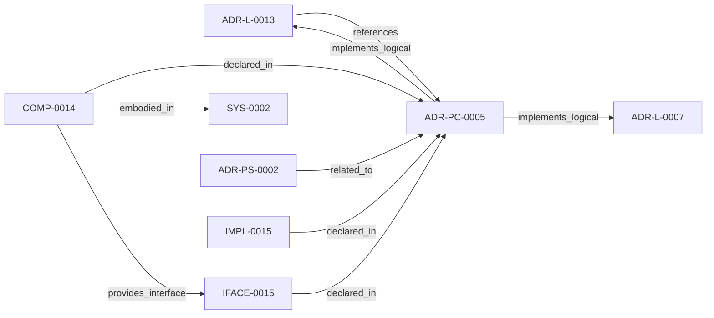

<!--
integrity_schema_version: 1
generated: deterministic_projection_v1
artifact_kind: rendered_adr_markdown
generator_id: adr-projection-markdown
generator_version: 2
hash_algorithm: sha256
source_hash: 2f6ccc1252f1aacd6edef17d595403c0bfb273f438e60e8f737fe05e48828b74
rendered_hash: b60793ba587670e709b68c7b3a79e27c738dad6446e9e90464273e736f67a1cc
-->

# ADR-PC-0005: Generated Artifact Integrity Validation

**Status:** proposed  
**Created:** 2026-03-15  
**Authors:** adr-architecture-kit  
**Domains:** integrity, validation, projections  
**Alias name:** adr-pc-0005-generated-artifact-integrity-validation  

**Implements Logical:** [ADR-L-0007](../logical/ADR-L-0007-deterministic-documentation-projection.md), [ADR-L-0013](../logical/ADR-L-0013-architecture-repository-boundary-and-normalized-semantic-model.md)  
**Technologies:** python, sha256, yaml  

**Implements System:** [ADR-PS-0002](../physical-system/ADR-PS-0002-adr-kit-authoring-compiler-and-validation-system.md)  

## Context

Generated artifact integrity validation verifies freshness, tamper status,
integrity headers, and scope-local generated outputs. It is a distinct public
subsystem used by validator and governance flows.

## Technology Stack

### Python (language)

**Version:** 3.11

**Rationale:**
Existing implementation language.

### PyYAML (library)

**Version:** 6.x

**Rationale:**
Generated artifact inspection and parsing.

## Relationship graph

## Related ADRs

### ADR-L-0007 — Deterministic Documentation Projection

**Relationships:**
- this ADR -[:implements_logical]-> 019fee89-e615-7b9c-8e3f-32ceeda01491

**Context:** The repository already treats several human-readable artifacts as derived state:
ADR human projections under adrs/adr-projection/, manifest summaries, and the AI-first SYSTEM-OVERVIEW
are generated from structured or code-defined sources. That behavior now needs
explicit architectural authority so future contributors do not reintroduce
manually maintained documentation that drifts from canonical artifacts.

[Open projection](../logical/ADR-L-0007-deterministic-documentation-projection.md)
### ADR-L-0013 — Architecture Repository Boundary and Normalized Semantic Model

**Relationships:**
- this ADR -[:implements_logical]-> 019fee89-e616-7c4e-953c-b7349412a784
- 019fee89-e616-7c4e-953c-b7349412a784 -[:references]-> this ADR

**Context:** adr-architecture-kit now has an explicit compiler pipeline, a compiler IR
(`ArchModel`), compiled registry bundles, and an additive architecture graph.
Those pieces are sufficient to produce deterministic machine-facing artifacts,
and ArchitectureRepository already defines the semantic in-process boundary.
Phase 1 adds a narrow supported authoring facade that reuses that seam without
expanding the normalized model or exposing compiler internals.

[Open projection](../logical/ADR-L-0013-architecture-repository-boundary-and-normalized-semantic-model.md)
### ADR-PS-0002 — ADR Kit Authoring Compiler and Validation System

**Relationships:**
- 019fee89-e618-7d04-9337-4aa2d3258507 -[:related_to]-> this ADR

**Context:** adr-architecture-kit operates as an authoring-time compiler and validation system rather
than a collection of unrelated generators. The implementation includes an
explicit compiler pipeline, contract validation, normalized repository/model
access, integrity verification, and CLI orchestration over those surfaces.

[Open projection](../physical-system/ADR-PS-0002-adr-kit-authoring-compiler-and-validation-system.md)

## Component Specifications

### COMP-0014: Generated Artifact Integrity Validation (service)

**Responsibilities:**
- Enumerate scope-local generated artifacts
- Validate integrity headers and source hashes
- Detect stale, tampered, or malformed generated outputs
- Support governance checks over generated artifacts

**Interfaces:**
- **IFACE-0015** (library_api): Public surfaces:
- GeneratedArtifactValidator
- generated artifact integrity result models
...

**Implementation Identifiers:**
- Module Path: `src/adr_kit/integrity/validation.py`

## Implementation Decisions

### IMPL-0015: Separate artifact integrity validation from discovery/indexing authority

**Rationale:**
Integrity validation is a runtime concern shared across generated artifact
kinds and deserves its own component authority.

---

*Generated from ADR-PC-0005 by ADR Architecture Kit*