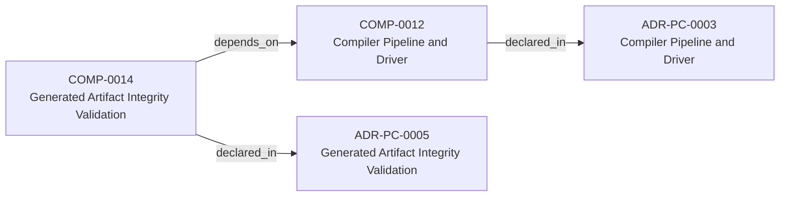
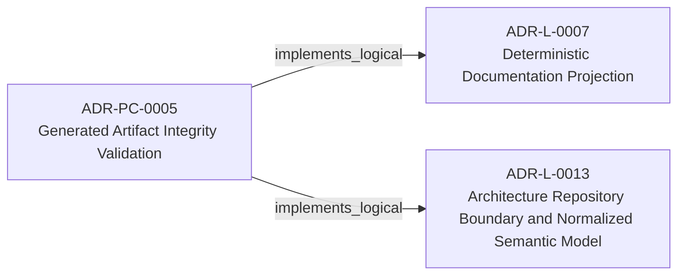
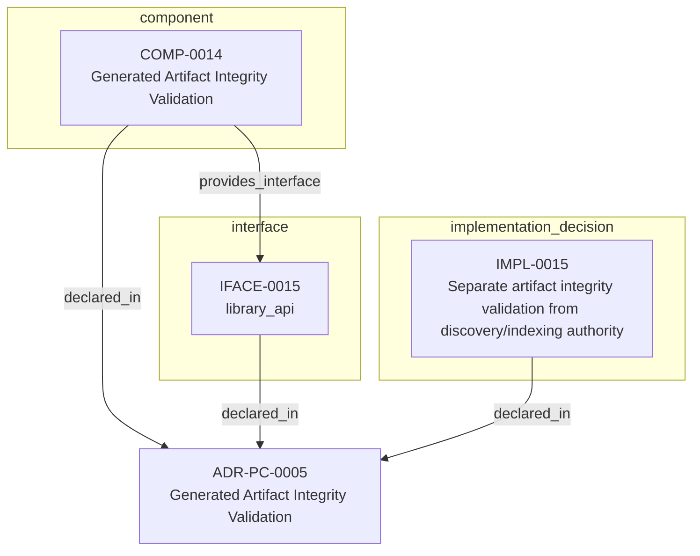

<!--
integrity_schema_version: 1
generated: deterministic_projection_v1
artifact_kind: rendered_adr_markdown
generator_id: adr-projection-markdown
generator_version: 3
hash_algorithm: sha256
source_hash: b3554290cd572d62d67ff266ffaa5fc749dd3505c46f227e5c9211a44faba5b5
rendered_hash: 3de6c85880f459e49afc1b58530733ccad47b71fb90337541240cc6720b724b9
-->

# ADR-PC-0005: Generated Artifact Integrity Validation

## Identity / Status

**Type:** physical-component  
**Status:** accepted  
**Alias:** ADR-PC-0005  
**Authoring contract:** authoring v1.5  
**Created:** 2026-03-15  
**Modified:** 2026-08-27  
**Authors:** adr-architecture-kit  
**Domains:** integrity, validation, projections  
**Implements Logical:** [ADR-L-0007](../logical/ADR-L-0007-deterministic-documentation-projection.md), [ADR-L-0013](../logical/ADR-L-0013-architecture-repository-boundary-and-normalized-semantic-model.md)  
**Implements System:** [ADR-PS-0002](../physical-system/ADR-PS-0002-adr-kit-authoring-compiler-and-validation-system.md)  

## Architecture Position

Physical-component ADRs author component, interface, and implementation entities. Topology is not authored here; neighborhood uses compiled semantic architecture edges plus structural bridges.

**Containing system(s):**
- [ADR-PS-0002](../physical-system/ADR-PS-0002-adr-kit-authoring-compiler-and-validation-system.md)

**Logical authority implemented:**
- [ADR-L-0007](../logical/ADR-L-0007-deterministic-documentation-projection.md)
- [ADR-L-0013](../logical/ADR-L-0013-architecture-repository-boundary-and-normalized-semantic-model.md)

**Component(s) owned by this ADR:**
- COMP-0014 — Generated Artifact Integrity Validation (service)

**Component type(s):** service

**Authored purpose:**
- Protect derived artifacts from silent drift and tampering.

**Depends on:**
- Compiler Pipeline and Driver (COMP-0012)

**Provided interface types:** library_api

**Implementation location(s):**
- Primary implementation: src/adr_kit/integrity/validation.py
- Primary tests: tests/test_generated_docs_integrity.py

## Architecture Neighborhood

### Semantic architecture inventory

- `depends_on`: COMP-0014 → COMP-0012
- `implements_logical`: ADR-PC-0005 → ADR-L-0007
- `implements_logical`: ADR-PC-0005 → ADR-L-0013

### Component Relationships

**Depends on**
- Compiler Pipeline and Driver (COMP-0012)
  - `COMP-0014 -[:depends_on]-> COMP-0012`

**Provides interface**
- library_api (IFACE-0015)
  - `COMP-0014 -[:provides_interface]-> IFACE-0015`

**Implements logical authority**
- Deterministic Documentation Projection (ADR-L-0007)
  - `ADR-PC-0005 -[:implements_logical]-> ADR-L-0007`
- Architecture Repository Boundary and Normalized Semantic Model (ADR-L-0013)
  - `ADR-PC-0005 -[:implements_logical]-> ADR-L-0013`

## Neighbor Relationships

### ADR-L-0007 — Deterministic Documentation Projection

Generated Artifact Integrity Validation (ADR-PC-0005)
    -[:implements_logical]->
Deterministic Documentation Projection (ADR-L-0007)

`ADR-PC-0005 -[:implements_logical]-> ADR-L-0007`

**Peer context:** The repository already treats several human-readable artifacts as derived state:
ADR human projections under adrs/adr-projection/, manifest summaries, and the AI-first SYSTEM-OVERVIEW
are generated from structured or code-defined sources. That behavior now needs
explicit architectural authority so future contributors do not reintroduce
manually maintained documentation that drifts from canonical artifacts.

[Open projection](../logical/ADR-L-0007-deterministic-documentation-projection.md)
### ADR-L-0013 — Architecture Repository Boundary and Normalized Semantic Model

Generated Artifact Integrity Validation (ADR-PC-0005)
    -[:implements_logical]->
Architecture Repository Boundary and Normalized Semantic Model (ADR-L-0013)

`ADR-PC-0005 -[:implements_logical]-> ADR-L-0013`

**Peer context:** adr-architecture-kit now has an explicit compiler pipeline, a compiler IR
(`ArchModel`), compiled registry bundles, and an additive architecture graph.
Those pieces are sufficient to produce deterministic machine-facing artifacts,
and ArchitectureRepository already defines the semantic in-process boundary.
Phase 1 adds a narrow supported authoring facade that reuses that seam without
expanding the normalized model or exposing compiler internals.

[Open projection](../logical/ADR-L-0013-architecture-repository-boundary-and-normalized-semantic-model.md)
### ADR-PC-0003 — Compiler Pipeline and Driver

Generated Artifact Integrity Validation (COMP-0014)
    -[:depends_on]->
Compiler Pipeline and Driver (COMP-0012)

`COMP-0014 -[:depends_on]-> COMP-0012`

**Peer context:** The compiler driver and explicit pipeline now own deterministic architecture
compilation across parse, analysis, emission, and recursive scope
orchestration. The command-line behavior is compatibility-relevant, while the
Python compiler pipeline, passes, `ArchModel`, emitters, and result plumbing are
internal reference implementation and are not a supported SDK facade.

[Open projection](ADR-PC-0003-compiler-pipeline-and-driver.md)

## Context

Generated artifact integrity validation verifies freshness, tamper status,
integrity headers, and scope-local generated outputs. It is a distinct public
subsystem used by validator and governance flows.

## Internal Structure

- `component` COMP-0014 — Generated Artifact Integrity Validation
- `implementation_decision` IMPL-0015 — Separate artifact integrity validation from discovery/indexing authority
- `interface` IFACE-0015 — library_api

## Type-specific Detail

### Before You Change This Component
**Must preserve:**
- Derived artifacts remain non-authoritative
- Integrity validation must operate scope-locally

**Public / exposed interfaces:**
- IFACE-0015 — library_api

**Depends on:**
- Compiler Pipeline and Driver (COMP-0012)

**Verify with:**
- Invalid generated outputs are surfaced explicitly
- Scope-local integrity checks remain deterministic
- tests/test_generated_docs_integrity.py
- >= 80%
- - Generated docs integrity checks
- Scope-local artifact enumeration
- Stale/tampered artifact detection

### COMP-0014: Generated Artifact Integrity Validation

**Type:** service

**Purpose:**

Protect derived artifacts from silent drift and tampering.

**Responsibilities:**

- Enumerate scope-local generated artifacts
- Validate integrity headers and source hashes
- Detect stale, tampered, or malformed generated outputs
- Support governance checks over generated artifacts

**Key Responsibilities:**
- Validate generated outputs deterministically
- Support governance and documentation checks

**Must Remain True:**
- Derived artifacts remain non-authoritative
- Integrity validation must operate scope-locally

**Success Criteria:**
- Invalid generated outputs are surfaced explicitly
- Scope-local integrity checks remain deterministic

### IFACE-0015 — library_api

**Type:** library_api

**Specification:**

Public surfaces:
- GeneratedArtifactValidator
- generated artifact integrity result models

### IMPL-0015 — Separate artifact integrity validation from discovery/indexing authority

**Decision:**

Separate artifact integrity validation from discovery/indexing authority

**Rationale:**

Integrity validation is a runtime concern shared across generated artifact
kinds and deserves its own component authority.

## Engineering Contract

### Failure Semantics

Return explicit invalid states for malformed, stale, or tampered artifacts.

### Observability

**Logging:**
- Level: info
- Structured: false

**Metrics:**
- generated_artifact_validations_total (counter)

### Verification

**Unit test coverage:** >= 80%

**Integration tests:**

- Generated docs integrity checks
- Scope-local artifact enumeration
- Stale/tampered artifact detection

## Implementation Locations

| Role | Location |
| --- | --- |
| Primary implementation | `src/adr_kit/integrity/validation.py` |
| Primary tests | `tests/test_generated_docs_integrity.py` |

## Technology Stack

### Python (language)
**Version:** >=3.14

**Rationale:**
Minimum supported Python minor is 3.14 (`requires-python >=3.14`); currently qualified released minor line is 3.14; repository reference interpreter is currently 3.14.7; new GA Python minors require explicit qualification before support is advertised.

### PyYAML (library)
**Version:** 6.x

**Rationale:**
Generated artifact inspection and parsing.

---

*Generated from ADR-PC-0005 by ADR Architecture Kit (projection v3)*