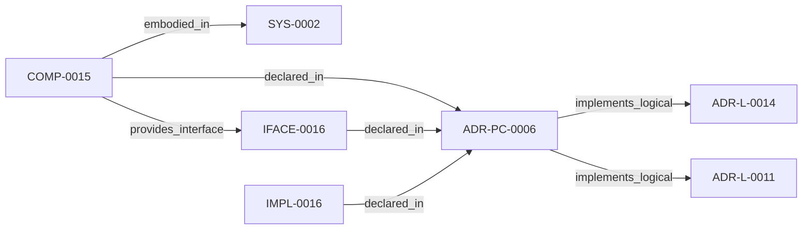

<!--
integrity_schema_version: 1
generated: deterministic_projection_v1
artifact_kind: rendered_adr_markdown
generator_id: adr-projection-markdown
generator_version: 2
hash_algorithm: sha256
source_hash: f3aeaf7829757857eacb3ff0a2e0a481c091e555365e62872da6538aa5ab5fcf
rendered_hash: 49fb9b5078c7415695e54a05192958fe9a55f4a11562508ace99f2f3140dca52
-->

# ADR-PC-0006: Brownfield Onboarding and Canonical Normalization

**Status:** accepted  
**Created:** 2026-03-15  
**Modified:** 2026-08-27  
**Authors:** adr-architecture-kit  
**Domains:** migration, onboarding, normalization  
**Alias name:** adr-pc-0006-brownfield-onboarding-and-canonical-normalization  

**Implements Logical:** [ADR-L-0011](../logical/ADR-L-0011-metadata-schemas-and-remediation-ledger-enforcement.md), [ADR-L-0014](../logical/ADR-L-0014-brownfield-onboarding-and-canonicalization-workflow.md)  
**Technologies:** python, yaml, click  

**Implements System:** [ADR-PS-0002](../physical-system/ADR-PS-0002-adr-kit-authoring-compiler-and-validation-system.md)  

## Context

adr-architecture-kit already includes migration and normalization behavior in
its migrator and CLI surfaces. This component makes brownfield onboarding and
canonical normalization an explicit part of the compiler/validation runtime.

## Technology Stack

### Python (language)

**Version:** >=3.14

**Rationale:**
Minimum supported Python minor is 3.14 (`requires-python >=3.14`); currently qualified released minor line is 3.14; repository reference interpreter is currently 3.14.7; new GA Python minors require explicit qualification before support is advertised. 

### Click (tooling)

**Version:** 8.x

**Rationale:**
Existing CLI surface for migration workflows.

## Relationship graph

## Related ADRs

### ADR-L-0011 — Metadata Schemas and Remediation Ledger Enforcement

**Relationships:**
- this ADR -[:implements_logical]-> 019fee89-e616-7b97-971d-ae165d13bf9c

**Context:** The compiler contract now distinguishes fully compliant bundles from
sentinel-backed brownfield and migration bundles. That boundary is only safe
if sentinel use is narrow, explicitly tracked, and moved toward approved
canonical content through a monotonic workflow.

[Open projection](../logical/ADR-L-0011-metadata-schemas-and-remediation-ledger-enforcement.md)
### ADR-L-0014 — Brownfield Onboarding and Canonicalization Workflow

**Relationships:**
- this ADR -[:implements_logical]-> 019fee89-e616-7628-913b-a059c1057c36

**Context:** STE adoption often begins after meaningful architecture and implementation
decisions already exist. In that stage, the problem is not blank-slate design;
it is brownfield onboarding: discover current architecture state, normalize
legacy identifiers and metadata, formalize already-made decisions into
canonical ADRs, and regenerate deterministic derived artifacts without
treating derived state as authority.

[Open projection](../logical/ADR-L-0014-brownfield-onboarding-and-canonicalization-workflow.md)

## Component Specifications

### COMP-0015: Brownfield Onboarding and Canonical Normalization (service)

**Responsibilities:**
- Detect canonical entity ID collisions
- Apply deterministic canonical ID remaps
- Write canonical migration ledgers
- Support brownfield onboarding cleanup as governed normalization rather than ad hoc editing

**Interfaces:**
- **IFACE-0016** (CLI): Commands:
- adr normalize-canonical-ids
Public modules:
- src/adr_kit/migrators/canonical_id_normali...

**Implementation Identifiers:**
- Module Path: `src/adr_kit/migrators/canonical_id_normalizer.py`

## Implementation Decisions

### IMPL-0016: Treat brownfield onboarding and canonical normalization as an explicit component capability

**Rationale:**
Migration logic is part of the usable onboarding path for STE adoption and
should be documented as an intentional system capability rather than hidden
utility behavior.

---

*Generated from ADR-PC-0006 by ADR Architecture Kit*