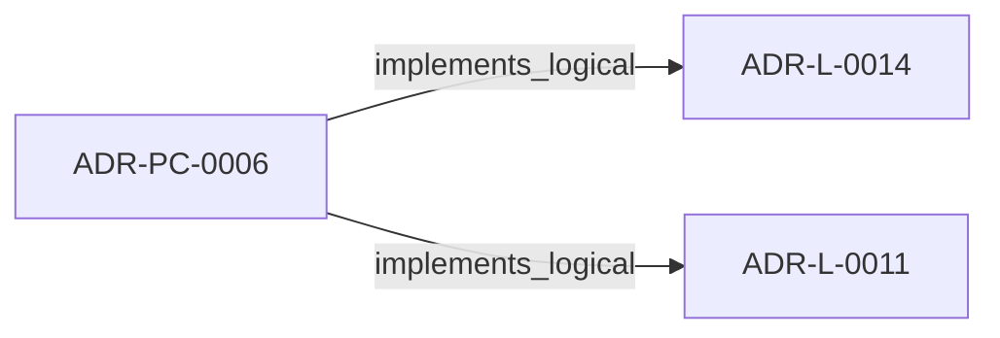
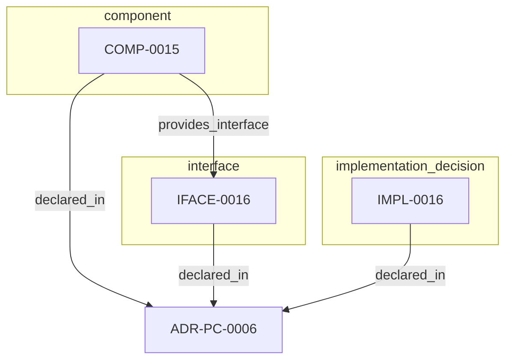

<!--
integrity_schema_version: 1
generated: deterministic_projection_v1
artifact_kind: rendered_adr_markdown
generator_id: adr-projection-markdown
generator_version: 3
hash_algorithm: sha256
source_hash: 1d671ecea9a694126f221afd49415ec021b5840588567d9ef3cb9f8a20768d4d
rendered_hash: 22c8a4cc7d37db600e7633452ff90c5dcf924153612eaaab4cc04700dd92085f
-->

# ADR-PC-0006: Brownfield Onboarding and Canonical Normalization

## Identity / Status

**Type:** physical-component  
**Status:** accepted  
**Alias:** ADR-PC-0006  
**Alias name:** adr-pc-0006-brownfield-onboarding-and-canonical-normalization  
**Created:** 2026-03-15  
**Implements Logical:** [ADR-L-0011](../logical/ADR-L-0011-metadata-schemas-and-remediation-ledger-enforcement.md), [ADR-L-0014](../logical/ADR-L-0014-brownfield-onboarding-and-canonicalization-workflow.md)  
**Implements System:** [ADR-PS-0002](../physical-system/ADR-PS-0002-adr-kit-authoring-compiler-and-validation-system.md)  

## Architecture Position

Physical-component ADRs author component, interface, and implementation entities. Topology is not authored here; neighborhood uses compiled semantic architecture edges plus structural bridges.

## Architecture Neighborhood

### Semantic architecture inventory

- `implements_logical`: ADR-PC-0006 → ADR-L-0014
- `implements_logical`: ADR-PC-0006 → ADR-L-0011

## Neighbor Relationships

### ADR-L-0011 — Metadata Schemas and Remediation Ledger Enforcement

- ADR-PC-0006 -[:implements_logical]-> ADR-L-0011 (peer ADR-L-0011)

**Context:** The compiler contract now distinguishes fully compliant bundles from
sentinel-backed brownfield and migration bundles. That boundary is only safe
if sentinel use is narrow, explicitly tracked, and moved toward approved
canonical content through a monotonic workflow.

[Open projection](../logical/ADR-L-0011-metadata-schemas-and-remediation-ledger-enforcement.md)
### ADR-L-0014 — Brownfield Onboarding and Canonicalization Workflow

- ADR-PC-0006 -[:implements_logical]-> ADR-L-0014 (peer ADR-L-0014)

**Context:** STE adoption often begins after meaningful architecture and implementation
decisions already exist. In that stage, the problem is not blank-slate design;
it is brownfield onboarding: discover current architecture state, normalize
legacy identifiers and metadata, formalize already-made decisions into
canonical ADRs, and regenerate deterministic derived artifacts without
treating derived state as authority.

[Open projection](../logical/ADR-L-0014-brownfield-onboarding-and-canonicalization-workflow.md)

## Context

adr-architecture-kit already includes migration and normalization behavior in
its migrator and CLI surfaces. This component makes brownfield onboarding and
canonical normalization an explicit part of the compiler/validation runtime.

## Internal Structure

### COMP-0015: Brownfield Onboarding and Canonical Normalization (service)

**Responsibilities:**
- Detect canonical entity ID collisions
- Apply deterministic canonical ID remaps
- Write canonical migration ledgers
- Support brownfield onboarding cleanup as governed normalization rather than ad hoc editing

**Interfaces:**
- **IFACE-0016** (CLI): Commands:
- adr normalize-canonical-ids
Public modules:
- src/adr_kit/migrators/canonical_id_normalizer.py

**Implementation Identifiers:**
- Module Path: `src/adr_kit/migrators/canonical_id_normalizer.py`

- `component` COMP-0015 — Brownfield Onboarding and Canonical Normalization
- `implementation_decision` IMPL-0016 — Treat brownfield onboarding and canonical normalization as an explicit component capability
- `interface` IFACE-0016 — 019fee89-e618-7ad6-903b-955fab187e68

## Technology Stack

### Python (language)

**Version:** >=3.14

**Rationale:**
Minimum supported Python minor is 3.14 (`requires-python >=3.14`); currently qualified released minor line is 3.14; repository reference interpreter is currently 3.14.7; new GA Python minors require explicit qualification before support is advertised. 

### Click (tooling)

**Version:** 8.x

**Rationale:**
Existing CLI surface for migration workflows.

---

*Generated from ADR-PC-0006 by ADR Architecture Kit (projection v3)*