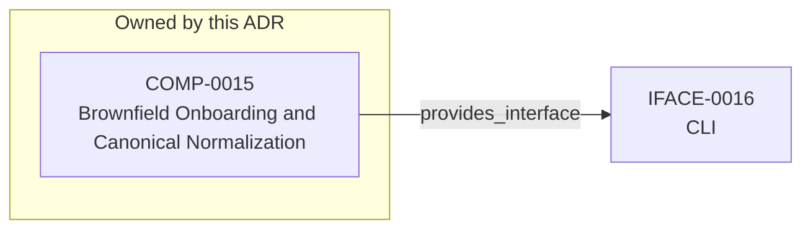

<!--
integrity_schema_version: 1
generated: deterministic_projection_v1
artifact_kind: rendered_adr_markdown
generator_id: adr-projection-markdown
generator_version: 3
hash_algorithm: sha256
source_hash: f4825c6747a0eccc33c75db16e1d5c8c0f14c1d097c92e835920afebb1fc0413
rendered_hash: f2bb78c9308f0132cadf4567d3f10ba682abda26c3c55b51f77e8c6b6e063fb4
-->

# ADR-PC-0006: Brownfield Onboarding and Canonical Normalization

## Identity / Status

**Type:** physical-component  
**Status:** accepted  
**Alias:** ADR-PC-0006  
**Authoring contract:** authoring v1.5  
**Created:** 2026-03-15  
**Modified:** 2026-08-27  
**Authors:** adr-architecture-kit  
**Domains:** migration, onboarding, normalization  
**Implements Logical:** [ADR-L-0011](../logical/ADR-L-0011-metadata-schemas-and-remediation-ledger-enforcement.md), [ADR-L-0014](../logical/ADR-L-0014-brownfield-onboarding-and-canonicalization-workflow.md)  
**Implements System:** [ADR-PS-0002](../physical-system/ADR-PS-0002-adr-kit-authoring-compiler-and-validation-system.md)  

## Architecture at a Glance

| | |
| --- | --- |
| Component | COMP-0015 — Brownfield Onboarding and Canonical Normalization |
| Type | service |
| System | [ADR-PS-0002](../physical-system/ADR-PS-0002-adr-kit-authoring-compiler-and-validation-system.md) |
| Purpose | Normalize brownfield architecture artifacts into canonical STE form. |
| Interfaces | IFACE-0016 — CLI |
| Primary implementation | `src/adr_kit/migrators/canonical_id_normalizer.py` |

**Logical authority**
- [ADR-L-0011](../logical/ADR-L-0011-metadata-schemas-and-remediation-ledger-enforcement.md)
- [ADR-L-0014](../logical/ADR-L-0014-brownfield-onboarding-and-canonicalization-workflow.md)

## Change Safety

**Must preserve**
- normalization must be deterministic and auditable
- canonical updates must precede derived artifact regeneration

**Known architectural surface**
- Provided interfaces: IFACE-0016 — CLI

**Verification**
- Primary tests: `tests/test_canonical_id_normalizer.py`
- Unit coverage: >= 80%
- Success criteria: 2
- Integration checks: 3

## Context

adr-architecture-kit already includes migration and normalization behavior in
its migrator and CLI surfaces. This component makes brownfield onboarding and
canonical normalization an explicit part of the compiler/validation runtime.

## Architecture & Relationships

### Component Relationships

**Provides interface**
- CLI (IFACE-0016)

  `COMP-0015 -[:provides_interface]-> IFACE-0016`

**Implements logical authority**
- Metadata Schemas and Remediation Ledger Enforcement (ADR-L-0011)

  `ADR-PC-0006 -[:implements_logical]-> ADR-L-0011`
- Brownfield Onboarding and Canonicalization Workflow (ADR-L-0014)

  `ADR-PC-0006 -[:implements_logical]-> ADR-L-0014`

## Component Contract

### COMP-0015: Brownfield Onboarding and Canonical Normalization

**Type:** service

**Purpose:**

Normalize brownfield architecture artifacts into canonical STE form.

**Responsibilities:**

- Detect canonical entity ID collisions
- Apply deterministic canonical ID remaps
- Write canonical migration ledgers
- Support brownfield onboarding cleanup as governed normalization rather than ad hoc editing

**Key Responsibilities:**
- canonical ID normalization
- migration ledger generation
- brownfield onboarding support

**Success Criteria:**
- normalize-canonical-ids produces deterministic remaps
- migration ledgers preserve old-to-new mapping evidence

## Interfaces

### IFACE-0016 — CLI

**Type:** CLI

**Specification:**

Commands:
- adr normalize-canonical-ids
Public modules:
- src/adr_kit/migrators/canonical_id_normalizer.py

## Implementation Decisions

### IMPL-0016 — Treat brownfield onboarding and canonical normalization as an explicit component capability

**Rationale:**

Migration logic is part of the usable onboarding path for STE adoption and
should be documented as an intentional system capability rather than hidden
utility behavior.

## Engineering Contract

### Failure Semantics

Apply deterministic remaps only for detected collisions and preserve a machine-readable migration ledger.

### Observability

**Logging:**
- Level: info
- Structured: false

**Metrics:**
- canonical_id_normalizations_total (counter)

### Verification

**Unit test coverage:** >= 80%

**Integration tests:**

- Canonical collision detection
- Deterministic remap application
- Migration ledger generation

## Implementation Map

| Role | Location |
| --- | --- |
| Primary implementation | `src/adr_kit/migrators/canonical_id_normalizer.py` |
| Entry point | `src/adr_kit/cli/main.py` |
| Primary tests | `tests/test_canonical_id_normalizer.py` |

## Technology & Dependencies

### Python (language)
**Version:** >=3.14

**Rationale:**
Minimum supported Python minor is 3.14 (`requires-python >=3.14`); currently qualified released minor line is 3.14; repository reference interpreter is currently 3.14.7; new GA Python minors require explicit qualification before support is advertised.

### Click (tooling)
**Version:** 8.x

**Rationale:**
Existing CLI surface for migration workflows.

## Internal Structure

| Kind | Entity |
| --- | --- |
| Component | COMP-0015 — Brownfield Onboarding and Canonical Normalization |
| Implementation Decision | IMPL-0016 — Treat brownfield onboarding and canonical normalization as an explicit component capability |
| Interface | IFACE-0016 — CLI |

## Neighbor Relationships

| Neighbor | Relationship | Exact Path |
| --- | --- | --- |
| [ADR-L-0011 — Metadata Schemas and Remediation Ledger Enforcement](../logical/ADR-L-0011-metadata-schemas-and-remediation-ledger-enforcement.md) | Brownfield Onboarding and Canonical Normalization (ADR-PC-0006) → Metadata Schemas and Remediation Ledger Enforcement (ADR-L-0011) | `ADR-PC-0006 -[:implements_logical]-> ADR-L-0011` |
| [ADR-L-0014 — Brownfield Onboarding and Canonicalization Workflow](../logical/ADR-L-0014-brownfield-onboarding-and-canonicalization-workflow.md) | Brownfield Onboarding and Canonical Normalization (ADR-PC-0006) → Brownfield Onboarding and Canonicalization Workflow (ADR-L-0014) | `ADR-PC-0006 -[:implements_logical]-> ADR-L-0014` |

---

*Generated from ADR-PC-0006 by ADR Architecture Kit (projection v3)*