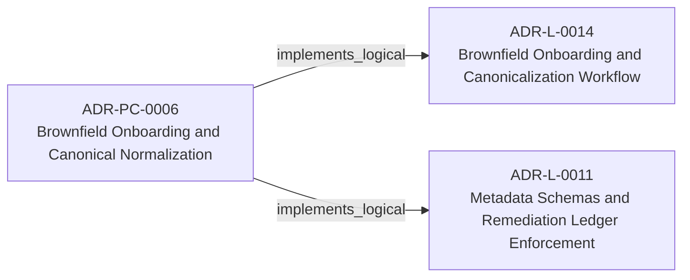
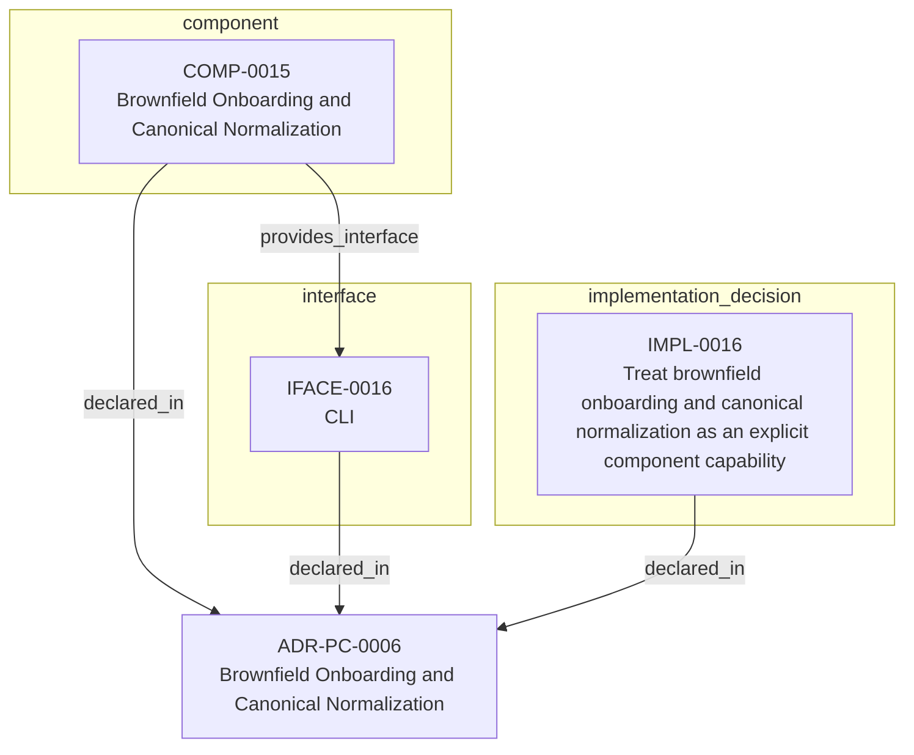

<!--
integrity_schema_version: 1
generated: deterministic_projection_v1
artifact_kind: rendered_adr_markdown
generator_id: adr-projection-markdown
generator_version: 3
hash_algorithm: sha256
source_hash: 3e97710c7de944ccba6dacd559533e1cee6aa0518a76390d888fbf04552e0f50
rendered_hash: acb1adc8fa8b2598985bc8c00787fe9b23cbe64377b4df6eafbed3c662b8f8d6
-->

# ADR-PC-0006: Brownfield Onboarding and Canonical Normalization

## Identity / Status

**Type:** physical-component  
**Status:** accepted  
**Alias:** ADR-PC-0006  
**Authoring contract:** authoring v1.5  
**Created:** 2026-03-15  
**Modified:** 2026-08-27  
**Authors:** adr-architecture-kit  
**Domains:** migration, onboarding, normalization  
**Implements Logical:** [ADR-L-0011](../logical/ADR-L-0011-metadata-schemas-and-remediation-ledger-enforcement.md), [ADR-L-0014](../logical/ADR-L-0014-brownfield-onboarding-and-canonicalization-workflow.md)  
**Implements System:** [ADR-PS-0002](../physical-system/ADR-PS-0002-adr-kit-authoring-compiler-and-validation-system.md)  

## Architecture Position

Physical-component ADRs author component, interface, and implementation entities. Topology is not authored here; neighborhood uses compiled semantic architecture edges plus structural bridges.

**Containing system(s):**
- [ADR-PS-0002](../physical-system/ADR-PS-0002-adr-kit-authoring-compiler-and-validation-system.md)

**Logical authority implemented:**
- [ADR-L-0011](../logical/ADR-L-0011-metadata-schemas-and-remediation-ledger-enforcement.md)
- [ADR-L-0014](../logical/ADR-L-0014-brownfield-onboarding-and-canonicalization-workflow.md)

**Component(s) owned by this ADR:**
- COMP-0015 — Brownfield Onboarding and Canonical Normalization (service)

**Component type(s):** service

**Authored purpose:**
- Normalize brownfield architecture artifacts into canonical STE form.

**Provided interface types:** CLI

**Implementation location(s):**
- Primary implementation: src/adr_kit/migrators/canonical_id_normalizer.py
- Entry point: src/adr_kit/cli/main.py
- Primary tests: tests/test_canonical_id_normalizer.py

## Architecture Neighborhood

### Semantic architecture inventory

- `implements_logical`: ADR-PC-0006 → ADR-L-0014
- `implements_logical`: ADR-PC-0006 → ADR-L-0011

### Component Relationships

**Provides interface**
- CLI (IFACE-0016)
  - `COMP-0015 -[:provides_interface]-> IFACE-0016`

**Implements logical authority**
- Metadata Schemas and Remediation Ledger Enforcement (ADR-L-0011)
  - `ADR-PC-0006 -[:implements_logical]-> ADR-L-0011`
- Brownfield Onboarding and Canonicalization Workflow (ADR-L-0014)
  - `ADR-PC-0006 -[:implements_logical]-> ADR-L-0014`

## Neighbor Relationships

### ADR-L-0011 — Metadata Schemas and Remediation Ledger Enforcement

Brownfield Onboarding and Canonical Normalization (ADR-PC-0006)
    -[:implements_logical]->
Metadata Schemas and Remediation Ledger Enforcement (ADR-L-0011)

`ADR-PC-0006 -[:implements_logical]-> ADR-L-0011`

**Peer context:** The compiler contract now distinguishes fully compliant bundles from
sentinel-backed brownfield and migration bundles. That boundary is only safe
if sentinel use is narrow, explicitly tracked, and moved toward approved
canonical content through a monotonic workflow.

[Open projection](../logical/ADR-L-0011-metadata-schemas-and-remediation-ledger-enforcement.md)
### ADR-L-0014 — Brownfield Onboarding and Canonicalization Workflow

Brownfield Onboarding and Canonical Normalization (ADR-PC-0006)
    -[:implements_logical]->
Brownfield Onboarding and Canonicalization Workflow (ADR-L-0014)

`ADR-PC-0006 -[:implements_logical]-> ADR-L-0014`

**Peer context:** STE adoption often begins after meaningful architecture and implementation
decisions already exist. In that stage, the problem is not blank-slate design;
it is brownfield onboarding: discover current architecture state, normalize
legacy identifiers and metadata, formalize already-made decisions into
canonical ADRs, and regenerate deterministic derived artifacts without
treating derived state as authority.

[Open projection](../logical/ADR-L-0014-brownfield-onboarding-and-canonicalization-workflow.md)

## Context

adr-architecture-kit already includes migration and normalization behavior in
its migrator and CLI surfaces. This component makes brownfield onboarding and
canonical normalization an explicit part of the compiler/validation runtime.

## Internal Structure

- `component` COMP-0015 — Brownfield Onboarding and Canonical Normalization
- `implementation_decision` IMPL-0016 — Treat brownfield onboarding and canonical normalization as an explicit component capability
- `interface` IFACE-0016 — CLI

## Type-specific Detail

### Before You Change This Component
**Must preserve:**
- normalization must be deterministic and auditable
- canonical updates must precede derived artifact regeneration

**Public / exposed interfaces:**
- IFACE-0016 — CLI

**Verify with:**
- normalize-canonical-ids produces deterministic remaps
- migration ledgers preserve old-to-new mapping evidence
- tests/test_canonical_id_normalizer.py
- >= 80%
- - Canonical collision detection
- Deterministic remap application
- Migration ledger generation

### COMP-0015: Brownfield Onboarding and Canonical Normalization

**Type:** service

**Purpose:**

Normalize brownfield architecture artifacts into canonical STE form.

**Responsibilities:**

- Detect canonical entity ID collisions
- Apply deterministic canonical ID remaps
- Write canonical migration ledgers
- Support brownfield onboarding cleanup as governed normalization rather than ad hoc editing

**Key Responsibilities:**
- canonical ID normalization
- migration ledger generation
- brownfield onboarding support

**Must Remain True:**
- normalization must be deterministic and auditable
- canonical updates must precede derived artifact regeneration

**Success Criteria:**
- normalize-canonical-ids produces deterministic remaps
- migration ledgers preserve old-to-new mapping evidence

### IFACE-0016 — CLI

**Type:** CLI

**Specification:**

Commands:
- adr normalize-canonical-ids
Public modules:
- src/adr_kit/migrators/canonical_id_normalizer.py

### IMPL-0016 — Treat brownfield onboarding and canonical normalization as an explicit component capability

**Decision:**

Treat brownfield onboarding and canonical normalization as an explicit component capability

**Rationale:**

Migration logic is part of the usable onboarding path for STE adoption and
should be documented as an intentional system capability rather than hidden
utility behavior.

## Engineering Contract

### Failure Semantics

Apply deterministic remaps only for detected collisions and preserve a machine-readable migration ledger.

### Observability

**Logging:**
- Level: info
- Structured: false

**Metrics:**
- canonical_id_normalizations_total (counter)

### Verification

**Unit test coverage:** >= 80%

**Integration tests:**

- Canonical collision detection
- Deterministic remap application
- Migration ledger generation

## Implementation Locations

| Role | Location |
| --- | --- |
| Primary implementation | `src/adr_kit/migrators/canonical_id_normalizer.py` |
| Entry point | `src/adr_kit/cli/main.py` |
| Primary tests | `tests/test_canonical_id_normalizer.py` |

## Technology Stack

### Python (language)
**Version:** >=3.14

**Rationale:**
Minimum supported Python minor is 3.14 (`requires-python >=3.14`); currently qualified released minor line is 3.14; repository reference interpreter is currently 3.14.7; new GA Python minors require explicit qualification before support is advertised.

### Click (tooling)
**Version:** 8.x

**Rationale:**
Existing CLI surface for migration workflows.

---

*Generated from ADR-PC-0006 by ADR Architecture Kit (projection v3)*