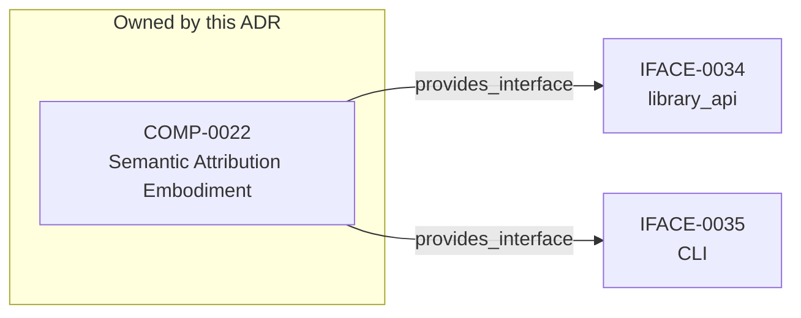

<!--
integrity_schema_version: 1
generated: deterministic_projection_v1
artifact_kind: rendered_adr_markdown
generator_id: adr-projection-markdown
generator_version: 3
hash_algorithm: sha256
source_hash: b8a1bbd73d18462f30c64e65c9a6b2258e0691f3eabba266265ba8047393d327
rendered_hash: d65918e77337ac9ac5f07a1816266f5fb5a5ec2469c10628bec4ab9ce724dc3e
-->

# ADR-PC-0007: Semantic Attribution Embodiment

## Identity / Status

**Type:** physical-component  
**Status:** accepted  
**Alias:** ADR-PC-0007  
**Authoring contract:** authoring v1.5  
**Created:** 2026-08-13  
**Modified:** 2026-08-27  
**Authors:** adr-architecture-kit  
**Domains:** attribution, validation, decorators  
**Implements Logical:** [ADR-L-0004](../logical/ADR-L-0004-adr-to-implementation-traceability-via-decorators-and-metadata-attribution.md), [ADR-L-0020](../logical/ADR-L-0020-semantic-implementation-attribution-and-cross-layer-architecture-relationships.md)  
**Implements System:** [ADR-PS-0002](../physical-system/ADR-PS-0002-adr-kit-authoring-compiler-and-validation-system.md)  

## Architecture at a Glance

| | |
| --- | --- |
| Component | COMP-0022 — Semantic Attribution Embodiment |
| Type | library |
| System | [ADR-PS-0002](../physical-system/ADR-PS-0002-adr-kit-authoring-compiler-and-validation-system.md) |
| Purpose | Embody ADR-L-0020 without moving source parsing into this repository. |
| Interfaces | IFACE-0034 — library_api; IFACE-0035 — CLI |
| Primary implementation | `src/adr_kit/decorators.py` |

**Logical authority**
- [ADR-L-0004](../logical/ADR-L-0004-adr-to-implementation-traceability-via-decorators-and-metadata-attribution.md)
- [ADR-L-0020](../logical/ADR-L-0020-semantic-implementation-attribution-and-cross-layer-architecture-relationships.md)

## Change Safety

**Must preserve**
- Must not load architecture state from legacy decorators or shim generation
- Must not write relationship registries or Architecture IR from evidence verbs
- Must expose only immutable supported contracts through `adr_kit.api`
- Must not write evidence input, Architecture IR relationships, or graph state

**Known architectural surface**
- Provided interfaces: IFACE-0034 — library_api; IFACE-0035 — CLI

**Verification**
- Primary tests: `tests/test_semantic_attribution_vocabulary_parity.py`
- Unit coverage: >= 80%
- Success criteria: 4
- Integration checks: 6

## Context

Semantic attribution needs a kit-owned embodiment for vocabulary, evidence
models, UUID decorators, standalone shims, architecture-aware validation,
repository-aware versioned normalization, and a supported bidirectional
linkage facade. This component does not parse consumer source code, does not
own RECON extraction, and does not admit evidence to the architecture graph.

## Architecture & Relationships

### Component Relationships

**Provides interface**
- library_api (IFACE-0034)

  `COMP-0022 -[:provides_interface]-> IFACE-0034`
- CLI (IFACE-0035)

  `COMP-0022 -[:provides_interface]-> IFACE-0035`

**Implements logical authority**
- ADR-to-Implementation Traceability via Decorators and Metadata Attribution (ADR-L-0004)

  `ADR-PC-0007 -[:implements_logical]-> ADR-L-0004`
- Semantic Implementation Attribution and Cross-Layer Architecture Relationships (ADR-L-0020)

  `ADR-PC-0007 -[:implements_logical]-> ADR-L-0020`

## Component Contract

### COMP-0022: Semantic Attribution Embodiment

**Type:** library

**Purpose:**

Embody ADR-L-0020 without moving source parsing into this repository.

**Responsibilities:**

- Load versioned mechanical v1.5/v1.6 semantic attribution vocabularies
- Parse and validate 1.0/1.2/1.5/1.6 implementation attribution evidence
- Provide UUID claim decorators and vocabulary-driven Python/TypeScript shims
- Resolve claim targets against ArchitectureRepository / model 2.0
- Normalize supported evidence into explicitly selected lossless targets
- Build a deterministic non-authoritative bidirectional linkage projection

**Key Responsibilities:**
- Keep legacy alias decorators as metadata-only producers
- Compose `__architecture_attribution_claims__` only from UUID decorators
- Fail closed on unresolved UUIDs, illegal matrix pairs, and true duplicates
- Preserve independent evidence occurrences behind unique semantic links

**Success Criteria:**
- 1.0/1.2 callers of validate_implementation_attribution_evidence remain compatible
- v1.5 validation keeps historical behavior; v1.6 adds declared-only enforcement
- Python and TypeScript shims are generated from one vocabulary
- installed-wheel consumers use the linkage feature without private imports

## Interfaces

### IFACE-0034 — library_api

**Type:** library_api

**Specification:**

Public and de facto public surfaces:

- adr_kit.decorators implements/enforces/embodies UUID APIs
- adr_kit.decorators legacy implements_adr / enforces_invariant APIs
- validate_implementation_attribution_evidence
- normalize_attribution_evidence
- adr_kit.api build_embodiment_linkage and immutable request/result contracts
- schema/evidence-attribution/v1.5 and v1.6 vocabulary/evidence JSON

### IFACE-0035 — CLI

**Type:** CLI

**Specification:**

Commands:

- adr attribution check
- adr attribution coverage
- adr attribution generate-shim
- adr attribution workspace-report
- adr attribution normalize-evidence --scope --input [--output] [--target-version]
- adr attribution linkage-report --scope --evidence [direction filters]

## Implementation Decisions

### IMPL-0028 — Generate Python and TypeScript shims from the v1.5 vocabulary

**Rationale:**

Hand-copied shim strings drift from native decorators. One mechanical
versioned vocabulary is the source for relationship names, allowed types,
confidence policy, and generated standalone shims. Explicit native
functions remain stable and parity tests prevent runtime vocabulary drift.

### IMPL-0029 — Keep legacy alias decorators separate from UUID claim composition

**Rationale:**

Last-write-wins legacy metadata remains a Stable surface. New UUID
decorators compose `__architecture_attribution_claims__` with
`confidence: declared` and must not overwrite `__implements_adrs__` or
`__enforces_invariants__`.

## Engineering Contract

### Failure Semantics

Fail closed on invalid schema, unresolved UUID, illegal matrix pair, and true duplicate evidence.

### Observability

**Logging:**
- Level: info
- Structured: false

**Metrics:**
- attribution_validations_total (counter)

### Verification

**Unit test coverage:** >= 80%

**Integration tests:**

- Vocabulary parity across schema, Pydantic, decorators, and shims
- Version-aware confidence and loss-aware normalization matrices
- Public bidirectional linkage and partial-result behavior
- Retained-wheel public consumer and packaged v1.6 resource checks
- Legacy decorator no architecture load
- Repository-aware 1.0/1.2 normalization idempotency

## Implementation Map

| Role | Location |
| --- | --- |
| Primary implementation | `src/adr_kit/decorators.py` |
| Entry point | `src/adr_kit/cli/main.py` |
| Primary tests | `tests/test_semantic_attribution_vocabulary_parity.py` |

## Technology & Dependencies

### Python (language)
**Version:** >=3.14

**Rationale:**
Minimum supported Python minor is 3.14 (`requires-python >=3.14`); currently qualified released minor line is 3.14; repository reference interpreter is currently 3.14.7; new GA Python minors require explicit qualification before support is advertised.

### Pydantic (library)
**Version:** 2.x

**Rationale:**
Typed evidence and claim models.

### jsonschema (library)
**Version:** 4.x

**Rationale:**
Structural schema validation for 1.0/1.2/1.5/1.6 evidence.

## Internal Structure

| Kind | Entity |
| --- | --- |
| Component | COMP-0022 — Semantic Attribution Embodiment |
| Implementation Decision | IMPL-0028 — Generate Python and TypeScript shims from the v1.5 vocabulary |
| Implementation Decision | IMPL-0029 — Keep legacy alias decorators separate from UUID claim composition |
| Interface | IFACE-0034 — library_api |
| Interface | IFACE-0035 — CLI |

## Neighbor Relationships

| Neighbor | Relationship | Exact Path |
| --- | --- | --- |
| [ADR-L-0004 — ADR-to-Implementation Traceability via Decorators and Metadata Attribution](../logical/ADR-L-0004-adr-to-implementation-traceability-via-decorators-and-metadata-attribution.md) | Semantic Attribution Embodiment (ADR-PC-0007) → ADR-to-Implementation Traceability via Decorators and Metadata Attribution (ADR-L-0004) | `ADR-PC-0007 -[:implements_logical]-> ADR-L-0004` |
| [ADR-L-0020 — Semantic Implementation Attribution and Cross-Layer Architecture Relationships](../logical/ADR-L-0020-semantic-implementation-attribution-and-cross-layer-architecture-relationships.md) | Semantic Attribution Embodiment (ADR-PC-0007) → Semantic Implementation Attribution and Cross-Layer Architecture Relationships (ADR-L-0020) | `ADR-PC-0007 -[:implements_logical]-> ADR-L-0020` |

---

*Generated from ADR-PC-0007 by ADR Architecture Kit (projection v3)*