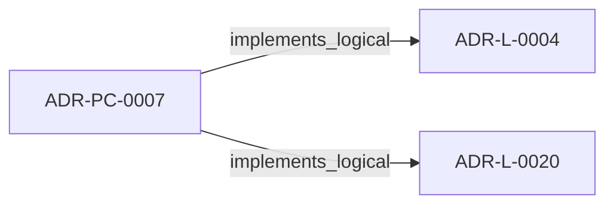
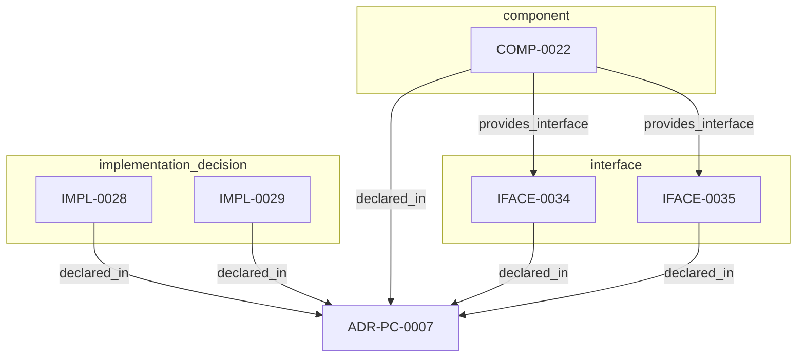

<!--
integrity_schema_version: 1
generated: deterministic_projection_v1
artifact_kind: rendered_adr_markdown
generator_id: adr-projection-markdown
generator_version: 3
hash_algorithm: sha256
source_hash: de2cdb4c970da54463d131172abdce12a0758c5b7ff6c32347fd4dafdfbbbba3
rendered_hash: 2f6e12a0b29422f71ff0b1d78a080f8dba273462884bb5bdc1fd03ee1bc3fee9
-->

# ADR-PC-0007: Semantic Attribution Embodiment

## Identity / Status

**Type:** physical-component  
**Status:** accepted  
**Alias:** ADR-PC-0007  
**Alias name:** semantic-attribution-embodiment  
**Created:** 2026-08-13  
**Implements Logical:** [ADR-L-0004](../logical/ADR-L-0004-adr-to-implementation-traceability-via-decorators-and-metadata-attribution.md), [ADR-L-0020](../logical/ADR-L-0020-semantic-implementation-attribution-and-cross-layer-architecture-relationships.md)  
**Implements System:** [ADR-PS-0002](../physical-system/ADR-PS-0002-adr-kit-authoring-compiler-and-validation-system.md)  

## Architecture Position

Physical-component ADRs author component, interface, and implementation entities. Topology is not authored here; neighborhood uses compiled semantic architecture edges plus structural bridges.

## Architecture Neighborhood

### Semantic architecture inventory

- `implements_logical`: ADR-PC-0007 → ADR-L-0004
- `implements_logical`: ADR-PC-0007 → ADR-L-0020

## Neighbor Relationships

### ADR-L-0004 — ADR-to-Implementation Traceability via Decorators and Metadata Attribution

- ADR-PC-0007 -[:implements_logical]-> ADR-L-0004 (peer ADR-L-0004)

**Context:** Architecture Decision Records document why implementation artifacts exist, but
the repo still lacks a universal, machine-verifiable way to trace code,
infrastructure, configuration, schemas, pipelines, and scripts back to the
ADRs that justify them.

[Open projection](../logical/ADR-L-0004-adr-to-implementation-traceability-via-decorators-and-metadata-attribution.md)
### ADR-L-0020 — Semantic Implementation Attribution and Cross-Layer Architecture Relationships

- ADR-PC-0007 -[:implements_logical]-> ADR-L-0020 (peer ADR-L-0020)

**Context:** ADR-L-0004 established implementation attribution as an explicit intent
surface. ADR-L-0019 made canonical machine identity a lowercase UUIDv7.
Attribution evidence still cited human aliases (`ADR-L-*`, `INV-*`) and
could not name typed relationships to nested architecture entities.

[Open projection](../logical/ADR-L-0020-semantic-implementation-attribution-and-cross-layer-architecture-relationships.md)

## Context

Semantic attribution needs a kit-owned embodiment for vocabulary, evidence
models, UUID decorators, standalone shims, architecture-aware validation,
repository-aware versioned normalization, and a supported bidirectional
linkage facade. This component does not parse consumer source code, does not
own RECON extraction, and does not admit evidence to the architecture graph.

## Internal Structure

### COMP-0022: Semantic Attribution Embodiment (library)

**Responsibilities:**
- Load versioned mechanical v1.5/v1.6 semantic attribution vocabularies
- Parse and validate 1.0/1.2/1.5/1.6 implementation attribution evidence
- Provide UUID claim decorators and vocabulary-driven Python/TypeScript shims
- Resolve claim targets against ArchitectureRepository / model 2.0
- Normalize supported evidence into explicitly selected lossless targets
- Build a deterministic non-authoritative bidirectional linkage projection

**Interfaces:**
- **IFACE-0034** (library_api): Public and de facto public surfaces:

- adr_kit.decorators implements/enforces/embodies UUID APIs
- adr_kit.decorators legacy implements_adr / enforces_invariant APIs
- validate_implementation_attribution_evidence
- normalize_attribution_evidence
- adr_kit.api build_embodiment_linkage and immutable request/result contracts
- schema/evidence-attribution/v1.5 and v1.6 vocabulary/evidence JSON

- **IFACE-0035** (CLI): Commands:

- adr attribution check
- adr attribution coverage
- adr attribution generate-shim
- adr attribution workspace-report
- adr attribution normalize-evidence --scope --input [--output] [--target-version]
- adr attribution linkage-report --scope --evidence [direction filters]

**Implementation Identifiers:**
- Module Path: `src/adr_kit/decorators.py`

- `component` COMP-0022 — Semantic Attribution Embodiment
- `implementation_decision` IMPL-0028 — Generate Python and TypeScript shims from the v1.5 vocabulary
- `implementation_decision` IMPL-0029 — Keep legacy alias decorators separate from UUID claim composition
- `interface` IFACE-0034 — 019ffdba-3c42-77f6-903f-7753342c5b5f
- `interface` IFACE-0035 — 019ffdba-3c42-7d5b-b52f-b36c3000f299

## Technology Stack

### Python (language)

**Version:** >=3.14

**Rationale:**
Minimum supported Python minor is 3.14 (`requires-python >=3.14`); currently qualified released minor line is 3.14; repository reference interpreter is currently 3.14.7; new GA Python minors require explicit qualification before support is advertised. 

### Pydantic (library)

**Version:** 2.x

**Rationale:**
Typed evidence and claim models.

### jsonschema (library)

**Version:** 4.x

**Rationale:**
Structural schema validation for 1.0/1.2/1.5/1.6 evidence.

---

*Generated from ADR-PC-0007 by ADR Architecture Kit (projection v3)*