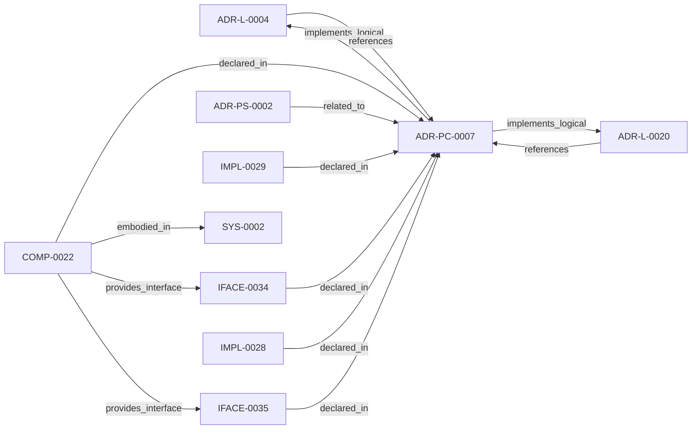

<!--
integrity_schema_version: 1
generated: deterministic_projection_v1
artifact_kind: rendered_adr_markdown
generator_id: adr-projection-markdown
generator_version: 2
hash_algorithm: sha256
source_hash: 486a6c1dfa51ddfd6ef47848dd064aa1b7b151635aa0220a468941cdd8184de9
rendered_hash: bfbdd07d6a4e7044cba649e3db02aff5dbe4813ee4af709ea986c7a7d27b3c1a
-->

# ADR-PC-0007: Semantic Attribution Embodiment

**Status:** accepted  
**Created:** 2026-08-13  
**Modified:** 2026-08-20  
**Authors:** adr-architecture-kit  
**Domains:** attribution, validation, decorators  
**Alias name:** semantic-attribution-embodiment  

**Implements Logical:** [ADR-L-0004](../logical/ADR-L-0004-adr-to-implementation-traceability-via-decorators-and-metadata-attribution.md), [ADR-L-0020](../logical/ADR-L-0020-semantic-implementation-attribution-and-cross-layer-architecture-relationships.md)  
**Technologies:** python, jsonschema, pydantic, typescript  

**Implements System:** [ADR-PS-0002](../physical-system/ADR-PS-0002-adr-kit-authoring-compiler-and-validation-system.md)  

## Context

Semantic attribution needs a kit-owned embodiment for vocabulary, evidence
models, UUID decorators, standalone shims, architecture-aware validation,
repository-aware versioned normalization, and a supported bidirectional
linkage facade. This component does not parse consumer source code, does not
own RECON extraction, and does not admit evidence to the architecture graph.

## Technology Stack

### Python (language)

**Version:** 3.11

**Rationale:**
Existing implementation language.

### Pydantic (library)

**Version:** 2.x

**Rationale:**
Typed evidence and claim models.

### jsonschema (library)

**Version:** 4.x

**Rationale:**
Structural schema validation for 1.0/1.2/1.5/1.6 evidence.

## Relationship graph

## Related ADRs

### ADR-L-0004 — ADR-to-Implementation Traceability via Decorators and Metadata Attribution

**Relationships:**
- this ADR -[:implements_logical]-> 019fee89-e615-7577-8d37-dd0df031bec9
- 019fee89-e615-7577-8d37-dd0df031bec9 -[:references]-> this ADR

**Context:** Architecture Decision Records document why implementation artifacts exist, but
the repo still lacks a universal, machine-verifiable way to trace code,
infrastructure, configuration, schemas, pipelines, and scripts back to the
ADRs that justify them.

[Open projection](../logical/ADR-L-0004-adr-to-implementation-traceability-via-decorators-and-metadata-attribution.md)
### ADR-L-0020 — Semantic Implementation Attribution and Cross-Layer Architecture Relationships

**Relationships:**
- this ADR -[:implements_logical]-> 019ffdba-3c42-7c4a-a737-f6751a265d60
- 019ffdba-3c42-7c4a-a737-f6751a265d60 -[:references]-> this ADR

**Context:** ADR-L-0004 established implementation attribution as an explicit intent
surface. ADR-L-0019 made canonical machine identity a lowercase UUIDv7.
Attribution evidence still cited human aliases (`ADR-L-*`, `INV-*`) and
could not name typed relationships to nested architecture entities.

[Open projection](../logical/ADR-L-0020-semantic-implementation-attribution-and-cross-layer-architecture-relationships.md)
### ADR-PS-0002 — ADR Kit Authoring Compiler and Validation System

**Relationships:**
- 019fee89-e618-7d04-9337-4aa2d3258507 -[:related_to]-> this ADR

**Context:** adr-architecture-kit operates as an authoring-time compiler and validation system rather
than a collection of unrelated generators. The implementation includes an
explicit compiler pipeline, contract validation, normalized repository/model
access, integrity verification, and CLI orchestration over those surfaces.

[Open projection](../physical-system/ADR-PS-0002-adr-kit-authoring-compiler-and-validation-system.md)

## Component Specifications

### COMP-0022: Semantic Attribution Embodiment (library)

**Responsibilities:**
- Load versioned mechanical v1.5/v1.6 semantic attribution vocabularies
- Parse and validate 1.0/1.2/1.5/1.6 implementation attribution evidence
- Provide UUID claim decorators and vocabulary-driven Python/TypeScript shims
- Resolve claim targets against ArchitectureRepository / model 2.0
- Normalize supported evidence into explicitly selected lossless targets
- Build a deterministic non-authoritative bidirectional linkage projection

**Interfaces:**
- **IFACE-0034** (library_api): Public and de facto public surfaces:

- adr_kit.decorators implements/enforces/embodies UUID APIs
- ...- **IFACE-0035** (CLI): Commands:

- adr attribution check
- adr attribution coverage
- adr attribution generate-shim
- adr ...

**Implementation Identifiers:**
- Module Path: `src/adr_kit/decorators.py`

## Implementation Decisions

### IMPL-0028: Generate Python and TypeScript shims from the v1.5 vocabulary

**Rationale:**
Hand-copied shim strings drift from native decorators. One mechanical
versioned vocabulary is the source for relationship names, allowed types,
confidence policy, and generated standalone shims. Explicit native
functions remain stable and parity tests prevent runtime vocabulary drift.

### IMPL-0029: Keep legacy alias decorators separate from UUID claim composition

**Rationale:**
Last-write-wins legacy metadata remains a Stable surface. New UUID
decorators compose `__architecture_attribution_claims__` with
`confidence: declared` and must not overwrite `__implements_adrs__` or
`__enforces_invariants__`.

---

*Generated from ADR-PC-0007 by ADR Architecture Kit*