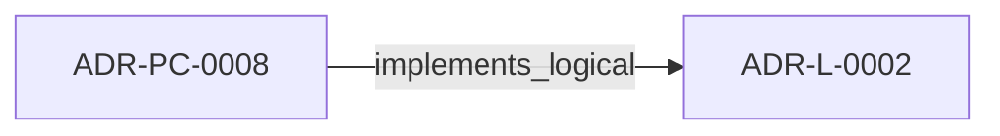
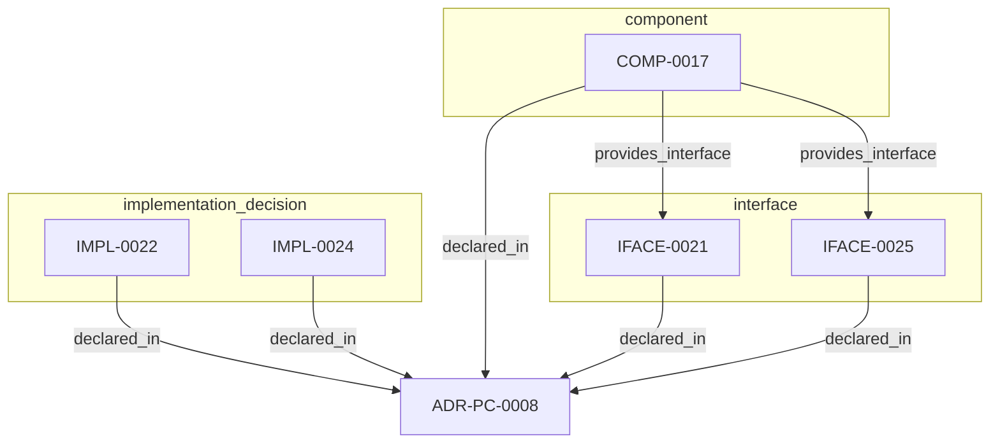

<!--
integrity_schema_version: 1
generated: deterministic_projection_v1
artifact_kind: rendered_adr_markdown
generator_id: adr-projection-markdown
generator_version: 3
hash_algorithm: sha256
source_hash: 7472c655ed7e17816c474a851486ae058c39d64252ee3c3856169d7bf323fd07
rendered_hash: a28ac916f80a2215297da7dbbd1a4c0ca97a64882865cc6d638ab228eee42b71
-->

# ADR-PC-0008: Project Scope Resolution

## Identity / Status

**Type:** physical-component  
**Status:** accepted  
**Alias:** ADR-PC-0008  
**Alias name:** project-scope-resolution  
**Created:** 2026-08-28  
**Implements Logical:** [ADR-L-0002](../logical/ADR-L-0002-multi-scope-adr-architecture-for-sub-module-development.md)  
**Implements System:** [ADR-PS-0001](../physical-system/ADR-PS-0001-adr-architecture-kit-discovery-and-indexing-system.md), [ADR-PS-0002](../physical-system/ADR-PS-0002-adr-kit-authoring-compiler-and-validation-system.md)  

## Architecture Position

Physical-component ADRs author component, interface, and implementation entities. Topology is not authored here; neighborhood uses compiled semantic architecture edges plus structural bridges.

## Architecture Neighborhood

### Semantic architecture inventory

- `implements_logical`: ADR-PC-0008 → ADR-L-0002

## Neighbor Relationships

### ADR-L-0002 — Multi-Scope ADR Architecture for Sub-Module Development

- ADR-PC-0008 -[:implements_logical]-> ADR-L-0002 (peer ADR-L-0002)

**Context:** The adr-architecture-kit is being actively developed in a single workspace alongside
multiple sub-modules (ste-runtime, future services) that will eventually become
independent services. Each sub-module needs to leverage the ADR system for its own
architectural documentation while being developed in parallel within the monorepo.

[Open projection](../logical/ADR-L-0002-multi-scope-adr-architecture-for-sub-module-development.md)

## Context

Permanent physical-component authority for multi-scope project-root detection,
scope boundary validation, and scope-resolution semantics per ADR-L-0002.
Rehomes preserved nested identity from retired ADR-P-0003 (COMP-0017) into
governed PS+PC authority without topology authoring in this document.

## Internal Structure

### COMP-0017: Project Scope Resolver (library)

**Responsibilities:**
- Detect project boundaries using marker files
- Enforce workspace boundaries (INV-0018)
- Support explicit scope override
- Discover sub-module scopes recursively
- Maintain parent-child scope relationships

**Interfaces:**
- **IFACE-0021** (library_api): ProjectScope dataclass exposes immutable scope metadata: root, adr_dir, manifest_path, marker, name, is_sub_module, parent_scope.

- **IFACE-0025** (library_api): ProjectScopeResolver.resolve(start_dir) -> ProjectScope and resolve_recursive(start_dir) -> List[ProjectScope].

**Implementation Identifiers:**
- Module Path: `src/adr_kit/scope/`

- `component` COMP-0017 — Project Scope Resolver
- `implementation_decision` IMPL-0022 — Adopt Red-Green-Refactor TDD Methodology
- `implementation_decision` IMPL-0024 — Use Dataclasses for ProjectScope
- `interface` IFACE-0021 — 019fee89-e618-717e-933f-f02a053e8ac5
- `interface` IFACE-0025 — 019fee89-e618-79e6-8b3f-27b30946373a

## Technology Stack

### Python (language)

**Version:** >=3.14

**Rationale:**
Minimum supported Python minor is 3.14 (`requires-python >=3.14`); currently qualified released minor line is 3.14; repository reference interpreter is currently 3.14.7; new GA Python minors require explicit qualification before support is advertised. 

### Click (library)

**Version:** 8.x

**Rationale:**
CLI framework; consistent with STE ecosystem CLI patterns

### PyYAML (library)

**Version:** 6.x

**Rationale:**
ADR YAML parsing; schema validation

### pathlib (library)

**Version:** stdlib

**Rationale:**
Cross-platform path handling for scope resolution

---

*Generated from ADR-PC-0008 by ADR Architecture Kit (projection v3)*