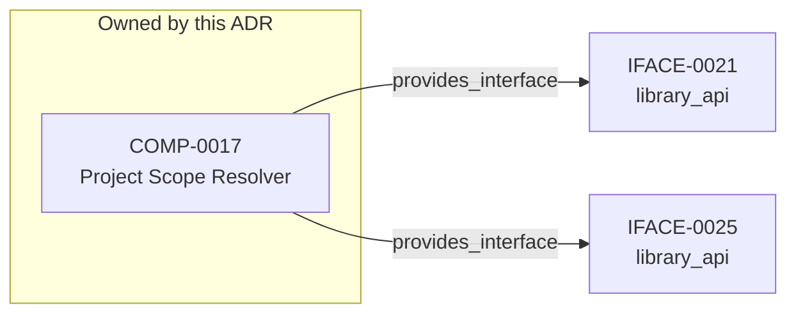

<!--
integrity_schema_version: 1
generated: deterministic_projection_v1
artifact_kind: rendered_adr_markdown
generator_id: adr-projection-markdown
generator_version: 3
hash_algorithm: sha256
source_hash: 6eb6cca0f8d571f620ac3c50c1948dd85ff5f33af485f5ed25a72a785976ebdb
rendered_hash: 9f9f6e2506ad959a8657bfd6e20030d7fb8fc194015214729d769dc189cf6613
-->

# ADR-PC-0008: Project Scope Resolution

## Identity / Status

**Type:** physical-component  
**Status:** accepted  
**Alias:** ADR-PC-0008  
**Authoring contract:** authoring v1.5  
**Created:** 2026-08-28  
**Authors:** adr-architecture-kit  
**Domains:** implementation, adr, python, scope-resolution  
**Tags:** python, scope-resolution, multi-scope  
**Implements Logical:** [ADR-L-0002](../logical/ADR-L-0002-multi-scope-adr-architecture-for-sub-module-development.md)  
**Implements System:** [ADR-PS-0001](../physical-system/ADR-PS-0001-adr-architecture-kit-discovery-and-indexing-system.md), [ADR-PS-0002](../physical-system/ADR-PS-0002-adr-kit-authoring-compiler-and-validation-system.md)  

## Architecture at a Glance

| | |
| --- | --- |
| Component | COMP-0017 — Project Scope Resolver |
| Type | library |
| System | [ADR-PS-0001](../physical-system/ADR-PS-0001-adr-architecture-kit-discovery-and-indexing-system.md) |
| Purpose | Resolve project scope boundaries for multi-scope ADR operations. |
| Interfaces | IFACE-0021 — library_api; IFACE-0025 — library_api |
| Primary implementation | `src/adr_kit/scope/` |

**Logical authority**
- [ADR-L-0002](../logical/ADR-L-0002-multi-scope-adr-architecture-for-sub-module-development.md)

## Change Safety

**Must preserve**
- Scope metadata must remain deterministic for unchanged repository layout
- Parent-child scope relationships must be explicit and testable

**Known architectural surface**
- Provided interfaces: IFACE-0021 — library_api; IFACE-0025 — library_api

**Verification**
- Success criteria: 2
- Integration checks: 4

## Context

Permanent physical-component authority for multi-scope project-root detection,
scope boundary validation, and scope-resolution semantics per ADR-L-0002.
Rehomes preserved nested identity from retired ADR-P-0003 (COMP-0017) into
governed PS+PC authority without topology authoring in this document.

## Architecture & Relationships

### Component Relationships

**Provides interface**
- library_api (IFACE-0021)

  `COMP-0017 -[:provides_interface]-> IFACE-0021`
- library_api (IFACE-0025)

  `COMP-0017 -[:provides_interface]-> IFACE-0025`

**Implements logical authority**
- Multi-Scope ADR Architecture for Sub-Module Development (ADR-L-0002)

  `ADR-PC-0008 -[:implements_logical]-> ADR-L-0002`

## Component Contract

### COMP-0017: Project Scope Resolver

**Type:** library

**Description:**

Python module implementing project scope detection and resolution
per ADR-L-0002 INV-0015 marker hierarchy

**Purpose:**

Resolve project scope boundaries for multi-scope ADR operations.

**Responsibilities:**

- Detect project boundaries using marker files
- Enforce workspace boundaries (INV-0018)
- Support explicit scope override
- Discover sub-module scopes recursively
- Maintain parent-child scope relationships

**Key Responsibilities:**
- Detect project boundaries using marker hierarchy (ADR-L-0002 INV-0015)
- Enforce workspace boundaries (INV-0018)
- Support explicit scope override and recursive discovery

**Success Criteria:**
- Scope auto-detection works from any nested working directory
- Recursive discovery returns independent per-scope metadata

## Interfaces

### IFACE-0021 — library_api

**Type:** library_api

**Specification:**

ProjectScope dataclass exposes immutable scope metadata: root, adr_dir, manifest_path, marker, name, is_sub_module, parent_scope.

### IFACE-0025 — library_api

**Type:** library_api

**Specification:**

ProjectScopeResolver.resolve(start_dir) -> ProjectScope and resolve_recursive(start_dir) -> List[ProjectScope].

## Implementation Decisions

### IMPL-0022 — Adopt Red-Green-Refactor TDD Methodology

**Rationale:**

Test-Driven Development is architecturally aligned with STE principles:
1. **SYS-2 (Deterministic Cognition)**: Tests enforce deterministic behavior
2. **SYS-4 (Drift Prevention)**: Tests detect implementation drift immediately
3. **PRIME-1 (No Implicit Assumptions)**: Tests make behavior explicit
4. **INV-0001 (Schema Validation)**: Tests prove validation correctness

This is a governance tool that validates other systems - it MUST be provably
correct. TDD provides executable specification, immediate feedback, refactoring
safety, and living documentation.

### IMPL-0024 — Use Dataclasses for ProjectScope

**Rationale:**

Dataclasses provide immutable, type-safe scope metadata with minimal
boilerplate. Aligns with modern Python best practices.

**Alternatives Considered:**

| Alternative | Rejected Because |
| --- | --- |
| Named tuples | Less readable, no default values |
| Regular classes | More boilerplate, mutable by default |

**Consequences:**
- Requires Python 3.7+ (already required)
- Clear, type-checked scope objects
- Easy serialization for debugging

## Engineering Contract

### Verification

**Testing requirements:**
- Unit tests for marker detection
- Unit tests for boundary enforcement
- Unit tests for recursive discovery
- Integration tests with real directory structures

### Dependencies
- pathlib.Path
- dataclasses.dataclass
- typing (Optional, List)
- yaml (for PROJECT.yaml parsing)

## Implementation Map

| Role | Location |
| --- | --- |
| Primary implementation | `src/adr_kit/scope/` |

## Lineage / Migration

| Entity Type | Historical Alias | Current Alias | Source |
| --- | --- | --- | --- |
| component | COMP-0001 | COMP-0017 | /component_specifications/0/id |
| implementation_decision | IMPL-0001 | IMPL-0022 | /implementation_decisions/0/id |
| implementation_decision | IMPL-0002 | IMPL-0024 | /implementation_decisions/1/id |
| interface | IFACE-0001 | IFACE-0021 | /component_specifications/0/interfaces/0/id |
| interface | IFACE-0002 | IFACE-0025 | /component_specifications/0/interfaces/1/id |

## Technology & Dependencies

### Python (language)
**Version:** >=3.14

**Rationale:**
Minimum supported Python minor is 3.14 (`requires-python >=3.14`); currently qualified released minor line is 3.14; repository reference interpreter is currently 3.14.7; new GA Python minors require explicit qualification before support is advertised.

### Click (library)
**Version:** 8.x

**Rationale:**
CLI framework; consistent with STE ecosystem CLI patterns

### PyYAML (library)
**Version:** 6.x

**Rationale:**
ADR YAML parsing; schema validation

### pathlib (library)
**Version:** stdlib

**Rationale:**
Cross-platform path handling for scope resolution

## Architecture Impact

**Related ADRs:** [ADR-L-0002](../logical/ADR-L-0002-multi-scope-adr-architecture-for-sub-module-development.md)

## Internal Structure

| Kind | Entity |
| --- | --- |
| Component | COMP-0017 — Project Scope Resolver |
| Implementation Decision | IMPL-0022 — Adopt Red-Green-Refactor TDD Methodology |
| Implementation Decision | IMPL-0024 — Use Dataclasses for ProjectScope |
| Interface | IFACE-0021 — library_api |
| Interface | IFACE-0025 — library_api |

## Neighbor Relationships

| Neighbor | Relationship | Exact Path |
| --- | --- | --- |
| [ADR-L-0002 — Multi-Scope ADR Architecture for Sub-Module Development](../logical/ADR-L-0002-multi-scope-adr-architecture-for-sub-module-development.md) | Project Scope Resolution (ADR-PC-0008) → Multi-Scope ADR Architecture for Sub-Module Development (ADR-L-0002) | `ADR-PC-0008 -[:implements_logical]-> ADR-L-0002` |

---

*Generated from ADR-PC-0008 by ADR Architecture Kit (projection v3)*