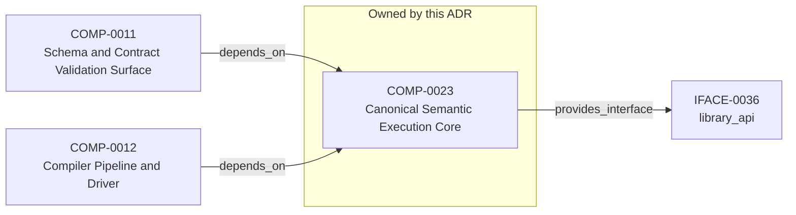

<!--
integrity_schema_version: 1
generated: deterministic_projection_v1
artifact_kind: rendered_adr_markdown
generator_id: adr-projection-markdown
generator_version: 3
hash_algorithm: sha256
source_hash: 7e4ca47bf62597387b9f57fbb7ba9c857bbcdb3a4019e9f7d539287c5c47b92c
rendered_hash: f4764ef67d413d9b735545b3015fc6697dd6f3e6bcffd84a4801e201d76dd03d
-->

# ADR-PC-0009: Canonical Semantic Execution Core

## Identity / Status

**Type:** physical-component 
**Status:** proposed 
**Alias:** ADR-PC-0009 
**Authoring contract:** authoring v1.5 
**Created:** 2026-10-05 
**Authors:** erik.gallmann 
**Domains:** semantic-core, semantic-execution, rust, wasm 
**Tags:** semantic-core, rust, wasm, python, node 
**Implements Logical:** [ADR-L-0027](../logical/ADR-L-0027-public-binding-construction-and-release-parity.md), [ADR-L-0029](../logical/ADR-L-0029-semantic-authoring-construction-and-candidate-authority.md), [ADR-L-0030](../logical/ADR-L-0030-canonical-source-basis-and-semantic-execution-surface.md) 
**Implements System:** [ADR-PS-0002](../physical-system/ADR-PS-0002-adr-kit-authoring-compiler-and-validation-system.md) 

## Architecture at a Glance

| | |
| --- | --- |
| Component | COMP-0023 — Canonical Semantic Execution Core |
| Type | library |
| System | [ADR-PS-0002](../physical-system/ADR-PS-0002-adr-kit-authoring-compiler-and-validation-system.md) |
| Purpose | Provide one canonical semantic execution authority to supported ADR-Kit hosts. |
| Depended on by | Schema and Contract Validation Surface (COMP-0011); Compiler Pipeline and Driver (COMP-0012) |
| Interfaces | IFACE-0036 — library_api |

**Logical authority**
- [ADR-L-0027](../logical/ADR-L-0027-public-binding-construction-and-release-parity.md)
- [ADR-L-0029](../logical/ADR-L-0029-semantic-authoring-construction-and-candidate-authority.md)
- [ADR-L-0030](../logical/ADR-L-0030-canonical-source-basis-and-semantic-execution-surface.md)

## Change Safety

**Must preserve**
- Host adapters own filesystem discovery, YAML acquisition/parsing, and presentation.
- The core must not traverse or write consumer repositories or perform admission.
- Python and Node must not recreate meaning-bearing core behavior.
- Rust-native modules and types are not public SDK contracts.
- The component remains one crate and does not change the WASM ABI or operation inventory through internal restructuring.

**Known architectural surface**
- Depended on by: Schema and Contract Validation Surface (COMP-0011); Compiler Pipeline and Driver (COMP-0012)
- Provided interfaces: IFACE-0036 — library_api

**Verification**
- Success criteria: 3
- Integration checks: 4

## Context

The Rust/WASM semantic core is ADR-Kit's canonical meaning-bearing execution
component. It implements the versioned semantic-core request/result boundary
used by Python and TypeScript/Node hosts. The core owns shared semantic rules
and deterministic results; it is an implementation boundary, not a Rust-native
public SDK.

The component includes canonical JSON transport needed to execute the core
protocol, versioned dispatch, schema execution used by core operations,
semantic-contract identity/closure/set operations, authoring validation and
construction, canonical architecture validation, Architecture Interpretation,
normalized materialization, and shared attribution/linkage operations.
Python and Node acquire filesystem and YAML facts, adapt explicit inputs to the
protocol, and present results. The core does not traverse or mutate consumer
filesystems, persist ADRs, perform governance or Runtime admission, or own CLI
presentation. It remains one Rust crate; internal modules are not separately
published components.

## Architecture & Relationships

### Component Relationships

**Depended on by**
- Schema and Contract Validation Surface (COMP-0011)

  `COMP-0011 -[:depends_on]-> COMP-0023`
- Compiler Pipeline and Driver (COMP-0012)

  `COMP-0012 -[:depends_on]-> COMP-0023`

**Provides interface**
- library_api (IFACE-0036)

  `COMP-0023 -[:provides_interface]-> IFACE-0036`

**Implements logical authority**
- Public Binding Construction and Release Parity (ADR-L-0027)

  `ADR-PC-0009 -[:implements_logical]-> ADR-L-0027`
- Semantic Authoring Construction and Candidate Authority (ADR-L-0029)

  `ADR-PC-0009 -[:implements_logical]-> ADR-L-0029`
- Canonical Source Basis and Semantic Execution Surface (ADR-L-0030)

  `ADR-PC-0009 -[:implements_logical]-> ADR-L-0030`

## Component Contract

### COMP-0023: Canonical Semantic Execution Core

**Type:** library

**Purpose:**

Provide one canonical semantic execution authority to supported ADR-Kit hosts.

**Responsibilities:**

- Execute canonical meaning-bearing semantic operations for supported core protocol versions.
- Own shared semantic validation, authoring construction, architecture interpretation, and materialization rules.
- Produce deterministic protocol results and diagnostics consumed by peer host bindings.
- Provide one Rust implementation built for native qualification and the shared WebAssembly artifact.
- Keep protocol dispatch separate from the semantic meaning implemented by domain operations.

**Key Responsibilities:**
- Validate and execute exact semantic-contract, authoring, interpretation, materialization, and attribution operations.
- Preserve deterministic results and diagnostics across Python and TypeScript/Node hosts.
- Keep the versioned JSON/WASM boundary stable independently of internal Rust module organization.

**Success Criteria:**
- Supported hosts execute the same source-built semantic-core WASM artifact.
- Protocol conformance and host parity checks pass for supported operations.
- Internal structural changes preserve request/result behavior and deterministic diagnostics.

## Interfaces

### IFACE-0036 — library_api

**Type:** library_api

**Specification:**

Internal shared execution boundary for supported hosts. Hosts submit UTF-8
JSON requests with an explicit `core_contract_version` and receive UTF-8
JSON results. The current protocol inventory is 1.0 through 1.3 and is
routed by version. The WASM `execute` ABI accepts a byte pointer and size
and returns the serialized result. This protocol does not expose Rust
module APIs or types as a public SDK.

## Engineering Contract

### Verification

**Testing requirements:**
- Complete Rust semantic-core unit and protocol conformance suites.
- Source-built WASM artifact parity across Python and Node package locations.
- Python and Node observe equivalent results from the same semantic execution path.
- Behavior-preserving structural work verifies protocol, ABI, diagnostics, and semantic outputs.

### Dependencies
- serde
- serde_json
- sha2
- zmij_ecma
- regex

## Implementation Map

| Role | Location |
| --- | --- |
| Crate manifest | `core/Cargo.toml` |
| Source root | `core/src/` |

## Technology & Dependencies

### Rust (language)
**Version:** 2021 edition

**Rationale:**
Implementation language for the single canonical semantic-core crate.

### WebAssembly (runtime)
**Version:** wasm32-unknown-unknown

**Rationale:**
Portable shared execution artifact consumed by peer hosts.

## Internal Structure

| Kind | Entity |
| --- | --- |
| Component | COMP-0023 — Canonical Semantic Execution Core |
| Interface | IFACE-0036 — library_api |

## Neighbor Relationships

| Neighbor | Relationship | Exact Path |
| --- | --- | --- |
| [ADR-L-0027 — Public Binding Construction and Release Parity](../logical/ADR-L-0027-public-binding-construction-and-release-parity.md) | Canonical Semantic Execution Core (ADR-PC-0009) → Public Binding Construction and Release Parity (ADR-L-0027) | `ADR-PC-0009 -[:implements_logical]-> ADR-L-0027` |
| [ADR-L-0029 — Semantic Authoring Construction and Candidate Authority](../logical/ADR-L-0029-semantic-authoring-construction-and-candidate-authority.md) | Canonical Semantic Execution Core (ADR-PC-0009) → Semantic Authoring Construction and Candidate Authority (ADR-L-0029) | `ADR-PC-0009 -[:implements_logical]-> ADR-L-0029` |
| [ADR-L-0030 — Canonical Source Basis and Semantic Execution Surface](../logical/ADR-L-0030-canonical-source-basis-and-semantic-execution-surface.md) | Canonical Semantic Execution Core (ADR-PC-0009) → Canonical Source Basis and Semantic Execution Surface (ADR-L-0030) | `ADR-PC-0009 -[:implements_logical]-> ADR-L-0030` |
| [ADR-PC-0002 — Schema and Contract Validation](ADR-PC-0002-schema-and-contract-validation.md) | Schema and Contract Validation Surface (COMP-0011) → Canonical Semantic Execution Core (COMP-0023) | `COMP-0011 -[:depends_on]-> COMP-0023` |
| [ADR-PC-0003 — Compiler Pipeline and Driver](ADR-PC-0003-compiler-pipeline-and-driver.md) | Compiler Pipeline and Driver (COMP-0012) → Canonical Semantic Execution Core (COMP-0023) | `COMP-0012 -[:depends_on]-> COMP-0023` |

---

*Generated from ADR-PC-0009 by ADR Architecture Kit (projection v3)*