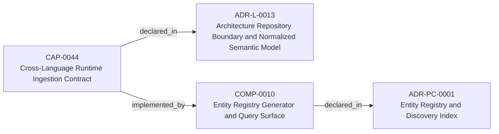
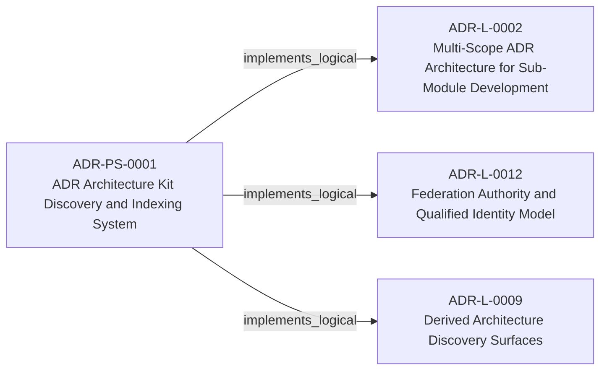
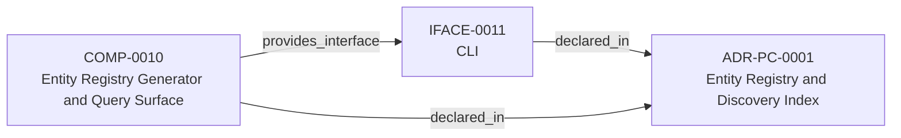

<!--
integrity_schema_version: 1
generated: deterministic_projection_v1
artifact_kind: rendered_adr_markdown
generator_id: adr-projection-markdown
generator_version: 3
hash_algorithm: sha256
source_hash: adb4222b92be7ad398e641138fd9198bbbbc367fbd1e6d57257ec0252216d55b
rendered_hash: d4c6b99d8fa15ad4f9a060af330fa31f2a171d7872898d8b52d54d3dace85441
-->

# ADR-PS-0001: ADR Architecture Kit Discovery and Indexing System

## Identity / Status

**Type:** physical-system  
**Status:** accepted  
**Alias:** ADR-PS-0001  
**Alias name:** adr-architecture-kit-discovery-and-indexing-system  
**Created:** 2026-03-13  
**Implements Logical:** [ADR-L-0009](../logical/ADR-L-0009-derived-architecture-discovery-surfaces.md), [ADR-L-0012](../logical/ADR-L-0012-federation-authority-and-qualified-identity-model.md), [ADR-L-0002](../logical/ADR-L-0002-multi-scope-adr-architecture-for-sub-module-development.md)  

## Architecture Position

Physical-system membership is `composed_of` from the system entity to admitted components. Topology handles are local authoring labels, not graph identities.

**System:** SYS-0001 — ADR Architecture Kit Discovery and Indexing System

## Architecture Neighborhood

### Semantic architecture inventory

- `implemented_by`: CAP-0044 → COMP-0010
- `implements_logical`: ADR-PS-0001 → ADR-L-0002
- `implements_logical`: ADR-PS-0001 → ADR-L-0012
- `implements_logical`: ADR-PS-0001 → ADR-L-0009
- `provides_interface`: COMP-0010 → IFACE-0011

## Neighbor Relationships

### ADR-L-0002 — Multi-Scope ADR Architecture for Sub-Module Development

- ADR-PS-0001 -[:implements_logical]-> ADR-L-0002

**Context:** The adr-architecture-kit is being actively developed in a single workspace alongside
multiple sub-modules (ste-runtime, future services) that will eventually become
independent services. Each sub-module needs to leverage the ADR system for its own
architectural documentation while being developed in parallel within the monorepo.

[Open projection](../logical/ADR-L-0002-multi-scope-adr-architecture-for-sub-module-development.md)
### ADR-L-0009 — Derived Architecture Discovery Surfaces

- ADR-PS-0001 -[:implements_logical]-> ADR-L-0009

**Context:** adr-architecture-kit is primarily machine-facing tooling used by agents to
reason over canonical architecture artifacts. Relying on agents to scan raw
ADR bodies for discovery is inconsistent with the toolkit's AI-first design
theory: discovery surfaces should be explicit, deterministic, cheap to query,
and derived from canonical authority.

[Open projection](../logical/ADR-L-0009-derived-architecture-discovery-surfaces.md)
### ADR-L-0012 — Federation Authority and Qualified Identity Model

- ADR-PS-0001 -[:implements_logical]-> ADR-L-0012

**Context:** The compiler and recursive multi-scope model preserve repository-local
compilation boundaries, while STE federation spans independently compiled
repositories. Federation therefore requires global identity without weakening
provider authority or allowing the aggregation layer to rewrite canonical
repository state.

[Open projection](../logical/ADR-L-0012-federation-authority-and-qualified-identity-model.md)
### ADR-L-0013 — Architecture Repository Boundary and Normalized Semantic Model

- CAP-0044 -[:implemented_by]-> COMP-0010

**Context:** adr-architecture-kit now has an explicit compiler pipeline, a compiler IR
(`ArchModel`), compiled registry bundles, and an additive architecture graph.
Those pieces are sufficient to produce deterministic machine-facing artifacts,
and ArchitectureRepository already defines the semantic in-process boundary.
Phase 1 adds a narrow supported authoring facade that reuses that seam without
expanding the normalized model or exposing compiler internals.

[Open projection](../logical/ADR-L-0013-architecture-repository-boundary-and-normalized-semantic-model.md)
### ADR-PC-0001 — Entity Registry and Discovery Index

- COMP-0010 -[:provides_interface]-> IFACE-0011

**Context:** The discovery/indexing component now centers on the unified compiler path. It
generates the normalized discovery bundle under `adrs/index/`, emits the
legacy compatibility registry at `adrs/entities/registry.yaml`, generates
manifest and rendered ADR markdown outputs through the same compiler-owned
path for single-scope use, and exposes exact-ID and filtered CLI query
operations over generated registry state.

[Open projection](../physical-component/ADR-PC-0001-entity-registry-and-discovery-index.md)

## Context

The discovery and indexing subsystem provides the derived surfaces that agents
query instead of scanning raw ADR bodies by default. It now includes
normalized discovery bundle generation under `adrs/index/`, legacy
compatibility registry generation under `adrs/entities/registry.yaml`,
manifest generation, rendered ADR markdown generation, CLI query surfaces over
generated registry state, and the unified `adr compile` orchestration path
that emits these derived discovery artifacts together.

## Internal Structure

### Topology membership

- Handle `TOPO-0001` → component `019fee89-e617-76d8-a333-e21361cd6602` — Compile, emit, and query derived discovery artifacts for architecture indexing.

- `system` SYS-0001 — ADR Architecture Kit Discovery and Indexing System

## System Boundaries

### Discovery and Indexing Boundary

Encapsulates generation and query of derived discovery artifacts without
changing canonical ADR authority.

**External dependencies:** Canonical ADR artifacts, Standalone invariant artifacts

## Technology Stack

### Python (language)

**Version:** >=3.14

**Rationale:**
Minimum supported Python minor is 3.14 (`requires-python >=3.14`); currently qualified released minor line is 3.14; repository reference interpreter is currently 3.14.7; new GA Python minors require explicit qualification before support is advertised. 

### PyYAML (library)

**Version:** 6.x

**Rationale:**
Deterministic YAML parsing and rendering for derived artifacts.

### Click (tooling)

**Version:** 8.x

**Rationale:**
Existing CLI surface for agent and human invocation.

---

*Generated from ADR-PS-0001 by ADR Architecture Kit (projection v3)*