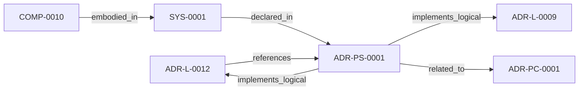

<!--
integrity_schema_version: 1
generated: deterministic_projection_v1
artifact_kind: rendered_adr_markdown
generator_id: adr-projection-markdown
generator_version: 2
hash_algorithm: sha256
source_hash: 5433b20ee1e8055558c25cc291167faedb8da98d9b7dd557f1f7c7d074fb6a30
rendered_hash: d9aeff41fedc181df42e94d215b31307cf407a51dd19a7b59e42f8a220e58d32
-->

# ADR-PS-0001: ADR Architecture Kit Discovery and Indexing System

**Status:** proposed  
**Created:** 2026-03-13  
**Authors:** adr-architecture-kit  
**Domains:** discovery, indexing, tooling  
**Alias name:** adr-architecture-kit-discovery-and-indexing-system  

**Implements Logical:** [ADR-L-0009](../logical/ADR-L-0009-derived-architecture-discovery-surfaces.md), [ADR-L-0012](../logical/ADR-L-0012-federation-authority-and-qualified-identity-model.md)  
**Technologies:** python, pyyaml, click  

## Context

The discovery and indexing subsystem provides the derived surfaces that agents
query instead of scanning raw ADR bodies by default. It now includes
normalized discovery bundle generation under `adrs/index/`, legacy
compatibility registry generation under `adrs/entities/registry.yaml`,
manifest generation, rendered ADR markdown generation, CLI query surfaces over
generated registry state, and the unified `adr compile` orchestration path
that emits these derived discovery artifacts together.

## Technology Stack

### Python (language)

**Version:** 3.11

**Rationale:**
Existing adr-architecture-kit implementation language.

### PyYAML (library)

**Version:** 6.x

**Rationale:**
Deterministic YAML parsing and rendering for derived artifacts.

### Click (tooling)

**Version:** 8.x

**Rationale:**
Existing CLI surface for agent and human invocation.

## Relationship graph

## Related ADRs

### ADR-L-0009 — Derived Architecture Discovery Surfaces

**Relationships:**
- this ADR -[:implements_logical]-> 019fee89-e616-770c-a025-2c241a720730

**Context:** adr-architecture-kit is primarily machine-facing tooling used by agents to
reason over canonical architecture artifacts. Relying on agents to scan raw
ADR bodies for discovery is inconsistent with the toolkit's AI-first design
theory: discovery surfaces should be explicit, deterministic, cheap to query,
and derived from canonical authority.

[Open projection](../logical/ADR-L-0009-derived-architecture-discovery-surfaces.md)
### ADR-L-0012 — Federation Authority and Qualified Identity Model

**Relationships:**
- this ADR -[:implements_logical]-> 019fee89-e616-744f-b63e-5ecddf344faa
- 019fee89-e616-744f-b63e-5ecddf344faa -[:references]-> this ADR

**Context:** The compiler and recursive multi-scope model preserve repository-local
compilation boundaries, while STE federation spans independently compiled
repositories. Federation therefore requires global identity without weakening
provider authority or allowing the aggregation layer to rewrite canonical
repository state.

[Open projection](../logical/ADR-L-0012-federation-authority-and-qualified-identity-model.md)
### ADR-PC-0001 — Entity Registry and Discovery Index

**Relationships:**
- this ADR -[:related_to]-> 019fee89-e617-7270-ab2f-58a756d2530e

**Context:** The discovery/indexing component now centers on the unified compiler path. It
generates the normalized discovery bundle under `adrs/index/`, emits the
legacy compatibility registry at `adrs/entities/registry.yaml`, generates
manifest and rendered ADR markdown outputs through the same compiler-owned
path for single-scope use, and exposes exact-ID and filtered CLI query
operations over generated registry state.

[Open projection](../physical-component/ADR-PC-0001-entity-registry-and-discovery-index.md)

---

*Generated from ADR-PS-0001 by ADR Architecture Kit*