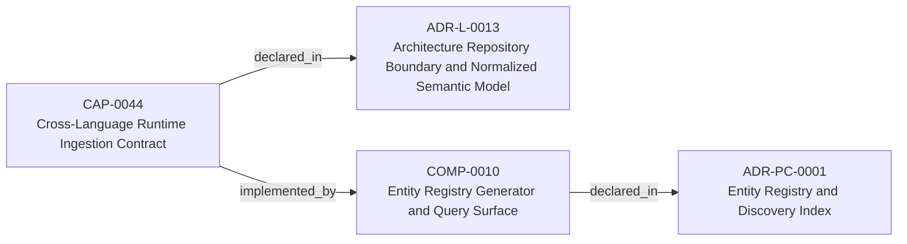
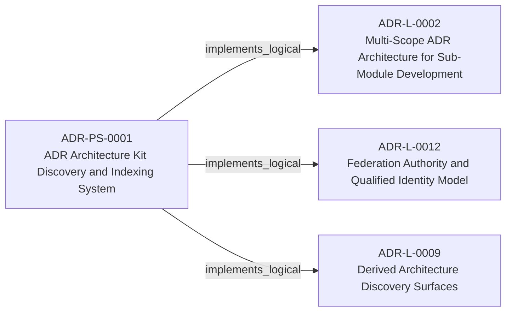
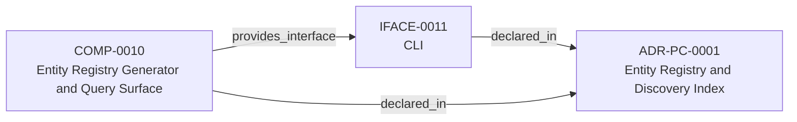

<!--
integrity_schema_version: 1
generated: deterministic_projection_v1
artifact_kind: rendered_adr_markdown
generator_id: adr-projection-markdown
generator_version: 3
hash_algorithm: sha256
source_hash: 0a926e70e5017dd33d5968937d2cca73cfd17a8cd8604cd982df36d1798c1d9d
rendered_hash: a0276bc8cb982da7aab332f9d2089747b716f9ee3c359dca529ab1cfa42931b8
-->

# ADR-PS-0001: ADR Architecture Kit Discovery and Indexing System

## Identity / Status

**Type:** physical-system  
**Status:** accepted  
**Alias:** ADR-PS-0001  
**System:** SYS-0001 — ADR Architecture Kit Discovery and Indexing System  
**Authoring contract:** authoring v1.5  
**Created:** 2026-03-13  
**Modified:** 2026-08-27  
**Authors:** adr-architecture-kit  
**Domains:** discovery, indexing, tooling  
**Implements Logical:** [ADR-L-0009](../logical/ADR-L-0009-derived-architecture-discovery-surfaces.md), [ADR-L-0012](../logical/ADR-L-0012-federation-authority-and-qualified-identity-model.md), [ADR-L-0002](../logical/ADR-L-0002-multi-scope-adr-architecture-for-sub-module-development.md)  

## Architecture Position

Topology handles are local authoring labels, not graph identities.

**System:** SYS-0001 — ADR Architecture Kit Discovery and Indexing System
**Components:** 1
**Boundaries:** 1
**Internal topology relationships:** 0
**External dependencies:** 2

**Logical authority:**
- [ADR-L-0009](../logical/ADR-L-0009-derived-architecture-discovery-surfaces.md)
- [ADR-L-0012](../logical/ADR-L-0012-federation-authority-and-qualified-identity-model.md)
- [ADR-L-0002](../logical/ADR-L-0002-multi-scope-adr-architecture-for-sub-module-development.md)

**Exposed surfaces:**
- `adr compile`
- `adr generate-architecture-index`
- `adr generate-manifest`
- `adr generate-adr-projection`
- `adr generate-rendered-docs`
- `adr generate-entity-registry`
- `adr entities *`

## Context

The discovery and indexing subsystem provides the derived surfaces that agents
query instead of scanning raw ADR bodies by default. It now includes
normalized discovery bundle generation under `adrs/index/`, legacy
compatibility registry generation under `adrs/entities/registry.yaml`,
manifest generation, rendered ADR markdown generation, CLI query surfaces over
generated registry state, and the unified `adr compile` orchestration path
that emits these derived discovery artifacts together.

## Internal Structure

### System Components

| Component | Type | Role in this System | Authority |
| --- | --- | --- | --- |
| COMP-0010 — Entity Registry Generator and Query Surface | service | Compile, emit, and query derived discovery artifacts for architecture indexing. | [ADR-PC-0001](../physical-component/ADR-PC-0001-entity-registry-and-discovery-index.md) |

Local topology handles:
- `TOPO-0001` → COMP-0010 — Entity Registry Generator and Query Surface

### System Topology

## System Boundaries

### SYSBOUND-0001 — Discovery and Indexing Boundary

Encapsulates generation and query of derived discovery artifacts without
changing canonical ADR authority.

**External Dependencies**
- Canonical ADR artifacts
- Standalone invariant artifacts

**Exposed Interfaces**
- `adr compile`
- `adr generate-architecture-index`
- `adr generate-manifest`
- `adr generate-adr-projection`
- `adr generate-rendered-docs`
- `adr generate-entity-registry`
- `adr entities *`

## Before You Change This System

**Logical contracts implemented**
- [ADR-L-0009](../logical/ADR-L-0009-derived-architecture-discovery-surfaces.md)
- [ADR-L-0012](../logical/ADR-L-0012-federation-authority-and-qualified-identity-model.md)
- [ADR-L-0002](../logical/ADR-L-0002-multi-scope-adr-architecture-for-sub-module-development.md)

**Constituent components**
- COMP-0010 — Entity Registry Generator and Query Surface

**External dependencies**
- Canonical ADR artifacts
- Standalone invariant artifacts

**Exposed interfaces**
- `adr compile`
- `adr generate-architecture-index`
- `adr generate-manifest`
- `adr generate-adr-projection`
- `adr generate-rendered-docs`
- `adr generate-entity-registry`
- `adr entities *`

## Technology Stack

### Python (language)
**Version:** >=3.14

**Rationale:**
Minimum supported Python minor is 3.14 (`requires-python >=3.14`); currently qualified released minor line is 3.14; repository reference interpreter is currently 3.14.7; new GA Python minors require explicit qualification before support is advertised.

### PyYAML (library)
**Version:** 6.x

**Rationale:**
Deterministic YAML parsing and rendering for derived artifacts.

### Click (tooling)
**Version:** 8.x

**Rationale:**
Existing CLI surface for agent and human invocation.

## Architecture Neighborhood

### Semantic architecture inventory

- `implemented_by`: CAP-0044 → COMP-0010
- `implements_logical`: ADR-PS-0001 → ADR-L-0002
- `implements_logical`: ADR-PS-0001 → ADR-L-0012
- `implements_logical`: ADR-PS-0001 → ADR-L-0009
- `provides_interface`: COMP-0010 → IFACE-0011

## Neighbor Relationships

### ADR-L-0002 — Multi-Scope ADR Architecture for Sub-Module Development

ADR Architecture Kit Discovery and Indexing System (ADR-PS-0001)
    -[:implements_logical]->
Multi-Scope ADR Architecture for Sub-Module Development (ADR-L-0002)

`ADR-PS-0001 -[:implements_logical]-> ADR-L-0002`

**Peer context:** The adr-architecture-kit is being actively developed in a single workspace alongside
multiple sub-modules (ste-runtime, future services) that will eventually become
independent services. Each sub-module needs to leverage the ADR system for its own
architectural documentation while being developed in parallel within the monorepo.

[Open projection](../logical/ADR-L-0002-multi-scope-adr-architecture-for-sub-module-development.md)
### ADR-L-0009 — Derived Architecture Discovery Surfaces

ADR Architecture Kit Discovery and Indexing System (ADR-PS-0001)
    -[:implements_logical]->
Derived Architecture Discovery Surfaces (ADR-L-0009)

`ADR-PS-0001 -[:implements_logical]-> ADR-L-0009`

**Peer context:** adr-architecture-kit is primarily machine-facing tooling used by agents to
reason over canonical architecture artifacts. Relying on agents to scan raw
ADR bodies for discovery is inconsistent with the toolkit's AI-first design
theory: discovery surfaces should be explicit, deterministic, cheap to query,
and derived from canonical authority.

[Open projection](../logical/ADR-L-0009-derived-architecture-discovery-surfaces.md)
### ADR-L-0012 — Federation Authority and Qualified Identity Model

ADR Architecture Kit Discovery and Indexing System (ADR-PS-0001)
    -[:implements_logical]->
Federation Authority and Qualified Identity Model (ADR-L-0012)

`ADR-PS-0001 -[:implements_logical]-> ADR-L-0012`

**Peer context:** The compiler and recursive multi-scope model preserve repository-local
compilation boundaries, while STE federation spans independently compiled
repositories. Federation therefore requires global identity without weakening
provider authority or allowing the aggregation layer to rewrite canonical
repository state.

[Open projection](../logical/ADR-L-0012-federation-authority-and-qualified-identity-model.md)
### ADR-L-0013 — Architecture Repository Boundary and Normalized Semantic Model

Cross-Language Runtime Ingestion Contract (CAP-0044)
    -[:implemented_by]->
Entity Registry Generator and Query Surface (COMP-0010)

`CAP-0044 -[:implemented_by]-> COMP-0010`

**Peer context:** adr-architecture-kit now has an explicit compiler pipeline, a compiler IR
(`ArchModel`), compiled registry bundles, and an additive architecture graph.
Those pieces are sufficient to produce deterministic machine-facing artifacts,
and ArchitectureRepository already defines the semantic in-process boundary.
Phase 1 adds a narrow supported authoring facade that reuses that seam without
expanding the normalized model or exposing compiler internals.

[Open projection](../logical/ADR-L-0013-architecture-repository-boundary-and-normalized-semantic-model.md)
### ADR-PC-0001 — Entity Registry and Discovery Index

Entity Registry Generator and Query Surface (COMP-0010)
    -[:provides_interface]->
CLI (IFACE-0011)

`COMP-0010 -[:provides_interface]-> IFACE-0011`

**Peer context:** The discovery/indexing component now centers on the unified compiler path. It
generates the normalized discovery bundle under `adrs/index/`, emits the
legacy compatibility registry at `adrs/entities/registry.yaml`, generates
manifest and rendered ADR markdown outputs through the same compiler-owned
path for single-scope use, and exposes exact-ID and filtered CLI query
operations over generated registry state.

[Open projection](../physical-component/ADR-PC-0001-entity-registry-and-discovery-index.md)

---

*Generated from ADR-PS-0001 by ADR Architecture Kit (projection v3)*