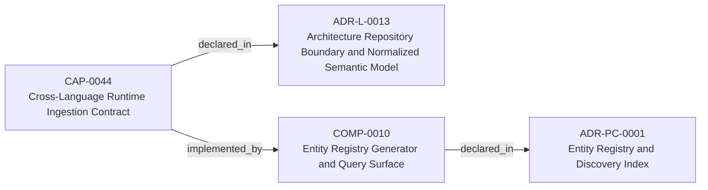
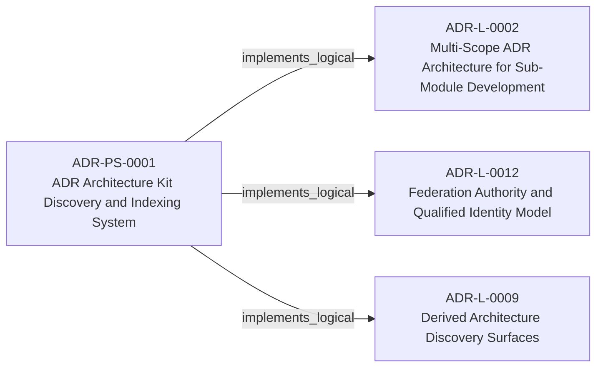
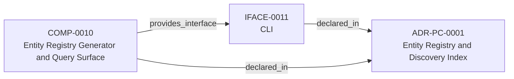

<!--
integrity_schema_version: 1
generated: deterministic_projection_v1
artifact_kind: rendered_adr_markdown
generator_id: adr-projection-markdown
generator_version: 3
hash_algorithm: sha256
source_hash: 71fea80a3646739fd377052280568bbd73a9b17eed3a3042877e2c00f5c3592d
rendered_hash: 1ee486757b597caa5395787efabbe71abe82c163f5e33aae15c117f4b89ac497
-->

# ADR-PS-0001: ADR Architecture Kit Discovery and Indexing System

## Identity / Status

**Type:** physical-system  
**Status:** accepted  
**Alias:** ADR-PS-0001  
**System:** SYS-0001 — ADR Architecture Kit Discovery and Indexing System  
**Authoring contract:** authoring v1.5  
**Created:** 2026-03-13  
**Modified:** 2026-08-27  
**Authors:** adr-architecture-kit  
**Domains:** discovery, indexing, tooling  
**Implements Logical:** [ADR-L-0009](../logical/ADR-L-0009-derived-architecture-discovery-surfaces.md), [ADR-L-0012](../logical/ADR-L-0012-federation-authority-and-qualified-identity-model.md), [ADR-L-0002](../logical/ADR-L-0002-multi-scope-adr-architecture-for-sub-module-development.md)  

## Architecture at a Glance

| | |
| --- | --- |
| System | SYS-0001 — ADR Architecture Kit Discovery and Indexing System |
| Components | 1 |
| Boundaries | 1 |
| Internal relationships | 0 |
| External dependencies | 2 |
| Exposed surfaces | 7 |

**Logical authority**
- [ADR-L-0009](../logical/ADR-L-0009-derived-architecture-discovery-surfaces.md)
- [ADR-L-0012](../logical/ADR-L-0012-federation-authority-and-qualified-identity-model.md)
- [ADR-L-0002](../logical/ADR-L-0002-multi-scope-adr-architecture-for-sub-module-development.md)

## Change Safety

**Logical contracts**
- [ADR-L-0009](../logical/ADR-L-0009-derived-architecture-discovery-surfaces.md)
- [ADR-L-0012](../logical/ADR-L-0012-federation-authority-and-qualified-identity-model.md)
- [ADR-L-0002](../logical/ADR-L-0002-multi-scope-adr-architecture-for-sub-module-development.md)

**Constituent components**
- COMP-0010 — Entity Registry Generator and Query Surface

**External dependencies**
- Canonical ADR artifacts
- Standalone invariant artifacts

**Exposed interfaces**
- `adr compile`
- `adr generate-architecture-index`
- `adr generate-manifest`
- `adr generate-adr-projection`
- `adr generate-rendered-docs`
- `adr generate-entity-registry`
- `adr entities *`

## Context

The discovery and indexing subsystem provides the derived surfaces that agents
query instead of scanning raw ADR bodies by default. It now includes
normalized discovery bundle generation under `adrs/index/`, legacy
compatibility registry generation under `adrs/entities/registry.yaml`,
manifest generation, rendered ADR markdown generation, CLI query surfaces over
generated registry state, and the unified `adr compile` orchestration path
that emits these derived discovery artifacts together.

## Internal System Architecture

### System Components

| Component | Type | Role in this System | Authority |
| --- | --- | --- | --- |
| COMP-0010 — Entity Registry Generator and Query Surface | service | Compile, emit, and query derived discovery artifacts for architecture indexing. | [ADR-PC-0001](../physical-component/ADR-PC-0001-entity-registry-and-discovery-index.md) |

*Topology handles are local authoring labels, not graph identities.*

Local topology handles:
- `TOPO-0001` → COMP-0010 — Entity Registry Generator and Query Surface

## System Boundaries

### SYSBOUND-0001 — Discovery and Indexing Boundary

Encapsulates generation and query of derived discovery artifacts without
changing canonical ADR authority.

**External Dependencies**
- Canonical ADR artifacts
- Standalone invariant artifacts

**Exposed Interfaces**
- `adr compile`
- `adr generate-architecture-index`
- `adr generate-manifest`
- `adr generate-adr-projection`
- `adr generate-rendered-docs`
- `adr generate-entity-registry`
- `adr entities *`

## Architecture Relationships

## Technology

### Python (language)
**Version:** >=3.14

**Rationale:**
Minimum supported Python minor is 3.14 (`requires-python >=3.14`); currently qualified released minor line is 3.14; repository reference interpreter is currently 3.14.7; new GA Python minors require explicit qualification before support is advertised.

### PyYAML (library)
**Version:** 6.x

**Rationale:**
Deterministic YAML parsing and rendering for derived artifacts.

### Click (tooling)
**Version:** 8.x

**Rationale:**
Existing CLI surface for agent and human invocation.

## Neighbor Relationships

| Neighbor | Relationship | Exact Path |
| --- | --- | --- |
| [ADR-L-0002 — Multi-Scope ADR Architecture for Sub-Module Development](../logical/ADR-L-0002-multi-scope-adr-architecture-for-sub-module-development.md) | ADR Architecture Kit Discovery and Indexing System (ADR-PS-0001) → Multi-Scope ADR Architecture for Sub-Module Development (ADR-L-0002) | `ADR-PS-0001 -[:implements_logical]-> ADR-L-0002` |
| [ADR-L-0009 — Derived Architecture Discovery Surfaces](../logical/ADR-L-0009-derived-architecture-discovery-surfaces.md) | ADR Architecture Kit Discovery and Indexing System (ADR-PS-0001) → Derived Architecture Discovery Surfaces (ADR-L-0009) | `ADR-PS-0001 -[:implements_logical]-> ADR-L-0009` |
| [ADR-L-0012 — Federation Authority and Qualified Identity Model](../logical/ADR-L-0012-federation-authority-and-qualified-identity-model.md) | ADR Architecture Kit Discovery and Indexing System (ADR-PS-0001) → Federation Authority and Qualified Identity Model (ADR-L-0012) | `ADR-PS-0001 -[:implements_logical]-> ADR-L-0012` |
| [ADR-L-0013 — Architecture Repository Boundary and Normalized Semantic Model](../logical/ADR-L-0013-architecture-repository-boundary-and-normalized-semantic-model.md) | Cross-Language Runtime Ingestion Contract (CAP-0044) → Entity Registry Generator and Query Surface (COMP-0010) | `CAP-0044 -[:implemented_by]-> COMP-0010` |
| [ADR-PC-0001 — Entity Registry and Discovery Index](../physical-component/ADR-PC-0001-entity-registry-and-discovery-index.md) | Entity Registry Generator and Query Surface (COMP-0010) → CLI (IFACE-0011) | `COMP-0010 -[:provides_interface]-> IFACE-0011` |

---

*Generated from ADR-PS-0001 by ADR Architecture Kit (projection v3)*