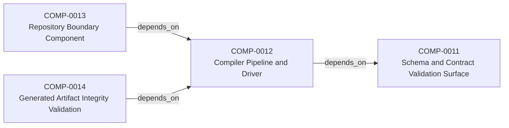
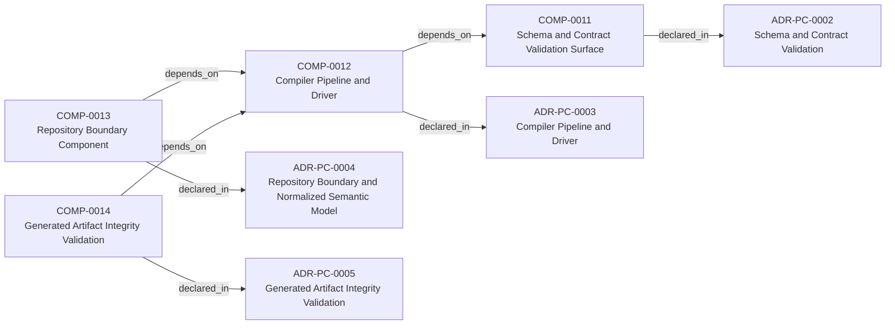
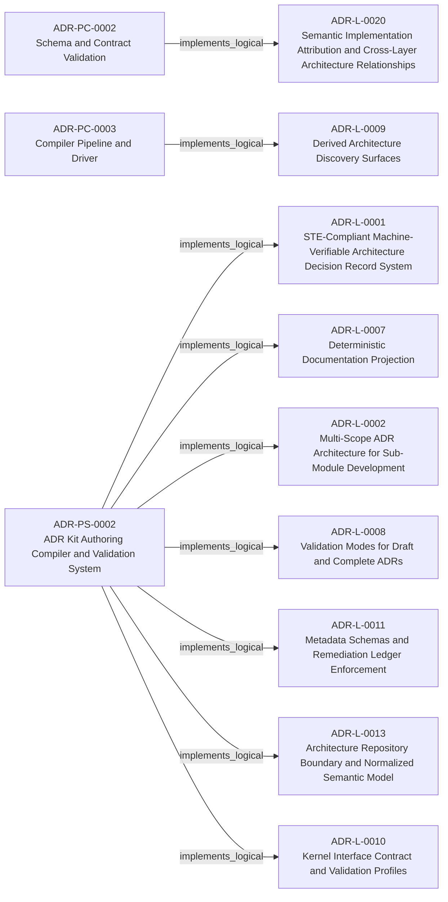

<!--
integrity_schema_version: 1
generated: deterministic_projection_v1
artifact_kind: rendered_adr_markdown
generator_id: adr-projection-markdown
generator_version: 3
hash_algorithm: sha256
source_hash: 0408f272a0f8c35c9f7072f9cc1a76724995f5865b5f23d065975b7034185b22
rendered_hash: d8885ad614f28b2ca301d6bbe5d528442151064e51cfef222f2fead120ceb53f
-->

# ADR-PS-0002: ADR Kit Authoring Compiler and Validation System

## Identity / Status

**Type:** physical-system  
**Status:** accepted  
**Alias:** ADR-PS-0002  
**System:** SYS-0002 — ADR Kit Authoring Compiler and Validation System  
**Authoring contract:** authoring v1.5  
**Created:** 2026-03-15  
**Modified:** 2026-08-27  
**Authors:** adr-architecture-kit  
**Domains:** compiler, validation, tooling  
**Tags:** compiler, validation, authoring, python  
**Implements Logical:** [ADR-L-0001](../logical/ADR-L-0001-ste-compliant-machine-verifiable-architecture-decision-record-system.md), [ADR-L-0007](../logical/ADR-L-0007-deterministic-documentation-projection.md), [ADR-L-0008](../logical/ADR-L-0008-validation-modes-for-draft-and-complete-adrs.md), [ADR-L-0010](../logical/ADR-L-0010-kernel-interface-contract-and-validation-profiles.md), [ADR-L-0011](../logical/ADR-L-0011-metadata-schemas-and-remediation-ledger-enforcement.md), [ADR-L-0013](../logical/ADR-L-0013-architecture-repository-boundary-and-normalized-semantic-model.md), [ADR-L-0002](../logical/ADR-L-0002-multi-scope-adr-architecture-for-sub-module-development.md)  

## Architecture at a Glance

| | |
| --- | --- |
| System | SYS-0002 — ADR Kit Authoring Compiler and Validation System |
| Components | 4 |
| Boundaries | 1 |
| Internal relationships | 3 |
| External dependencies | 3 |
| Exposed surfaces | 6 |

**Logical authority**
- [ADR-L-0001](../logical/ADR-L-0001-ste-compliant-machine-verifiable-architecture-decision-record-system.md)
- [ADR-L-0007](../logical/ADR-L-0007-deterministic-documentation-projection.md)
- [ADR-L-0008](../logical/ADR-L-0008-validation-modes-for-draft-and-complete-adrs.md)
- [ADR-L-0010](../logical/ADR-L-0010-kernel-interface-contract-and-validation-profiles.md)
- [ADR-L-0011](../logical/ADR-L-0011-metadata-schemas-and-remediation-ledger-enforcement.md)
- [ADR-L-0013](../logical/ADR-L-0013-architecture-repository-boundary-and-normalized-semantic-model.md)
- [ADR-L-0002](../logical/ADR-L-0002-multi-scope-adr-architecture-for-sub-module-development.md)

## Change Safety

**Logical contracts**
- [ADR-L-0001](../logical/ADR-L-0001-ste-compliant-machine-verifiable-architecture-decision-record-system.md)
- [ADR-L-0007](../logical/ADR-L-0007-deterministic-documentation-projection.md)
- [ADR-L-0008](../logical/ADR-L-0008-validation-modes-for-draft-and-complete-adrs.md)
- [ADR-L-0010](../logical/ADR-L-0010-kernel-interface-contract-and-validation-profiles.md)
- [ADR-L-0011](../logical/ADR-L-0011-metadata-schemas-and-remediation-ledger-enforcement.md)
- [ADR-L-0013](../logical/ADR-L-0013-architecture-repository-boundary-and-normalized-semantic-model.md)
- [ADR-L-0002](../logical/ADR-L-0002-multi-scope-adr-architecture-for-sub-module-development.md)

**Constituent components**
- COMP-0011 — Schema and Contract Validation Surface
- COMP-0012 — Compiler Pipeline and Driver
- COMP-0013 — Repository Boundary Component
- COMP-0014 — Generated Artifact Integrity Validation

**Internal relationships**
- COMP-0012 — Compiler Pipeline and Driver depends on COMP-0011 — Schema and Contract Validation Surface
- COMP-0013 — Repository Boundary Component depends on COMP-0012 — Compiler Pipeline and Driver
- COMP-0014 — Generated Artifact Integrity Validation depends on COMP-0012 — Compiler Pipeline and Driver

**External dependencies**
- Canonical ADR artifacts
- Canonical invariant artifacts
- Generated registry bundles

**Exposed interfaces**
- `adr compile`
- `adr validate`
- `adr validate-contract`
- `adr validate-project-metadata`
- `adr entities *`
- `adr_kit.api`

**Operational requirements**
- Monitoring: Deterministic validation and compilation output with explicit diagnostics.
- Logging: CLI-visible diagnostic logging with fail-closed validation behavior.

## Context

adr-architecture-kit operates as an authoring-time compiler and validation system rather
than a collection of unrelated generators. The implementation includes an
explicit compiler pipeline, contract validation, normalized repository/model
access, integrity verification, and CLI orchestration over those surfaces.

This ADR establishes the concrete authoring/compiler system boundary for those public
capabilities. Discovery and indexing remain covered by ADR-PS-0001; this ADR
covers the authoring/compiler implementation that powers canonical parsing,
compilation, repository loading, contract checks, artifact integrity, and the
narrow `adr_kit.api` authoring SDK.

The boundary explicitly excludes Assembler behavior, runtime observation or
evidence extraction, rules execution, substrate management, admission decisions,
MCP surfaces, and LLM responsibilities. Those belong to later work or sibling
systems and must not be introduced by the Phase 1 SDK.

## Internal System Architecture

### System Components

| Component | Type | Role in this System | Authority |
| --- | --- | --- | --- |
| COMP-0011 — Schema and Contract Validation Surface | service | Validates canonical ADR structure and contract expectations. | [ADR-PC-0002](../physical-component/ADR-PC-0002-schema-and-contract-validation.md) |
| COMP-0012 — Compiler Pipeline and Driver | service | Builds and emits deterministic architecture compilation outputs. | [ADR-PC-0003](../physical-component/ADR-PC-0003-compiler-pipeline-and-driver.md) |
| COMP-0013 — Repository Boundary Component | service | Loads and serves normalized semantic state for in-process consumers. | [ADR-PC-0004](../physical-component/ADR-PC-0004-repository-boundary-and-normalized-semantic-model.md) |
| COMP-0014 — Generated Artifact Integrity Validation | service | Verifies generated artifact freshness and tamper integrity. | [ADR-PC-0005](../physical-component/ADR-PC-0005-generated-artifact-integrity-validation.md) |

### System Topology

*Topology handles are local authoring labels, not graph identities.*

Local topology handles:
- `TOPO-0001` → COMP-0011 — Schema and Contract Validation Surface
- `TOPO-0002` → COMP-0012 — Compiler Pipeline and Driver
- `TOPO-0003` → COMP-0013 — Repository Boundary Component
- `TOPO-0004` → COMP-0014 — Generated Artifact Integrity Validation

### Component Interactions

| From | Relationship | To | Protocol | Description |
| --- | --- | --- | --- | --- |
| COMP-0012 — Compiler Pipeline and Driver | depends on (`depends_on`) | COMP-0011 — Schema and Contract Validation Surface | — | — |
| COMP-0013 — Repository Boundary Component | depends on (`depends_on`) | COMP-0012 — Compiler Pipeline and Driver | — | — |
| COMP-0014 — Generated Artifact Integrity Validation | depends on (`depends_on`) | COMP-0012 — Compiler Pipeline and Driver | — | — |

## System Boundaries

### SYSBOUND-0002 — Authoring Compiler and Validation Boundary

Encapsulates canonical ADR parsing, compiler orchestration, schema and
contract validation, normalized repository access, and generated artifact
integrity validation. It exposes a narrow Python authoring SDK over supported
validation, compilation, repository, model, and capability contracts. It does
not perform runtime extraction, rules, substrate, admission, MCP, LLM, or
Assembler responsibilities.

**External Dependencies**
- Canonical ADR artifacts
- Canonical invariant artifacts
- Generated registry bundles

**Exposed Interfaces**
- `adr compile`
- `adr validate`
- `adr validate-contract`
- `adr validate-project-metadata`
- `adr entities *`
- `adr_kit.api`

## Operational Requirements

**Monitoring**
Deterministic validation and compilation output with explicit diagnostics.

**Logging**
CLI-visible diagnostic logging with fail-closed validation behavior.

## Architecture Relationships

## Technology

### Python (language)
**Version:** >=3.14

**Rationale:**
Minimum supported Python minor is 3.14 (`requires-python >=3.14`); currently qualified released minor line is 3.14; repository reference interpreter is currently 3.14.7; new GA Python minors require explicit qualification before support is advertised.

### Click (tooling)
**Version:** 8.x

**Rationale:**
Existing CLI surface for compile and validate operations.

### Pydantic (library)
**Version:** 2.x

**Rationale:**
Typed canonical models and validation.

### jsonschema (library)
**Version:** 4.x

**Rationale:**
Structural schema validation for canonical artifacts.

## Neighbor Relationships

| Neighbor | Relationship | Exact Path |
| --- | --- | --- |
| [ADR-L-0001 — STE-Compliant Machine-Verifiable Architecture Decision Record System](../logical/ADR-L-0001-ste-compliant-machine-verifiable-architecture-decision-record-system.md) | ADR Kit Authoring Compiler and Validation System (ADR-PS-0002) → STE-Compliant Machine-Verifiable Architecture Decision Record System (ADR-L-0001) | `ADR-PS-0002 -[:implements_logical]-> ADR-L-0001` |
| [ADR-L-0002 — Multi-Scope ADR Architecture for Sub-Module Development](../logical/ADR-L-0002-multi-scope-adr-architecture-for-sub-module-development.md) | ADR Kit Authoring Compiler and Validation System (ADR-PS-0002) → Multi-Scope ADR Architecture for Sub-Module Development (ADR-L-0002) | `ADR-PS-0002 -[:implements_logical]-> ADR-L-0002` |
| [ADR-L-0007 — Deterministic Documentation Projection](../logical/ADR-L-0007-deterministic-documentation-projection.md) | ADR Kit Authoring Compiler and Validation System (ADR-PS-0002) → Deterministic Documentation Projection (ADR-L-0007) | `ADR-PS-0002 -[:implements_logical]-> ADR-L-0007` |
| [ADR-L-0008 — Validation Modes for Draft and Complete ADRs](../logical/ADR-L-0008-validation-modes-for-draft-and-complete-adrs.md) | ADR Kit Authoring Compiler and Validation System (ADR-PS-0002) → Validation Modes for Draft and Complete ADRs (ADR-L-0008) | `ADR-PS-0002 -[:implements_logical]-> ADR-L-0008` |
| [ADR-L-0009 — Derived Architecture Discovery Surfaces](../logical/ADR-L-0009-derived-architecture-discovery-surfaces.md) | Compiler Pipeline and Driver (ADR-PC-0003) → Derived Architecture Discovery Surfaces (ADR-L-0009) | `ADR-PC-0003 -[:implements_logical]-> ADR-L-0009` |
| [ADR-L-0010 — Kernel Interface Contract and Validation Profiles](../logical/ADR-L-0010-kernel-interface-contract-and-validation-profiles.md) | ADR Kit Authoring Compiler and Validation System (ADR-PS-0002) → Kernel Interface Contract and Validation Profiles (ADR-L-0010) | `ADR-PS-0002 -[:implements_logical]-> ADR-L-0010` |
| [ADR-L-0011 — Metadata Schemas and Remediation Ledger Enforcement](../logical/ADR-L-0011-metadata-schemas-and-remediation-ledger-enforcement.md) | ADR Kit Authoring Compiler and Validation System (ADR-PS-0002) → Metadata Schemas and Remediation Ledger Enforcement (ADR-L-0011) | `ADR-PS-0002 -[:implements_logical]-> ADR-L-0011` |
| [ADR-L-0013 — Architecture Repository Boundary and Normalized Semantic Model](../logical/ADR-L-0013-architecture-repository-boundary-and-normalized-semantic-model.md) | ADR Kit Authoring Compiler and Validation System (ADR-PS-0002) → Architecture Repository Boundary and Normalized Semantic Model (ADR-L-0013) | `ADR-PS-0002 -[:implements_logical]-> ADR-L-0013` |
| [ADR-L-0020 — Semantic Implementation Attribution and Cross-Layer Architecture Relationships](../logical/ADR-L-0020-semantic-implementation-attribution-and-cross-layer-architecture-relationships.md) | Schema and Contract Validation (ADR-PC-0002) → Semantic Implementation Attribution and Cross-Layer Architecture Relationships (ADR-L-0020) | `ADR-PC-0002 -[:implements_logical]-> ADR-L-0020` |

---

*Generated from ADR-PS-0002 by ADR Architecture Kit (projection v3)*