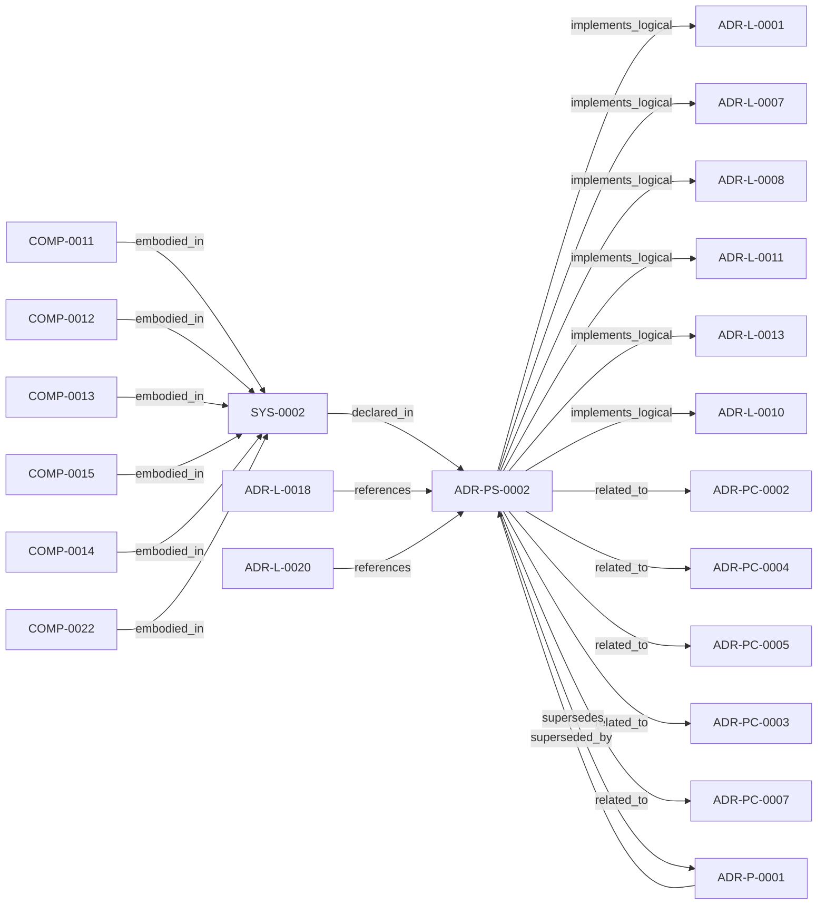

<!--
integrity_schema_version: 1
generated: deterministic_projection_v1
artifact_kind: rendered_adr_markdown
generator_id: adr-projection-markdown
generator_version: 2
hash_algorithm: sha256
source_hash: 16ca7bab17d479f6cb9a837f519d2b249441ad9555060688259137eaea66df9d
rendered_hash: 29b33e73475f423ad3dd4f5be554ac31d87f2acaee7c3ad817546cec2985f7f3
-->

# ADR-PS-0002: ADR Kit Authoring Compiler and Validation System

**Status:** proposed  
**Created:** 2026-03-15  
**Modified:** 2026-08-05  
**Authors:** adr-architecture-kit  
**Domains:** compiler, validation, tooling  
**Tags:** compiler, validation, authoring, python  
**Alias name:** adr-kit-authoring-compiler-and-validation-system  

**Implements Logical:** [ADR-L-0001](../logical/ADR-L-0001-ste-compliant-machine-verifiable-architecture-decision-record-system.md), [ADR-L-0007](../logical/ADR-L-0007-deterministic-documentation-projection.md), [ADR-L-0008](../logical/ADR-L-0008-validation-modes-for-draft-and-complete-adrs.md), [ADR-L-0010](../logical/ADR-L-0010-kernel-interface-contract-and-validation-profiles.md), [ADR-L-0011](../logical/ADR-L-0011-metadata-schemas-and-remediation-ledger-enforcement.md), [ADR-L-0013](../logical/ADR-L-0013-architecture-repository-boundary-and-normalized-semantic-model.md)  
**Technologies:** python, click, pydantic, yaml, json-schema  

## Context

adr-architecture-kit operates as an authoring-time compiler and validation system rather
than a collection of unrelated generators. The implementation includes an
explicit compiler pipeline, contract validation, normalized repository/model
access, integrity verification, and CLI orchestration over those surfaces.

This ADR establishes the concrete authoring/compiler system boundary for those public
capabilities. Discovery and indexing remain covered by ADR-PS-0001; this ADR
covers the authoring/compiler implementation that powers canonical parsing,
compilation, repository loading, contract checks, artifact integrity, and the
narrow `adr_kit.api` authoring SDK.

The boundary explicitly excludes Assembler behavior, runtime observation or
evidence extraction, rules execution, substrate management, admission decisions,
MCP surfaces, and LLM responsibilities. Those belong to later work or sibling
systems and must not be introduced by the Phase 1 SDK.

## Technology Stack

### Python (language)

**Version:** 3.11

**Rationale:**
Existing implementation language for compiler and validator code.

### Click (tooling)

**Version:** 8.x

**Rationale:**
Existing CLI surface for compile and validate operations.

### Pydantic (library)

**Version:** 2.x

**Rationale:**
Typed canonical models and validation.

### jsonschema (library)

**Version:** 4.x

**Rationale:**
Structural schema validation for canonical artifacts.

## Relationship graph

## Related ADRs

### ADR-L-0001 — STE-Compliant Machine-Verifiable Architecture Decision Record System

**Relationships:**
- this ADR -[:implements_logical]-> 019fee89-e615-70a5-861b-b2dde147e5af

**Context:** # ADR Architecture Kit — STE Authoring Subsystem

[Open projection](../logical/ADR-L-0001-ste-compliant-machine-verifiable-architecture-decision-record-system.md)
### ADR-L-0007 — Deterministic Documentation Projection

**Relationships:**
- this ADR -[:implements_logical]-> 019fee89-e615-7b9c-8e3f-32ceeda01491

**Context:** The repository already treats several human-readable artifacts as derived state:
ADR human projections under adrs/adr-projection/, manifest summaries, and the AI-first SYSTEM-OVERVIEW
are generated from structured or code-defined sources. That behavior now needs
explicit architectural authority so future contributors do not reintroduce
manually maintained documentation that drifts from canonical artifacts.

[Open projection](../logical/ADR-L-0007-deterministic-documentation-projection.md)
### ADR-L-0008 — Validation Modes for Draft and Complete ADRs

**Relationships:**
- this ADR -[:implements_logical]-> 019fee89-e616-7066-8d2f-3acc7f469f72

**Context:** The ADR Architecture Kit currently couples schema validation to completeness for
several ADR types. That behavior is useful for acceptance gates, but it is too
strict for the actual design workflow used in this workspace.

[Open projection](../logical/ADR-L-0008-validation-modes-for-draft-and-complete-adrs.md)
### ADR-L-0010 — Kernel Interface Contract and Validation Profiles

**Relationships:**
- this ADR -[:implements_logical]-> 019fee89-e616-7d61-8e35-f11ba2ddd75d

**Context:** adr-architecture-kit is transitioning from an implicit generator toolkit into
an explicit architecture compiler with a defined contract boundary to the STE
kernel. The plan work established that the compiler's guaranteed contract
surface is broader than the kernel's minimal load subset: the contract family
is all generated artifacts under `adrs/index/` plus `manifest.yaml`, while
individual consumers may rely on narrower subsets.

[Open projection](../logical/ADR-L-0010-kernel-interface-contract-and-validation-profiles.md)
### ADR-L-0011 — Metadata Schemas and Remediation Ledger Enforcement

**Relationships:**
- this ADR -[:implements_logical]-> 019fee89-e616-7b97-971d-ae165d13bf9c

**Context:** The compiler contract now distinguishes fully compliant bundles from
sentinel-backed brownfield and migration bundles. That boundary is only safe
if sentinel use is narrow, explicitly tracked, and moved toward approved
canonical content through a monotonic workflow.

[Open projection](../logical/ADR-L-0011-metadata-schemas-and-remediation-ledger-enforcement.md)
### ADR-L-0013 — Architecture Repository Boundary and Normalized Semantic Model

**Relationships:**
- this ADR -[:implements_logical]-> 019fee89-e616-7c4e-953c-b7349412a784

**Context:** adr-architecture-kit now has an explicit compiler pipeline, a compiler IR
(`ArchModel`), compiled registry bundles, and an additive architecture graph.
Those pieces are sufficient to produce deterministic machine-facing artifacts,
and ArchitectureRepository already defines the semantic in-process boundary.
Phase 1 adds a narrow supported authoring facade that reuses that seam without
expanding the normalized model or exposing compiler internals.

[Open projection](../logical/ADR-L-0013-architecture-repository-boundary-and-normalized-semantic-model.md)
### ADR-L-0018 — Schema v1.2 and Normalized Semantic Foundation

**Relationships:**
- 019fee89-e617-7f4d-811d-4862645a55c5 -[:references]-> this ADR

**Context:** Phase 1 established a narrow supported authoring SDK while explicitly deferring
schema expansion, normalized-model expansion, assertion identity, bindings, and
topology identity. The repository now needs those contracts as an additive
semantic foundation for future consumers, without implementing the Phase 3 graph
bundle or absorbing authority owned by runtime, rules, substrate, or admission
systems.

[Open projection](../logical/ADR-L-0018-schema-v1-2-and-normalized-semantic-foundation.md)
### ADR-L-0020 — Semantic Implementation Attribution and Cross-Layer Architecture Relationships

**Relationships:**
- 019ffdba-3c42-7c4a-a737-f6751a265d60 -[:references]-> this ADR

**Context:** ADR-L-0004 established implementation attribution as an explicit intent
surface. ADR-L-0019 made canonical machine identity a lowercase UUIDv7.
Attribution evidence still cited human aliases (`ADR-L-*`, `INV-*`) and
could not name typed relationships to nested architecture entities.

[Open projection](../logical/ADR-L-0020-semantic-implementation-attribution-and-cross-layer-architecture-relationships.md)
### ADR-P-0001 — Python Toolkit Implementation for ADR Kit

**Relationships:**
- 019fee89-e618-79ed-9d2d-cc35c63bc99a -[:superseded_by]-> this ADR
- this ADR -[:supersedes]-> 019fee89-e618-79ed-9d2d-cc35c63bc99a

**Context:** This ADR specifies the implementation of ADR Kit using Python ecosystem and modern
Python tooling. The implementation must support schema validation, YAML parsing,
Pydantic models, and view generation.

[Open projection](../physical/ADR-P-0001-python-toolkit-implementation-for-adr-kit.md)
### ADR-PC-0002 — Schema and Contract Validation

**Relationships:**
- this ADR -[:related_to]-> 019fee89-e617-7d2b-8325-cd85ff814477

**Context:** Schema and contract validation is now a stable component boundary rather than
a generic legacy physical slice. It validates canonical ADR structure,
profile-specific contract requirements, project metadata, and implementation
attribution evidence. Validation of that evidence is structural for schema shape and architecture-aware when claims must resolve to canonical UUIDs and entity types. Legacy 1.0/1.2 evidence normalizes to the v1.5 claim shape only with repository or model 2.0 context.

[Open projection](../physical-component/ADR-PC-0002-schema-and-contract-validation.md)
### ADR-PC-0003 — Compiler Pipeline and Driver

**Relationships:**
- this ADR -[:related_to]-> 019fee89-e618-7b76-843f-cfe21ceb2ea6

**Context:** The compiler driver and explicit pipeline now own deterministic architecture
compilation across parse, analysis, emission, and recursive scope
orchestration. The command-line behavior is compatibility-relevant, while the
Python compiler pipeline, passes, `ArchModel`, emitters, and result plumbing are
internal reference implementation and are not a supported SDK facade.

[Open projection](../physical-component/ADR-PC-0003-compiler-pipeline-and-driver.md)
### ADR-PC-0004 — Repository Boundary and Normalized Semantic Model

**Relationships:**
- this ADR -[:related_to]-> 019fee89-e618-73ce-aa2d-101276d64e33

**Context:** ArchitectureRepository and NormalizedArchitectureModel are the stable
in-process semantic boundary for consumers. Phase 1 adds a narrow supported
authoring facade that reuses those contracts without wrapping or changing the
normalized model and without making registry loaders or path helpers public.

[Open projection](../physical-component/ADR-PC-0004-repository-boundary-and-normalized-semantic-model.md)
### ADR-PC-0005 — Generated Artifact Integrity Validation

**Relationships:**
- this ADR -[:related_to]-> 019fee89-e618-74b2-a83e-e41c7d8c9f37

**Context:** Generated artifact integrity validation verifies freshness, tamper status,
integrity headers, and scope-local generated outputs. It is a distinct public
subsystem used by validator and governance flows.

[Open projection](../physical-component/ADR-PC-0005-generated-artifact-integrity-validation.md)
### ADR-PC-0007 — Semantic Attribution Embodiment

**Relationships:**
- this ADR -[:related_to]-> 019ffdba-3c42-70da-b33d-efc003269c42

**Context:** Semantic attribution needs a kit-owned embodiment for vocabulary, evidence
models, UUID decorators, standalone shims, architecture-aware validation,
repository-aware versioned normalization, and a supported bidirectional
linkage facade. This component does not parse consumer source code, does not
own RECON extraction, and does not admit evidence to the architecture graph.

[Open projection](../physical-component/ADR-PC-0007-semantic-attribution-embodiment.md)

## Operational Requirements

### Monitoring
Deterministic validation and compilation output with explicit diagnostics.

### Logging
CLI-visible diagnostic logging with fail-closed validation behavior.

---

*Generated from ADR-PS-0002 by ADR Architecture Kit*