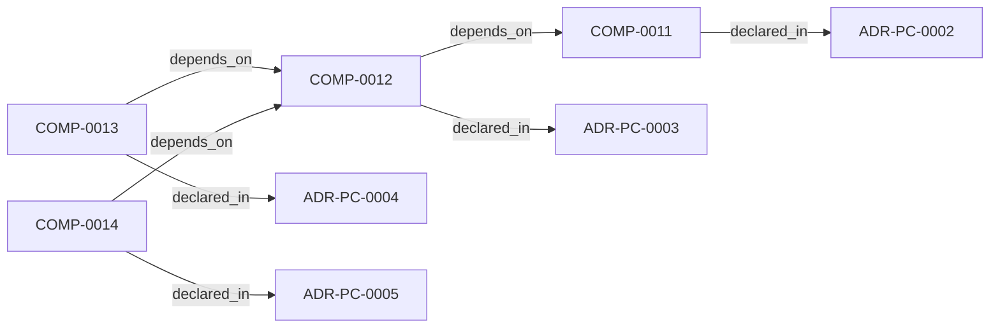
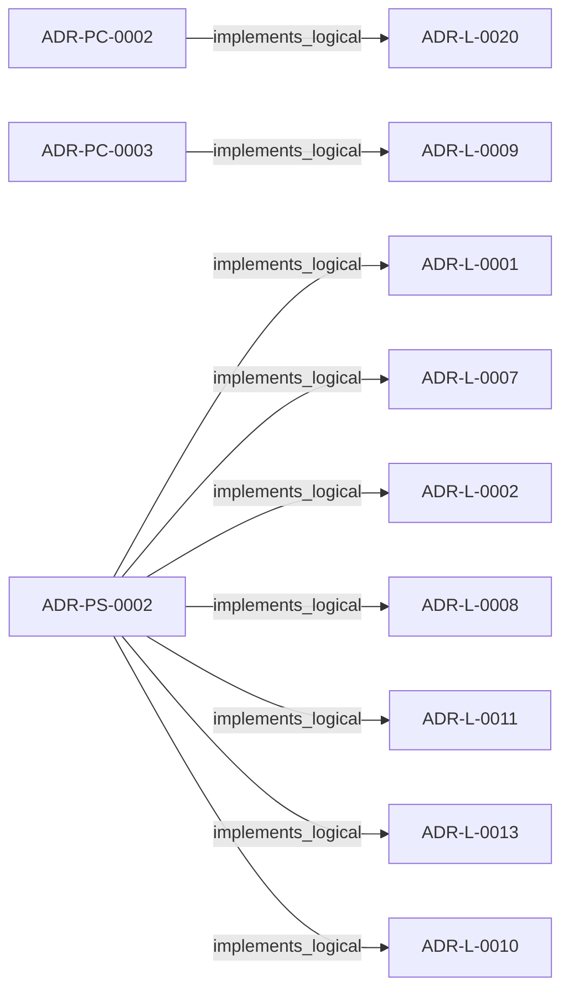

<!--
integrity_schema_version: 1
generated: deterministic_projection_v1
artifact_kind: rendered_adr_markdown
generator_id: adr-projection-markdown
generator_version: 3
hash_algorithm: sha256
source_hash: cfe98c2f8437b620b05d18b5c16fff1c153fb6a1fa735b51bc3098dfb0cf971f
rendered_hash: ea0c765ea8a50af205c8550e2b8e9f4be2b59c323a5c80eb6fd12926b761b2ed
-->

# ADR-PS-0002: ADR Kit Authoring Compiler and Validation System

## Identity / Status

**Type:** physical-system  
**Status:** accepted  
**Alias:** ADR-PS-0002  
**Alias name:** adr-kit-authoring-compiler-and-validation-system  
**Created:** 2026-03-15  
**Implements Logical:** [ADR-L-0001](../logical/ADR-L-0001-ste-compliant-machine-verifiable-architecture-decision-record-system.md), [ADR-L-0007](../logical/ADR-L-0007-deterministic-documentation-projection.md), [ADR-L-0008](../logical/ADR-L-0008-validation-modes-for-draft-and-complete-adrs.md), [ADR-L-0010](../logical/ADR-L-0010-kernel-interface-contract-and-validation-profiles.md), [ADR-L-0011](../logical/ADR-L-0011-metadata-schemas-and-remediation-ledger-enforcement.md), [ADR-L-0013](../logical/ADR-L-0013-architecture-repository-boundary-and-normalized-semantic-model.md), [ADR-L-0002](../logical/ADR-L-0002-multi-scope-adr-architecture-for-sub-module-development.md)  

## Architecture Position

Physical-system membership is `composed_of` from the system entity to admitted components. Topology handles are local authoring labels, not graph identities.

**System:** SYS-0002 — ADR Kit Authoring Compiler and Validation System

## Architecture Neighborhood

### Semantic architecture inventory

- `depends_on`: COMP-0012 → COMP-0011
- `depends_on`: COMP-0013 → COMP-0012
- `depends_on`: COMP-0014 → COMP-0012
- `implements_logical`: ADR-PC-0002 → ADR-L-0020
- `implements_logical`: ADR-PC-0003 → ADR-L-0009
- `implements_logical`: ADR-PS-0002 → ADR-L-0001
- `implements_logical`: ADR-PS-0002 → ADR-L-0007
- `implements_logical`: ADR-PS-0002 → ADR-L-0002
- `implements_logical`: ADR-PS-0002 → ADR-L-0008
- `implements_logical`: ADR-PS-0002 → ADR-L-0011
- `implements_logical`: ADR-PS-0002 → ADR-L-0013
- `implements_logical`: ADR-PS-0002 → ADR-L-0010

## Neighbor Relationships

### ADR-L-0001 — STE-Compliant Machine-Verifiable Architecture Decision Record System

- ADR-PS-0002 -[:implements_logical]-> ADR-L-0001 (peer ADR-L-0001)

**Context:** # ADR Architecture Kit — STE Authoring Subsystem

[Open projection](../logical/ADR-L-0001-ste-compliant-machine-verifiable-architecture-decision-record-system.md)
### ADR-L-0002 — Multi-Scope ADR Architecture for Sub-Module Development

- ADR-PS-0002 -[:implements_logical]-> ADR-L-0002 (peer ADR-L-0002)

**Context:** The adr-architecture-kit is being actively developed in a single workspace alongside
multiple sub-modules (ste-runtime, future services) that will eventually become
independent services. Each sub-module needs to leverage the ADR system for its own
architectural documentation while being developed in parallel within the monorepo.

[Open projection](../logical/ADR-L-0002-multi-scope-adr-architecture-for-sub-module-development.md)
### ADR-L-0007 — Deterministic Documentation Projection

- ADR-PS-0002 -[:implements_logical]-> ADR-L-0007 (peer ADR-L-0007)

**Context:** The repository already treats several human-readable artifacts as derived state:
ADR human projections under adrs/adr-projection/, manifest summaries, and the AI-first SYSTEM-OVERVIEW
are generated from structured or code-defined sources. That behavior now needs
explicit architectural authority so future contributors do not reintroduce
manually maintained documentation that drifts from canonical artifacts.

[Open projection](../logical/ADR-L-0007-deterministic-documentation-projection.md)
### ADR-L-0008 — Validation Modes for Draft and Complete ADRs

- ADR-PS-0002 -[:implements_logical]-> ADR-L-0008 (peer ADR-L-0008)

**Context:** The ADR Architecture Kit currently couples schema validation to completeness for
several ADR types. That behavior is useful for acceptance gates, but it is too
strict for the actual design workflow used in this workspace.

[Open projection](../logical/ADR-L-0008-validation-modes-for-draft-and-complete-adrs.md)
### ADR-L-0009 — Derived Architecture Discovery Surfaces

- ADR-PC-0003 -[:implements_logical]-> ADR-L-0009 (peer ADR-L-0009)

**Context:** adr-architecture-kit is primarily machine-facing tooling used by agents to
reason over canonical architecture artifacts. Relying on agents to scan raw
ADR bodies for discovery is inconsistent with the toolkit's AI-first design
theory: discovery surfaces should be explicit, deterministic, cheap to query,
and derived from canonical authority.

[Open projection](../logical/ADR-L-0009-derived-architecture-discovery-surfaces.md)
### ADR-L-0010 — Kernel Interface Contract and Validation Profiles

- ADR-PS-0002 -[:implements_logical]-> ADR-L-0010 (peer ADR-L-0010)

**Context:** adr-architecture-kit is transitioning from an implicit generator toolkit into
an explicit architecture compiler with a defined contract boundary to the STE
kernel. The plan work established that the compiler's guaranteed contract
surface is broader than the kernel's minimal load subset: the contract family
is all generated artifacts under `adrs/index/` plus `manifest.yaml`, while
individual consumers may rely on narrower subsets.

[Open projection](../logical/ADR-L-0010-kernel-interface-contract-and-validation-profiles.md)
### ADR-L-0011 — Metadata Schemas and Remediation Ledger Enforcement

- ADR-PS-0002 -[:implements_logical]-> ADR-L-0011 (peer ADR-L-0011)

**Context:** The compiler contract now distinguishes fully compliant bundles from
sentinel-backed brownfield and migration bundles. That boundary is only safe
if sentinel use is narrow, explicitly tracked, and moved toward approved
canonical content through a monotonic workflow.

[Open projection](../logical/ADR-L-0011-metadata-schemas-and-remediation-ledger-enforcement.md)
### ADR-L-0013 — Architecture Repository Boundary and Normalized Semantic Model

- ADR-PS-0002 -[:implements_logical]-> ADR-L-0013 (peer ADR-L-0013)

**Context:** adr-architecture-kit now has an explicit compiler pipeline, a compiler IR
(`ArchModel`), compiled registry bundles, and an additive architecture graph.
Those pieces are sufficient to produce deterministic machine-facing artifacts,
and ArchitectureRepository already defines the semantic in-process boundary.
Phase 1 adds a narrow supported authoring facade that reuses that seam without
expanding the normalized model or exposing compiler internals.

[Open projection](../logical/ADR-L-0013-architecture-repository-boundary-and-normalized-semantic-model.md)
### ADR-L-0020 — Semantic Implementation Attribution and Cross-Layer Architecture Relationships

- ADR-PC-0002 -[:implements_logical]-> ADR-L-0020 (peer ADR-L-0020)

**Context:** ADR-L-0004 established implementation attribution as an explicit intent
surface. ADR-L-0019 made canonical machine identity a lowercase UUIDv7.
Attribution evidence still cited human aliases (`ADR-L-*`, `INV-*`) and
could not name typed relationships to nested architecture entities.

[Open projection](../logical/ADR-L-0020-semantic-implementation-attribution-and-cross-layer-architecture-relationships.md)
### ADR-PC-0002 — Schema and Contract Validation

- COMP-0012 -[:depends_on]-> COMP-0011 (peer ADR-PC-0002)

**Context:** Schema and contract validation is now a stable component boundary rather than
a generic legacy physical slice. It validates canonical ADR structure,
profile-specific contract requirements, project metadata, and implementation
attribution evidence. Validation of that evidence is structural for schema shape and architecture-aware when claims must resolve to canonical UUIDs and entity types. Legacy 1.0/1.2 evidence normalizes to the v1.5 claim shape only with repository or model 2.0 context.

[Open projection](../physical-component/ADR-PC-0002-schema-and-contract-validation.md)
### ADR-PC-0003 — Compiler Pipeline and Driver

- COMP-0012 -[:depends_on]-> COMP-0011 (peer ADR-PC-0003)

**Context:** The compiler driver and explicit pipeline now own deterministic architecture
compilation across parse, analysis, emission, and recursive scope
orchestration. The command-line behavior is compatibility-relevant, while the
Python compiler pipeline, passes, `ArchModel`, emitters, and result plumbing are
internal reference implementation and are not a supported SDK facade.

[Open projection](../physical-component/ADR-PC-0003-compiler-pipeline-and-driver.md)
### ADR-PC-0004 — Repository Boundary and Normalized Semantic Model

- COMP-0013 -[:depends_on]-> COMP-0012 (peer ADR-PC-0004)

**Context:** ArchitectureRepository and NormalizedArchitectureModel are the stable
in-process semantic boundary for consumers. Phase 1 adds a narrow supported
authoring facade that reuses those contracts without wrapping or changing the
normalized model and without making registry loaders or path helpers public.

[Open projection](../physical-component/ADR-PC-0004-repository-boundary-and-normalized-semantic-model.md)
### ADR-PC-0005 — Generated Artifact Integrity Validation

- COMP-0014 -[:depends_on]-> COMP-0012 (peer ADR-PC-0005)

**Context:** Generated artifact integrity validation verifies freshness, tamper status,
integrity headers, and scope-local generated outputs. It is a distinct public
subsystem used by validator and governance flows.

[Open projection](../physical-component/ADR-PC-0005-generated-artifact-integrity-validation.md)

## Context

adr-architecture-kit operates as an authoring-time compiler and validation system rather
than a collection of unrelated generators. The implementation includes an
explicit compiler pipeline, contract validation, normalized repository/model
access, integrity verification, and CLI orchestration over those surfaces.

This ADR establishes the concrete authoring/compiler system boundary for those public
capabilities. Discovery and indexing remain covered by ADR-PS-0001; this ADR
covers the authoring/compiler implementation that powers canonical parsing,
compilation, repository loading, contract checks, artifact integrity, and the
narrow `adr_kit.api` authoring SDK.

The boundary explicitly excludes Assembler behavior, runtime observation or
evidence extraction, rules execution, substrate management, admission decisions,
MCP surfaces, and LLM responsibilities. Those belong to later work or sibling
systems and must not be introduced by the Phase 1 SDK.

## Internal Structure

### Topology membership

- Handle `TOPO-0001` → component `019fee89-e617-7060-8f3f-4ecd46a719da` — Validates canonical ADR structure and contract expectations.
- Handle `TOPO-0002` → component `019fee89-e617-76ad-9336-b3615a6e4bde` — Builds and emits deterministic architecture compilation outputs.
- Handle `TOPO-0003` → component `019fee89-e618-74d1-9a1f-37e2c2982a51` — Loads and serves normalized semantic state for in-process consumers.
- Handle `TOPO-0004` → component `019fee89-e618-781c-831f-0d5fe24f7d85` — Verifies generated artifact freshness and tamper integrity.

- `system` SYS-0002 — ADR Kit Authoring Compiler and Validation System

## System Boundaries

### Authoring Compiler and Validation Boundary

Encapsulates canonical ADR parsing, compiler orchestration, schema and
contract validation, normalized repository access, and generated artifact
integrity validation. It exposes a narrow Python authoring SDK over supported
validation, compilation, repository, model, and capability contracts. It does
not perform runtime extraction, rules, substrate, admission, MCP, LLM, or
Assembler responsibilities.

**External dependencies:** Canonical ADR artifacts, Canonical invariant artifacts, Generated registry bundles

## Technology Stack

### Python (language)

**Version:** >=3.14

**Rationale:**
Minimum supported Python minor is 3.14 (`requires-python >=3.14`); currently qualified released minor line is 3.14; repository reference interpreter is currently 3.14.7; new GA Python minors require explicit qualification before support is advertised. 

### Click (tooling)

**Version:** 8.x

**Rationale:**
Existing CLI surface for compile and validate operations.

### Pydantic (library)

**Version:** 2.x

**Rationale:**
Typed canonical models and validation.

### jsonschema (library)

**Version:** 4.x

**Rationale:**
Structural schema validation for canonical artifacts.

---

*Generated from ADR-PS-0002 by ADR Architecture Kit (projection v3)*