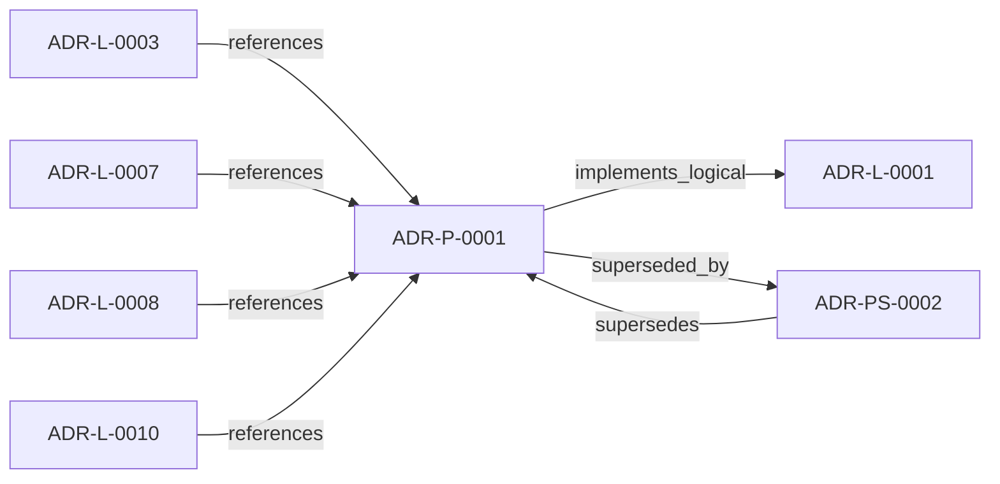

<!--
integrity_schema_version: 1
generated: deterministic_projection_v1
artifact_kind: rendered_adr_markdown
generator_id: adr-projection-markdown
generator_version: 2
hash_algorithm: sha256
source_hash: d47f3b5f34940ed22812e526a970031b689795f103868dd4bf5daf6fcc90d7c0
rendered_hash: 973928618521457dbdc91ad14ee02e12bb6588f5e5241549782b707b44c2c096
-->

# ADR-P-0001: Python Toolkit Implementation for ADR Kit

**Status:** superseded  
**Created:** 2026-03-07  
**Authors:** erik.gallmann  
**Domains:** implementation, tooling  
**Tags:** python, pydantic, yaml, json-schema  
**Alias name:** python-toolkit-implementation-for-adr-kit  

**Implements Logical:** [ADR-L-0001](../logical/ADR-L-0001-ste-compliant-machine-verifiable-architecture-decision-record-system.md)  
**Technologies:** python, pydantic, pyyaml, jsonschema, jinja2  


## Context

This ADR specifies the implementation of ADR Kit using Python ecosystem and modern
Python tooling. The implementation must support schema validation, YAML parsing,
Pydantic models, and view generation.

The choice of Python is driven by:
- Strong typing support (type hints, Pydantic)
- Excellent YAML and JSON Schema libraries
- Wide adoption in infrastructure tooling
- Integration with ste-runtime (also Python)


## Technology Stack

### Python (language)

**Version:** 3.10+

**Rationale:**
Python 3.10+ provides modern type hints, pattern matching, and performance
improvements. Pydantic 2.x requires Python 3.10+. Wide adoption ensures
contributor familiarity.


### Pydantic (library)

**Version:** 2.x

**Rationale:**
Pydantic v2 provides:
- Type-safe data models with validation
- JSON Schema generation
- Excellent error messages
- Performance (Rust core)
- Serialization/deserialization


### PyYAML (library)

**Version:** 6.x

**Rationale:**
Standard YAML parser for Python. Safe loading. Wide adoption. Stable API.


### jsonschema (library)

**Version:** 4.x

**Rationale:**
Reference JSON Schema validator for Python. Supports draft-07. Extensible
with custom validators. Clear error messages.


### Jinja2 (library)

**Version:** 3.1+

**Rationale:**
Template engine for view generation. Powerful, flexible, widely adopted.
Supports inheritance, macros, filters. Safe by default.


## Relationship graph



## Related ADRs

### ADR-L-0001 — STE-Compliant Machine-Verifiable Architecture Decision Record System

**Relationships:**
- this ADR -[:implements_logical]-> 019fee89-e615-70a5-861b-b2dde147e5af

**Context:** # ADR Architecture Kit — STE Authoring Subsystem

[Open projection](../logical/ADR-L-0001-ste-compliant-machine-verifiable-architecture-decision-record-system.md)
### ADR-L-0003 — Quality Assurance and Testing Strategy

**Relationships:**
- 019fee89-e615-77f6-9b1f-695732d25443 -[:references]-> this ADR

**Context:** The ADR Architecture Kit is a foundational tool for machine-verifiable architecture
documentation. As such, it must maintain high quality standards to ensure reliability,
correctness, and trust in the architectural governance it provides.

[Open projection](../logical/ADR-L-0003-quality-assurance-and-testing-strategy.md)
### ADR-L-0007 — Deterministic Documentation Projection

**Relationships:**
- 019fee89-e615-7b9c-8e3f-32ceeda01491 -[:references]-> this ADR

**Context:** The repository already treats several human-readable artifacts as derived state:
ADR human projections under adrs/adr-projection/, manifest summaries, and the AI-first SYSTEM-OVERVIEW
are generated from structured or code-defined sources. That behavior now needs
explicit architectural authority so future contributors do not reintroduce
manually maintained documentation that drifts from canonical artifacts.

[Open projection](../logical/ADR-L-0007-deterministic-documentation-projection.md)
### ADR-L-0008 — Validation Modes for Draft and Complete ADRs

**Relationships:**
- 019fee89-e616-7066-8d2f-3acc7f469f72 -[:references]-> this ADR

**Context:** The ADR Architecture Kit currently couples schema validation to completeness for
several ADR types. That behavior is useful for acceptance gates, but it is too
strict for the actual design workflow used in this workspace.

[Open projection](../logical/ADR-L-0008-validation-modes-for-draft-and-complete-adrs.md)
### ADR-L-0010 — Kernel Interface Contract and Validation Profiles

**Relationships:**
- 019fee89-e616-7d61-8e35-f11ba2ddd75d -[:references]-> this ADR

**Context:** adr-architecture-kit is transitioning from an implicit generator toolkit into
an explicit architecture compiler with a defined contract boundary to the STE
kernel. The plan work established that the compiler's guaranteed contract
surface is broader than the kernel's minimal load subset: the contract family
is all generated artifacts under `adrs/index/` plus `manifest.yaml`, while
individual consumers may rely on narrower subsets.

[Open projection](../logical/ADR-L-0010-kernel-interface-contract-and-validation-profiles.md)
### ADR-PS-0002 — ADR Kit Authoring Compiler and Validation System

**Relationships:**
- this ADR -[:superseded_by]-> 019fee89-e618-7d04-9337-4aa2d3258507
- 019fee89-e618-7d04-9337-4aa2d3258507 -[:supersedes]-> this ADR

**Context:** adr-architecture-kit operates as an authoring-time compiler and validation system rather
than a collection of unrelated generators. The implementation includes an
explicit compiler pipeline, contract validation, normalized repository/model
access, integrity verification, and CLI orchestration over those surfaces.

[Open projection](../physical-system/ADR-PS-0002-adr-kit-authoring-compiler-and-validation-system.md)

## Architecture Patterns

### Layered Architecture

Package organized into layers:
- models/ (data models)
- parser/ (YAML parsing)
- validator/ (validation logic)
- generators/ (artifact generation)
- cli/ (command-line interface)


**Components Affected:** COMP-0001, COMP-0002, COMP-0003, COMP-0004


## Component Specifications

### COMP-0001: Schema Validator (library)

**Responsibilities:**
Validate ADR YAML files against JSON Schema. Load schemas from schema/v1.0
directory. Provide clear error messages with field paths.


**Interfaces:**
- **IFACE-0001** (REST): Python API:
```python
parser = ADRParser(schema_dir=Path("schema/v1.0"))
adr = parser.parse_logical_...
**Dependencies:** jsonschema, pyyaml

**Implementation Identifiers:**
- Module Path: `src/adr_kit/parser/yaml_parser.py`

### COMP-0002: Pydantic Data Models (library)

**Responsibilities:**
Type-safe Python models for ADR artifacts. Validation, serialization,
deserialization. Match JSON Schema structure exactly.


**Interfaces:**
- **IFACE-0002** (REST): Python API:
```python
from adr_kit.models import LogicalADR, PhysicalADR

adr = LogicalADR(**yaml_da...
**Dependencies:** pydantic

**Implementation Identifiers:**
- Module Path: `src/adr_kit/models/`

### COMP-0003: Manifest Generator (library)

**Responsibilities:**
Generate manifest.yaml from ADR directory. Aggregate metadata, compute
statistics, create discovery indexes. Validate manifest freshness.


**Interfaces:**
- **IFACE-0003** (REST): Python API:
```python
from adr_kit.generators import ManifestGenerator

generator = ManifestGenerato...
**Dependencies:** 019fee89-e618-7eba-b73b-18b6428f74ac, 019fee89-e618-7400-b50f-4b5bf679c598

**Implementation Identifiers:**
- Module Path: `src/adr_kit/generators/manifest_generator.py`

### COMP-0004: Markdown View Generator (library)

**Responsibilities:**
Generate human-readable markdown views from ADR YAML. Use Jinja2 templates.
Support full and summary views.


**Interfaces:**
- **IFACE-0004** (REST): Python API:
```python
from adr_kit.generators.views import MarkdownGenerator

generator = MarkdownGe...
**Dependencies:** jinja2, 019fee89-e618-7400-b50f-4b5bf679c598

**Implementation Identifiers:**
- Module Path: `src/adr_kit/generators/views/markdown.py`


## Deployment Model

**Hosting:** on-premise  **Orchestration:** pip install  
**Scaling Strategy:**
Python package installed locally via pip. No runtime deployment. Used as
library or CLI tool. Scales horizontally via multiple developer workstations.


## Implementation Decisions

### IMPL-0001: Use pyproject.toml for modern Python packaging

**Rationale:**
pyproject.toml is the modern standard (PEP 518, PEP 621). Replaces setup.py
and setup.cfg. Better dependency management. Supports build backends.


**Alternatives Considered:**
- **setup.py only**: Legacy approach. pyproject.toml is now standard. Less flexible for
modern tooling.


### IMPL-0002: Use src/ layout for package structure

**Rationale:**
src/ layout prevents accidental imports of uninstalled package. Cleaner
separation of source and tests. Modern Python best practice.


**Alternatives Considered:**
- **Flat layout (adr_kit/ at root)**: Risk of importing uninstalled package. Tests can accidentally import
from source instead of installed package.


### IMPL-0003: Use RefResolver for local schema references

**Rationale:**
JSON Schema $ref references need resolver to load from local filesystem.
RefResolver with schema store prevents network calls. Deterministic validation.


**Alternatives Considered:**
- **Inline all schemas (no $ref)**: Duplication. Harder to maintain. Can't reuse common definitions.


**Implements Invariants:** 019fee89-e615-713e-b627-2ee4bf985295


## Operational Requirements

### Monitoring
No runtime monitoring required (library/CLI tool).


### Logging
Use Python logging module for parser/validator errors.


### Security
No secrets or credentials. Public open-source library.


---

*Generated from ADR-P-0001 by ADR Architecture Kit*