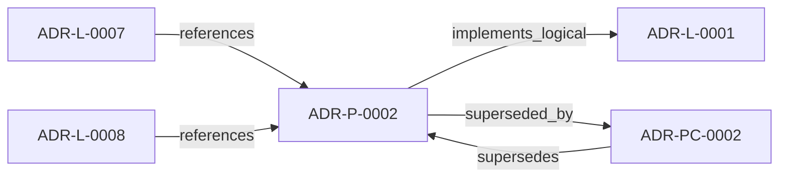

<!--
integrity_schema_version: 1
generated: deterministic_projection_v1
artifact_kind: rendered_adr_markdown
generator_id: adr-projection-markdown
generator_version: 2
hash_algorithm: sha256
source_hash: a67edf54a9e5d437fa49375a6913b431bf4495e11e669c6dc86ec1e294cbc321
rendered_hash: 0b0b5ed8d21524574e662253a5d02158348e3ed1f54465c0752ce37c1754f297
-->

# ADR-P-0002: JSON Schema Validation with YAML Document Format

**Status:** superseded  
**Created:** 2026-03-07  
**Authors:** erik.gallmann  
**Domains:** schema, validation, format  
**Tags:** json-schema, yaml, validation, ste-compliance  
**Alias name:** json-schema-validation-with-yaml-document-format  

**Implements Logical:** [ADR-L-0001](../logical/ADR-L-0001-ste-compliant-machine-verifiable-architecture-decision-record-system.md)  
**Technologies:** json-schema, yaml, jsonschema-python  


## Context

This ADR specifies the use of JSON Schema for validation with YAML as the document
format. This combination provides deterministic validation (JSON Schema) with
human-readable authoring (YAML with embedded markdown).

The choice enables:
- Schema-first design (define structure before implementation)
- Deterministic validation (same input = same result)
- Clear error messages (field paths, expected types)
- Extensibility (schema evolution without breaking changes)
- STE compliance (PRIME-1, PRIME-2, SYS-2)


## Technology Stack

### JSON Schema (tooling)

**Version:** draft-07

**Rationale:**
JSON Schema provides:
- Formal schema definition language
- Validation against defined structure
- Type checking and pattern matching
- Cross-reference validation via $ref
- Wide tooling support across languages
- Standard for API contracts (OpenAPI uses JSON Schema)


### jsonschema (Python) (library)

**Version:** 4.x

**Rationale:**
Reference JSON Schema validator for Python. Supports draft-07. Extensible
with custom validators. Clear error messages. Wide adoption.


### YAML (tooling)

**Version:** 1.2

**Rationale:**
YAML provides:
- Human-readable syntax
- Multiline strings (markdown embedding)
- Comments support
- Less verbose than JSON
- Version control friendly (readable diffs)
- Native support in Python (PyYAML)


## Relationship graph



## Related ADRs

### ADR-L-0001 — STE-Compliant Machine-Verifiable Architecture Decision Record System

**Relationships:**
- this ADR -[:implements_logical]-> 019fee89-e615-70a5-861b-b2dde147e5af

**Context:** # ADR Architecture Kit — STE Authoring Subsystem

[Open projection](../logical/ADR-L-0001-ste-compliant-machine-verifiable-architecture-decision-record-system.md)
### ADR-L-0007 — Deterministic Documentation Projection

**Relationships:**
- 019fee89-e615-7b9c-8e3f-32ceeda01491 -[:references]-> this ADR

**Context:** The repository already treats several human-readable artifacts as derived state:
ADR human projections under adrs/adr-projection/, manifest summaries, and the AI-first SYSTEM-OVERVIEW
are generated from structured or code-defined sources. That behavior now needs
explicit architectural authority so future contributors do not reintroduce
manually maintained documentation that drifts from canonical artifacts.

[Open projection](../logical/ADR-L-0007-deterministic-documentation-projection.md)
### ADR-L-0008 — Validation Modes for Draft and Complete ADRs

**Relationships:**
- 019fee89-e616-7066-8d2f-3acc7f469f72 -[:references]-> this ADR

**Context:** The ADR Architecture Kit currently couples schema validation to completeness for
several ADR types. That behavior is useful for acceptance gates, but it is too
strict for the actual design workflow used in this workspace.

[Open projection](../logical/ADR-L-0008-validation-modes-for-draft-and-complete-adrs.md)
### ADR-PC-0002 — Schema and Contract Validation

**Relationships:**
- this ADR -[:superseded_by]-> 019fee89-e617-7d2b-8325-cd85ff814477
- 019fee89-e617-7d2b-8325-cd85ff814477 -[:supersedes]-> this ADR

**Context:** Schema and contract validation is now a stable component boundary rather than
a generic legacy physical slice. It validates canonical ADR structure,
profile-specific contract requirements, project metadata, and implementation
attribution evidence.

[Open projection](../physical-component/ADR-PC-0002-schema-and-contract-validation.md)

## Architecture Patterns

### Schema-First Design

Define JSON Schemas before writing ADRs or code. Schema becomes contract.
Validation happens early (parse time, not runtime). Changes to schema are
versioned and documented.


**Components Affected:** COMP-0001, COMP-0002


## Component Specifications

### COMP-0016: JSON Schema Definitions (library)

**Responsibilities:**
Define structure for all ADR artifact types:
- types.schema.json (shared types)
- adr-common.schema.json (frontmatter)
- adr-logical.schema.json (logical ADRs)
- adr-physical.schema.json (physical ADRs)
- invariant.schema.json (invariants)
- project-metadata.schema.json (PROJECT.yaml)
- manifest.schema.json (generated manifest)


**Interfaces:**
- **IFACE-0020** (REST): JSON Schema files loaded by validation libraries. Standard JSON Schema
draft-07 format. $ref for cro...

**Implementation Identifiers:**
- Module Path: `schema/v1.0/`

### COMP-0018: Schema Resolver (library)

**Responsibilities:**
Resolve $ref references between schemas. Load schemas from local filesystem.
Build schema store for RefResolver. Enable cross-schema validation.


**Interfaces:**
- **IFACE-0024** (REST): Python API:
```python
parser = ADRParser(schema_dir=Path("schema/v1.0"))
# Automatically loads schem...
**Dependencies:** 019fee89-e618-7d70-831f-0d5a9959a816

**Implementation Identifiers:**
- Module Path: `src/adr_kit/parser/yaml_parser.py`


## Deployment Model

**Hosting:** on-premise  **Orchestration:** git repository  
**Scaling Strategy:**
JSON Schema files stored in git. Versioned in schema/v1.0/ directory.
Future versions in schema/v1.1/, schema/v2.0/, etc.


## Implementation Decisions

### IMPL-0021: Use JSON Schema draft-07 (not draft-2020-12)

**Rationale:**
draft-07 is widely supported across languages and tools. draft-2020-12 has
limited tooling support. Python jsonschema library has excellent draft-07
support. Sufficient for our validation needs.


**Alternatives Considered:**
- **JSON Schema draft-2020-12**: Limited tooling support. Python jsonschema library support is incomplete.
No significant features needed from draft-2020-12.


**Implements Invariants:** 019fee89-e615-713e-b627-2ee4bf985295
### IMPL-0023: Use $ref for schema composition (not allOf/oneOf where possible)

**Rationale:**
$ref is clearer for schema reuse. allOf can be ambiguous. $ref with RefResolver
enables modular schema design. Common frontmatter defined once, referenced by
logical and physical schemas.


**Alternatives Considered:**
- **Inline all schemas (no $ref)**: Duplication. Harder to maintain. Can't reuse common definitions.


### IMPL-0025: Store schemas in schema/v1.0/ directory (version-specific)

**Rationale:**
Enables schema evolution. Multiple versions can coexist. Tools can load
version-specific schemas. Clear migration path (v1.0 → v1.1 → v2.0).


**Alternatives Considered:**
- **Single schema/ directory (no versioning)**: Breaking changes would break all existing ADRs. No migration path.
Can't support multiple schema versions simultaneously.


**Implements Invariants:** 019fee89-e615-7502-a52f-af65757c9fd2
### IMPL-0004: Use RefResolver with schema store for local references

**Rationale:**
Prevents network calls (schemas loaded from filesystem). Deterministic
validation. Fast (no I/O during validation). Schema store built once at
parser initialization.


**Alternatives Considered:**
- **Allow network schema loading**: Non-deterministic (network failures). Slow (I/O per validation).
Security risk (external schema tampering).


**Implements Invariants:** 019fee89-e615-713e-b627-2ee4bf985295

## Integration Points

### INTEG-0001

**Systems:** adr-kit, pydantic  
**Protocol:** Python API

**Specification:**
Pydantic models must match JSON Schema structure. Field names, types, and
constraints must align. Pydantic validation happens after JSON Schema
validation (two-layer validation).


## Operational Requirements

### Monitoring
No runtime monitoring (library/CLI tool).


### Logging
Log schema validation errors with field paths and expected formats.


### Security
Schemas are public. No secrets or credentials in schema definitions.


---

*Generated from ADR-P-0002 by ADR Architecture Kit*