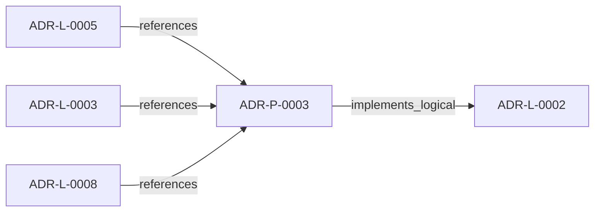

<!--
integrity_schema_version: 1
generated: deterministic_projection_v1
artifact_kind: rendered_adr_markdown
generator_id: adr-projection-markdown
generator_version: 2
hash_algorithm: sha256
source_hash: 70f3a5180a22e2d09d5ece40efc6af2851a68fcaaf14999767d57b0c3db869d2
rendered_hash: 9b56163c5f7184073811551985e8e31ccdb0be7566332387fa8eb49cef572e9a
-->

# ADR-P-0003: Multi-Scope Python Implementation for ADR Toolkit

**Status:** accepted  
**Created:** 2026-03-08  
**Modified:** 2026-03-08  **Authors:** adr-architecture-kit  
**Domains:** implementation, adr, python, cli  
**Tags:** python, implementation, scope-resolution, cli, api  **Alias name:** multi-scope-python-implementation-for-adr-toolkit  
**Implements Logical:** [ADR-L-0002](../logical/ADR-L-0002-multi-scope-adr-architecture-for-sub-module-development.md)  
**Technologies:** python, click, pyyaml, pathlib, dataclasses

## Context

ADR-L-0002 defines the logical architecture for multi-scope ADR support.
This Physical ADR specifies the concrete Python implementation including
module structure, API design, and CLI interface.

Implementation leverages existing patterns from ste-runtime's scope resolution
(src/config/index.ts) to maintain consistency across the STE ecosystem.

## Technology Stack

### Python (language)

**Version:** 3.10+

**Rationale:**
Primary implementation language; 3.10+ for type hints and pathlib

### Click (library)

**Version:** 8.x

**Rationale:**
CLI framework; consistent with STE ecosystem CLI patterns

### PyYAML (library)

**Version:** 6.x

**Rationale:**
ADR YAML parsing; schema validation

### pathlib (library)

**Version:** stdlib

**Rationale:**
Cross-platform path handling for scope resolution

## Relationship graph

## Related ADRs

### ADR-L-0002 — Multi-Scope ADR Architecture for Sub-Module Development

**Relationships:**
- this ADR -[:implements_logical]-> 019fee89-e615-7f19-810b-c7b33a9d9e0d

**Context:** The adr-architecture-kit is being actively developed in a single workspace alongside
multiple sub-modules (ste-runtime, future services) that will eventually become
independent services. Each sub-module needs to leverage the ADR system for its own
architectural documentation while being developed in parallel within the monorepo.

[Open projection](../logical/ADR-L-0002-multi-scope-adr-architecture-for-sub-module-development.md)
### ADR-L-0003 — Quality Assurance and Testing Strategy

**Relationships:**
- 019fee89-e615-77f6-9b1f-695732d25443 -[:references]-> this ADR

**Context:** The ADR Architecture Kit is a foundational tool for machine-verifiable architecture
documentation. As such, it must maintain high quality standards to ensure reliability,
correctness, and trust in the architectural governance it provides.

[Open projection](../logical/ADR-L-0003-quality-assurance-and-testing-strategy.md)
### ADR-L-0005 — ADR-to-Prompt Translation for AI Implementation

**Relationships:**
- 019fee89-e615-73a3-8d31-7a4721affae9 -[:references]-> this ADR

**Context:** The ADR Architecture Kit encodes architectural decisions in machine-readable YAML
format with explicit invariants, capabilities, and component specifications. These
structured ADRs contain all the information needed to guide AI implementation:

[Open projection](../logical/ADR-L-0005-adr-to-prompt-translation-for-ai-implementation.md)
### ADR-L-0008 — Validation Modes for Draft and Complete ADRs

**Relationships:**
- 019fee89-e616-7066-8d2f-3acc7f469f72 -[:references]-> this ADR

**Context:** The ADR Architecture Kit currently couples schema validation to completeness for
several ADR types. That behavior is useful for acceptance gates, but it is too
strict for the actual design workflow used in this workspace.

[Open projection](../logical/ADR-L-0008-validation-modes-for-draft-and-complete-adrs.md)

## Component Specifications

### COMP-0017: Project Scope Resolver (library)

**Responsibilities:**
- Detect project boundaries using marker files
- Enforce workspace boundaries (INV-0018)
- Support explicit scope override
- Discover sub-module scopes recursively
- Maintain parent-child scope relationships

**Interfaces:**
- **IFACE-0021** ProjectScope (dataclass): Immutable scope metadata...- **IFACE-0025** ProjectScopeResolver (class): ProjectScopeResolver
**Dependencies:** pathlib.Path, dataclasses.dataclass, typing (Optional, List), yaml (for PROJECT.yaml parsing)

**Implementation Identifiers:**
- Module Path: `src/adr_kit/scope/`

### COMP-0019: Scope-Aware Manifest Generator (library)

**Responsibilities:**
- Generate manifest scoped to specific project
- Support auto-detection and explicit scope
- Generate manifests recursively for all scopes
- Maintain backward compatibility with single-scope usage

**Interfaces:**
- **IFACE-0027** ManifestGenerator.__init__: ManifestGenerator.__init__- **IFACE-0029** generate_from_directory: generate_from_directory- **IFACE-0005** generate_from_scope: New method for scope-based generation...- **IFACE-0006** generate_recursive: New method for recursive generation...
**Dependencies:** adr_kit.scope.ProjectScopeResolver, adr_kit.scope.ProjectScope

**Implementation Identifiers:**
- Module Path: `src/adr_kit/generators/manifest_generator.py`

### COMP-0020: Scope-Aware Validator (library)

**Responsibilities:**
- Validate ADRs scoped to specific project
- Support auto-detection and explicit scope
- Validate recursively for all scopes (INV-0019)
- Maintain backward compatibility

**Interfaces:**
- **IFACE-0007** (REST): ADRValidator.__init__(parser, project_root, scope_resolver).
validate_directory(adr_dir, scope) -> d...
**Dependencies:** adr_kit.scope.ProjectScopeResolver, adr_kit.scope.ProjectScope

**Implementation Identifiers:**
- Module Path: `src/adr_kit/validators/adr_validator.py`

### COMP-0021: Multi-Scope CLI (library)

**Responsibilities:**
- Provide scope-aware commands
- Support --scope parameter for explicit override
- Support --recursive flag for multi-scope operations
- Display clear scope information to users

**Interfaces:**
- **IFACE-0008** (REST): adr generate-manifest: --scope PATH (optional), --recursive (flag), --output PATH (optional).
Genera...- **IFACE-0009** (REST): adr validate: --scope PATH (optional), --recursive (flag), --cross-references (flag).
Validate ADRs ...- **IFACE-0010** (REST): adr scope: --recursive (flag).
Show detected scope(s).
...
**Dependencies:** click>=8.0, adr_kit.generators.ManifestGenerator, adr_kit.validators.ADRValidator, adr_kit.scope.ProjectScopeResolver

**Implementation Identifiers:**
- Module Path: `src/adr_kit/cli/`

## Deployment Model

## Data Architecture

### scope_detection

**Storage:** File system traversal using pathlib

### state_storage

**Storage:** Per-scope adrs directories

### cross_scope_references

**Storage:** Documented pattern

## Implementation Decisions

### IMPL-0022: Adopt Red-Green-Refactor TDD Methodology

**Rationale:**
Test-Driven Development is architecturally aligned with STE principles:

1. **SYS-2 (Deterministic Cognition)**: Tests enforce deterministic behavior
2. **SYS-4 (Drift Prevention)**: Tests detect implementation drift immediately
3. **PRIME-1 (No Implicit Assumptions)**: Tests make behavior explicit
4. **INV-0001 (Schema Validation)**: Tests prove validation correctness

This is a governance tool that validates other systems - it MUST be provably
correct. TDD provides:
- Executable specification of behavior
- Immediate feedback on correctness
- Refactoring safety net
- Living documentation
- Design pressure toward testable code

Red-Green-Refactor cycle:
1. **Red**: Write failing test (specification)
2. **Green**: Implement minimum code to pass (correctness)
3. **Refactor**: Improve design while maintaining tests (quality)

**Alternatives Considered:**
- **Test-after development**: Risks untestable code, implicit behavior
- **No systematic testing**: Unacceptable for governance tool
- **Property-based only**: Insufficient for explicit behavior specification

### IMPL-0024: Use Dataclasses for ProjectScope

**Rationale:**
Dataclasses provide immutable, type-safe scope metadata with minimal
boilerplate. Aligns with modern Python best practices.

**Alternatives Considered:**
- **Named tuples**: Less readable, no default values
- **Regular classes**: More boilerplate, mutable by default

### IMPL-0026: Mirror ste-runtime Marker Hierarchy

**Rationale:**
Consistency across STE ecosystem. Users familiar with ste-runtime
scope detection will understand ADR toolkit behavior.

**Alternatives Considered:**
- **Different marker priority**: Would confuse users
- **ADR-specific markers only**: Less flexible

### IMPL-0027: Backward Compatible API

**Rationale:**
Existing single-scope code must continue working without changes.
Scope awareness is opt-in via new methods.

**Alternatives Considered:**
- **Breaking change with migration**: Too disruptive
- **Separate scope-aware classes**: Code duplication

### IMPL-0005: Click for CLI Framework

**Rationale:**
Click is already in optional dependencies [cli]. Provides excellent
parameter handling, help text, and color output.

**Alternatives Considered:**
- **argparse**: More verbose, less features
- **typer**: Additional dependency, overkill

### IMPL-0006: Auto-Detection by Default

**Rationale:**
Zero-configuration experience. Tools "just work" from any directory
without requiring --scope parameter.

**Alternatives Considered:**
- **Always require --scope**: Poor UX
- **Config file required**: Too much setup

## Operational Requirements

### Monitoring
CLI provides clear progress messages.
Errors include scope context.
--recursive shows per-scope results.

### Security
Workspace boundary enforcement (INV-0018).
No traversal above system directories.
Path validation prevents escape attacks.

---

*Generated from ADR-P-0003 by ADR Architecture Kit*