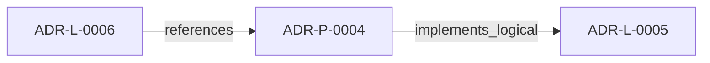

<!--
integrity_schema_version: 1
generated: deterministic_projection_v1
artifact_kind: rendered_adr_markdown
generator_id: adr-projection-markdown
generator_version: 2
hash_algorithm: sha256
source_hash: 8ba07542ae9af15ce969938dabb17baa62fd0f4a0ec20ecabb6e8f6617f8f273
rendered_hash: 1ddaa4126a660424a83222ed8f070b27bb641d3a435cd14c7d3ecd81e9fd9159
-->

# ADR-P-0004: Prompt Translator Implementation for AI-Driven Development

**Status:** deprecated  
**Created:** 2026-03-08  
**Modified:** 2026-03-08  
**Authors:** adr-architecture-kit  
**Domains:** implementation, automation, ai-tooling, code-generation  
**Tags:** python, prompt-engineering, automation, llm, code-generation  
**Alias name:** prompt-translator-implementation-for-ai-driven-development  

**Implements Logical:** [ADR-L-0005](../logical/ADR-L-0005-adr-to-prompt-translation-for-ai-implementation.md)  
**Technologies:** python, jinja2, pyyaml, click  

## Context

ADR-L-0005 defines the logical architecture for translating ADRs into
implementation prompts for AI agents. This Physical ADR specifies the
concrete Python implementation.

Current repo state does not contain the planned `src/adr_kit/prompts`
implementation surface. This document remains as deferred design material and
is not authoritative for current implemented behavior.

The prompt translator parses Physical ADRs and generates:
1. **Implementation prompts** - One per component (COMP-*)
2. **Validation checklist** - Comprehensive verification checklist
3. **Execution plan** - Dependency-ordered implementation sequence

Key design principles:
- **Deterministic**: Same ADR → same prompts (INV-0032)
- **Complete**: All invariants, specs, tests included (INV-0027, INV-0028, INV-0030)
- **Traceable**: Prompts reference source ADR (INV-0029)
- **Extensible**: Support multiple target agents (CAP-0009)

## Technology Stack

### Python (language)

**Version:** 3.10+

**Rationale:**
Primary implementation language

### Jinja2 (library)

**Version:** 3.x

**Rationale:**
Template engine for prompt generation

### PyYAML (library)

**Version:** 6.x

**Rationale:**
ADR YAML parsing

### Click (library)

**Version:** 8.x

**Rationale:**
CLI framework

## Relationship graph

## Related ADRs

### ADR-L-0005 — ADR-to-Prompt Translation for AI Implementation

**Relationships:**
- this ADR -[:implements_logical]-> 019fee89-e615-73a3-8d31-7a4721affae9

**Context:** The ADR Architecture Kit encodes architectural decisions in machine-readable YAML
format with explicit invariants, capabilities, and component specifications. These
structured ADRs contain all the information needed to guide AI implementation:

[Open projection](../logical/ADR-L-0005-adr-to-prompt-translation-for-ai-implementation.md)
### ADR-L-0006 — Rule Library Sub-Module with Cooperative Signals

**Relationships:**
- 019fee89-e615-7b66-b73a-3b99f7d92d4d -[:references]-> this ADR

**Context:** ADR-L-0004 defines a multi-tier governance architecture where a rule-library
sub-module activates and projects rules via MCP. The Rules & Signal Service
(Tier 2) parses ADRs and generates enforcement rules; the rule-library (Tier 3)
receives, activates, and serves those rules to consumers.

[Open projection](../logical/ADR-L-0006-rule-library-sub-module-with-cooperative-signals.md)

## Component Specifications

### COMP-0005: ADR Component Parser (library)

**Responsibilities:**
- Parse Physical ADR YAML
- Extract component specifications (COMP-*)
- Extract relevant invariants from Logical ADR
- Extract implementation decisions (IMPL-*)
- Extract testing requirements
- Build structured component metadata

**Interfaces:**
- **IFACE-0022** ComponentSpec (dataclass): Structured component specification...- **IFACE-0026** ComponentParser (class): ComponentParser
**Dependencies:** adr_kit.parser.ADRParser, adr_kit.models (LogicalADR, PhysicalADR), dataclasses, typing

**Implementation Identifiers:**
- Module Path: `src/adr_kit/prompts/`

### COMP-0006: Prompt Template Engine (library)

**Responsibilities:**
- Render implementation prompts from templates
- Support multiple target agent formats (codex, cursor, claude, gpt)
- Include all required sections (context, constraints, specs, tests)
- Generate validation checklists
- Generate execution plans
- Optimize prompt structure per agent capabilities

**Interfaces:**
- **IFACE-0028** AgentFormat (enum): AgentFormat- **IFACE-0030** PromptTemplate (class): Base template for all prompt formats...- **IFACE-0031** PromptGenerator (class): PromptGenerator
**Dependencies:** jinja2>=3.0, adr_kit.prompts.parser.ComponentSpec

**Implementation Identifiers:**
- Module Path: `src/adr_kit/prompts/`

### COMP-0007: Prompt CLI (library)

**Responsibilities:**
- Parse command-line arguments
- Load Physical ADR
- Generate prompts for components
- Write prompts to output directory
- Display execution plan
- Generate cooperative signals for parallel agent coordination

**Interfaces:**
- **IFACE-0032** adr generate-prompts: Generate implementation prompts from Physical ADR...
**Dependencies:** click, adr_kit.prompts.ComponentParser, adr_kit.prompts.PromptGenerator

**Implementation Identifiers:**
- Module Path: `src/adr_kit/cli/main.py`

### COMP-0008: Dependency Analyzer (library)

**Responsibilities:**
- Parse component dependencies
- Build dependency graph
- Detect circular dependencies
- Generate topological sort for execution order
- Identify parallelizable components

**Interfaces:**
- **IFACE-0033** DependencyAnalyzer (class): DependencyAnalyzer
**Dependencies:** typing, dataclasses

**Implementation Identifiers:**
- Module Path: `src/adr_kit/prompts/dependencies.py`

### COMP-0009: Cooperative Signal Generator (library)

**Responsibilities:**
- Generate component ownership signals (claim/release)
- Generate progress signals (started/in_progress/complete)
- Generate dependency satisfaction signals (wave complete)
- Generate completion signals (ready for validation)
- Clean up stale signals

**Interfaces:**
- **IFACE-0023** (REST): SignalType enum: claim, progress, complete, wave_complete, validation_ready.
Signal dataclass. Signa...
**Dependencies:** dataclasses, datetime, json, pathlib

**Implementation Identifiers:**
- Module Path: `src/adr_kit/prompts/signals.py`

## Deployment Model

## Data Architecture

### prompt_structure

**Storage:** Jinja2 templates

### template_data

**Storage:** ComponentSpec, invariants, capabilities, impl_decisions

### agent_specific_formatting

**Storage:** Per-agent configuration

## Implementation Decisions

### IMPL-0007: Use Jinja2 for Template Engine

**Rationale:**
Jinja2 is already used for markdown view generation. Reusing the same
template engine maintains consistency and reduces dependencies.

**Alternatives Considered:**
- **String formatting**: Not flexible enough
- **Custom template engine**: Unnecessary complexity

### IMPL-0008: Markdown as Primary Prompt Format with Agent-Specific Variants

**Rationale:**
Markdown is:
- Human-readable (architects can review prompts)
- AI-friendly (all agents parse markdown well)
- Version-controllable (text format)
- Supports code blocks, lists, emphasis

However, different AI agents have different strengths and optimal prompt formats:
- **CODEX**: Prefers concise, code-focused prompts
- **Cursor (Sonnet 4.5)**: Benefits from detailed context and reasoning
- **Claude**: Prefers structured thinking and step-by-step guidance
- **GPT**: Works well with examples and clear instructions

The translator should support agent-specific formatting while maintaining
core content consistency (same invariants, specs, tests).

**Alternatives Considered:**
- **Single universal format**: Doesn't leverage agent strengths
- **JSON**: Less readable, harder to review
- **Plain text**: Less structure

### IMPL-0009: File-Based Prompt Output

**Rationale:**
Generate prompts as files rather than stdout to enable:
- Review before execution
- Version control of prompts
- Batch processing
- Archival of prompts used

**Alternatives Considered:**
- **Stdout only**: Can't review or archive
- **Database storage**: Overkill

### IMPL-0010: Deterministic Generation via Templates

**Rationale:**
Using templates with structured data ensures deterministic generation.
No LLM involved in prompt generation - pure template rendering.

**Alternatives Considered:**
- **LLM-based generation**: Non-deterministic, violates INV-0032
- **Code-based generation**: Less maintainable than templates

## Operational Requirements

### Monitoring
Log prompts generated.
Track which ADRs used.
Report generation time.

### Security
No code execution during generation.
Template sandboxing via Jinja2.
Path validation for output directory.

## Gaps

### GAP-0001: How should the base prompt template hierarchy be structured?

**Impact:**   
**Blocking:** No

### GAP-0002: What agent-specific formatting rules should be standardized first?

**Impact:**   
**Blocking:** No

### GAP-0003: How should generated prompts integrate with the existing validation subsystem?

**Impact:**   
**Blocking:** No

---

*Generated from ADR-P-0004 by ADR Architecture Kit*