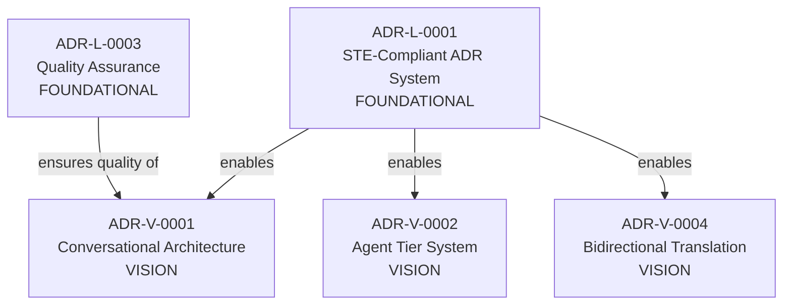

# Vision ADRs (ADR-V)

## What Are Vision ADRs?

**Vision ADRs** (`ADR-V-XXXX`) are a special category of Logical ADRs that document the **meta-system vision** - the future capabilities and architecture patterns that the system should evolve toward.

## Characteristics

- **Type**: Logical ADRs (capabilities, boundaries, contracts - not implementation)
- **Prefix**: `ADR-V-XXXX` (not `ADR-L-XXXX` to avoid ID conflicts)
- **Status**: Typically `proposed` (vision, not yet implemented)
- **Promotable**: Can be promoted to `ADR-L-XXXX` when implemented
- **Interviewable**: AI can ask questions to refine and evolve the vision

## Why Separate from ADR-L?

**Foundational ADRs** (`ADR-L-0001` through `ADR-L-0006`):
- Document the **current system** (what exists now)
- Status: `accepted` or `implemented`
- Examples: STE compliance, multi-scope architecture, testing strategy

**Vision ADRs** (`ADR-V-0001` through `ADR-V-0014`):
- Document the **future system** (what should exist)
- Status: `proposed` (vision, not yet built)
- Examples: Conversational architecture, agent tier system, meta-optimization

Separation prevents:
- ID conflicts (both need ADR-L-0001, ADR-L-0002, etc.)
- Confusion (is this implemented or vision?)
- Merge conflicts (foundation vs vision evolve independently)

## Relationship to Foundation

Vision ADRs **build on** foundational ADRs:



## Promotion Path

When a Vision ADR is implemented:

1. **Implementation complete**: Feature built, tested, documented
2. **Create ADR-L-XXXX**: Promote vision to foundational ADR
3. **Update ADR-V-XXXX**: Mark as `superseded_by: ADR-L-XXXX`
4. **Preserve history**: Vision ADR remains for historical context

Example:
```yaml
# Before implementation
id: ADR-V-0001
status: proposed
title: "Conversational Architecture System"

# After implementation
id: ADR-V-0001
status: superseded
superseded_by: ADR-L-0014
title: "Conversational Architecture System"
notes: "Vision realized, promoted to ADR-L-0014"
```

## Current Vision ADRs

### Core System Vision
- **ADR-V-0001**: Conversational Architecture System
- **ADR-V-0002**: Agent Tier System
- **ADR-V-0003**: Meta-Optimization System
- **ADR-V-0004**: Bidirectional Translation Layer

### Policy & Compliance Vision
- **ADR-V-0005**: Policy Lifecycle Management
- **ADR-V-0006**: Autonomous Compliance System
- **ADR-V-0007**: Compliance AI Agent

### Provider Ecosystem Vision
- **ADR-V-0008**: Provider Ecosystem
- **ADR-V-0009**: Proposal Security System

### Architecture Patterns Vision
- **ADR-V-0010**: Composable Architecture
- **ADR-V-0011**: Self-Evolving Infrastructure
- **ADR-V-0012**: Code Decorators (Intent Primitive)
- **ADR-V-0013**: Legacy Import Agent (Trust-First Validation)
- **ADR-V-0014**: Decorator Inference Agent (Self-Healing Graph)

## How AI Should Use Vision ADRs

### For Understanding Vision
```
AI: "What's the long-term vision for this system?"
→ Read ADR-V-0001 through ADR-V-0014
→ Understand complete meta-system architecture
```

### For Refining Vision
```
Human: "Update the agent tier system to include GPU-accelerated models"
AI: → Reads ADR-V-0002
    → Interviews human about GPU requirements
    → Updates ADR-V-0002 with new tier
    → Preserves conversation_metadata
```

### For Implementation Planning
```
AI: "What should I implement next?"
→ Read Vision ADRs (ADR-V-XXXX)
→ Identify unimplemented capabilities
→ Propose implementation plan
→ Create Physical-System and Physical-Component ADRs
```

## Relationship to Existing ADRs

Some existing ADRs may need reclassification:

- **ADR-L-0002** (Multi-Scope): Implementation detail → should be Physical-System?
- **ADR-L-0004** (Decorators): Implementation detail → absorbed by ADR-V-0012 (vision)
- **ADR-L-0005** (Prompt Translation): Implementation detail → absorbed by ADR-V-0004 (vision)
- **ADR-L-0006** (Rule Library): Implementation detail → should be Physical-System?

**Principle**: Logical ADRs describe **what** (capabilities), Physical ADRs describe **how** (implementation).

## Success Criteria

Vision ADRs are successful when:
- Vision is clear and comprehensive
- Implementation path is obvious
- No ambiguity about what to build
- Can be promoted to ADR-L when implemented
- AI can reason over vision to guide development

## What This Really Is

**Not**: A documentation system  
**Not**: An architecture DSL  
**Not**: A schema validator  

**Actually**: **A conversation compiler**

We're building a compiler that transforms human conversation into executable
architecture specifications.

```
Input:  Human conversation (natural language)
        ↓ Lexical analysis (extract intent)
        ↓ Parsing (structure decisions)
        ↓ Semantic analysis (detect gaps)
        ↓ Optimization (infer details)
        ↓ Code generation (generate ADRs)
Output: Executable architecture (structured, validated, implementable)
```

Just like a C compiler transforms C code into machine code, the conversation
compiler transforms architectural dialogue into structured ADRs.

The "source code" is conversation. The "executable" is ADRs. The "runtime"
is AI code generation.

**We're compiling conversations into systems.**

## Meta-Insight

**This README itself demonstrates conversational architecture**:
- Human asked: "Do these need to be absorbed or are these superior?"
- AI analyzed: "We have ID conflicts and conceptual overlap"
- Human clarified: "Use ADR-V category, promotable, interviewable"
- Human refined: "We're building a conversation compiler"
- AI implemented: Renamed ADRs, added metadata, updated framing

The vision is being refined through conversation, just as the vision describes.
